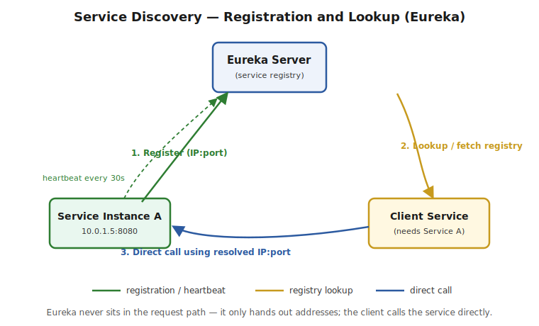

# Part 1 — Service Discovery

> The problem service discovery solves, client-side vs server-side discovery, Eureka server/client setup, self-preservation mode, health checks, and the AP vs CP tradeoff. Interview Q&A at the end.

## The Problem It Solves

**What it is:** in a microservices architecture, each service instance runs in its own container/VM, and its network location (IP address, port) is **not fixed** — instances scale up/down, get rescheduled by Kubernetes, restart after a crash, or move during a deployment. Hardcoding `http://10.0.1.5:8080` into every caller breaks the moment that instance disappears.

**The fix:** a **service registry** — a centralized directory that every service instance **registers** itself with on startup, and that every caller **queries** to resolve a logical service name (`order-service`) into a live, current network address.



> ⚠️ **Pitfall:** the registry itself never sits in the request path. It's consulted once (or cached) to resolve an address; the actual call still goes **directly** from caller to callee. Confusing service discovery with an API Gateway (Part 4) — which *does* sit in the request path — is a common conceptual mix-up interviewers listen for.

## Client-Side vs Server-Side Discovery

**Client-side discovery** (what Eureka implements): the calling service itself queries the registry, gets back a list of healthy instances, and picks one (often via a client-side load balancer — see Part 3). The client owns the decision.

**Server-side discovery** (what a cloud load balancer or Kubernetes Service implements): the caller sends the request to a single stable address (a load balancer or virtual IP); *that* component queries the registry and forwards the request. The caller never sees individual instance addresses at all.

| | Client-side (Eureka) | Server-side (Kubernetes Service, AWS ALB) |
|---|---|---|
| Who resolves the address? | The calling service | An infrastructure component in front of it |
| Extra network hop? | No — client calls the instance directly | Yes — request passes through the LB/proxy first |
| Client complexity | Higher — needs a discovery client library | Lower — client just calls one stable name/IP |
| Coupling | Client is coupled to the discovery mechanism | Client is decoupled — discovery is infrastructure's job |

> ⚠️ **Pitfall:** Kubernetes' built-in Service discovery (DNS-based, server-side) is why teams running on K8s often don't need Eureka at all — the platform already provides this. Eureka is still asked about heavily in interviews because it's the classic Spring Cloud Netflix answer and still runs in plenty of production systems, but be ready to name the Kubernetes-native alternative if asked "would you still reach for Eureka today."

## Eureka Server Setup

**Add the dependency:**
```xml
<dependency>
    <groupId>org.springframework.cloud</groupId>
    <artifactId>spring-cloud-starter-netflix-eureka-server</artifactId>
</dependency>
```

**Enable it on the main class:**
```java
@SpringBootApplication
@EnableEurekaServer
public class EurekaServerApplication {
    public static void main(String[] args) {
        SpringApplication.run(EurekaServerApplication.class, args);
    }
}
```

**A standalone Eureka server shouldn't register with itself:**
```properties
eureka.client.register-with-eureka=false
eureka.client.fetch-registry=false
```
**Why this matters:** by default, every Spring Cloud app — including the Eureka server itself, since it's built on the same `spring-cloud-starter` machinery — tries to act as *both* a Eureka client and register itself. For a single standalone registry instance, that's pointless (and in a peer-aware multi-node registry setup, you'd instead point each Eureka node at its *peers*, not disable this entirely). Setting both flags to `false` keeps a simple single-node registry from registering with itself.

## Eureka Client Setup

**Add the dependency:**
```xml
<dependency>
    <groupId>org.springframework.cloud</groupId>
    <artifactId>spring-cloud-starter-netflix-eureka-client</artifactId>
</dependency>
```

**Enable it and configure:**
```java
@SpringBootApplication
@EnableDiscoveryClient
public class OrderServiceApplication {
    public static void main(String[] args) {
        SpringApplication.run(OrderServiceApplication.class, args);
    }
}
```
```properties
server.port=8080
spring.application.name=order-service
eureka.client.service-url.defaultZone=http://localhost:8761/eureka/
```

> ⚠️ **Pitfall:** `spring.application.name` is the logical name every other service will look this instance up by — get it wrong (or inconsistent across environments) and service-to-service calls silently fail to resolve. As of Spring Cloud 2020.0+, `@EnableDiscoveryClient` is technically optional if the Eureka client dependency is on the classpath (auto-configuration picks it up) — but adding it explicitly is still the clearer, more interview-safe answer, since it documents intent.

## Self-Preservation Mode — the Gotcha the Source Article Doesn't Mention

**What it is:** Eureka expects every registered instance to send a **heartbeat** (renewal) every 30 seconds by default. If a server doesn't hear from an instance for 90 seconds (3 missed heartbeats), it normally **evicts** that instance from the registry. **Self-preservation mode** kicks in when the Eureka server notices renewals dropping below a threshold (~85%) across **all** registered instances at once — its interpretation is "this looks like a network partition between me and my clients, not real instance failures," so it **stops evicting anything** until renewals recover.

**Why this is a real production trap:** during self-preservation, Eureka may keep serving addresses for instances that are **actually dead** — callers get connection errors/timeouts calling a "registered" instance that no longer exists. This is Eureka explicitly favoring **availability** (keep serving a possibly-stale registry) over **consistency** (only ever serve confirmed-live instances) — a direct instance of the **AP vs CP** tradeoff from distributed systems theory (Eureka is AP; ZooKeeper/Consul in strict-consistency mode lean CP).

```properties
# tuning self-preservation (know these exist; changing them is an operational judgment call, not a default recommendation)
eureka.server.enable-self-preservation=true      # default true — disabling is common in local/dev, risky in prod
eureka.server.renewal-percent-threshold=0.85     # the 85% threshold that triggers self-preservation
eureka.instance.lease-renewal-interval-in-seconds=30   # heartbeat interval
eureka.instance.lease-expiration-duration-in-seconds=90 # how long without a heartbeat before eviction is considered
```

> ⚠️ **Pitfall — the answer that shows real depth:** don't just say "Eureka has self-preservation mode." Explain the *tradeoff* it represents: Eureka would rather risk a client calling a dead instance (and handling that failure with a circuit breaker — Part 2 — or a retry) than risk mass-evicting every instance because of a transient network blip between the registry and its clients. This is precisely why circuit breakers and Eureka are almost always deployed together in practice — Eureka doesn't promise the registry is always accurate, so the caller needs its own protection against calling something that's actually down.

## Health Checks and Heartbeats

By default, Eureka's "health check" is just the heartbeat — an instance stays registered as long as it keeps renewing its lease, regardless of whether the *application* is actually healthy. Spring Boot Actuator can wire real health status into this:

```properties
eureka.client.healthcheck.enabled=true
management.endpoint.health.enabled=true
```
With this enabled, Eureka reflects the instance's **actual** Actuator health status (`UP`/`DOWN`), not just "it's still sending heartbeats" — an instance whose app logic is broken but whose JVM/network is fine would otherwise look falsely healthy.

> ⚠️ **Pitfall:** without `eureka.client.healthcheck.enabled=true`, a service that's technically running but functionally broken (e.g. its DB connection pool is exhausted) still shows as `UP` in Eureka, and traffic keeps getting routed to it. This is a common real "why is my service still getting traffic when it's clearly failing" production question.

---

## Interview Q&A

**Q: What problem does service discovery solve, and why can't you just hardcode service URLs?**
Covered above under "The Problem It Solves" — instance addresses change constantly in a dynamic, scaled, containerized environment; hardcoding breaks the moment an instance moves.

**Q: Client-side vs server-side service discovery — what's the actual difference, and which does Eureka implement?**
Covered above — Eureka is client-side (the caller resolves the address itself); Kubernetes Service/cloud load balancers are server-side (an infrastructure component resolves it, client never sees individual addresses).

**Q: What is Eureka's self-preservation mode, and why is it dangerous in production if you don't know about it?**
Covered above under "Self-Preservation Mode" — Eureka stops evicting instances when renewal rates across the board drop below ~85%, assuming a network partition rather than real failures. This can mean serving addresses for genuinely dead instances, which is why pairing Eureka with a circuit breaker downstream is standard practice, not optional.

**Q: Is Eureka CP or AP, and what does that mean practically?**
AP — it favors staying available (serving a possibly-stale registry) over strict consistency (only ever serving confirmed-live instances). Contrast with ZooKeeper, which favors consistency and would rather refuse to answer than serve stale data.

**Q: Would you still choose Eureka for a new project today?**
Depends on the platform. On Kubernetes, the platform's built-in DNS-based service discovery already solves this problem natively, so adding Eureka is often redundant. Eureka (and Spring Cloud Netflix generally) remains common in interviews and in older/legacy Spring Cloud systems that predate widespread Kubernetes adoption — know it, but be ready to name the platform-native alternative.

**Q: How does Eureka know if a registered instance is actually healthy, versus just "still sending heartbeats"?**
Covered above under "Health Checks and Heartbeats" — by default it only tracks heartbeat renewal, not application health. Enabling `eureka.client.healthcheck.enabled=true` wires in real Actuator health status so a functionally-broken-but-still-running instance is correctly reflected as `DOWN`.
