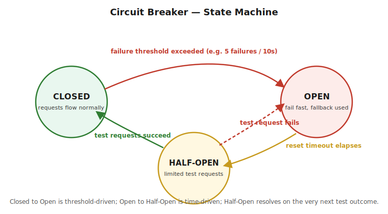

# Part 2 — Circuit Breaker

> The problem it solves, the three states, Hystrix (legacy — corrected from the source article's typos) vs Resilience4j (modern), and the Bulkhead isolation pattern. Interview Q&A at the end.

## The Problem It Solves

**What it is:** in a microservices architecture, Service A calling Service B over the network can fail in ways a monolith's in-process method call never could — B is slow, B is down, the network is congested. Without protection, A's threads pile up **waiting** on a struggling B, eventually exhausting A's own thread pool/connection pool — and now A is failing too, even though A's own logic was fine. This is a **cascading failure**: one slow dependency takes down everything calling it, and everything calling *that*.

**The fix — a circuit breaker:** wraps a risky call and, after it starts failing repeatedly, stops even attempting the call for a while — **failing fast** with an immediate fallback instead of piling up blocked/timed-out requests. Exactly the same goal as an electrical circuit breaker: trip before the failure cascades into something worse.

## The Three States



- **Closed** — normal operation. Requests flow through to the real service. The breaker counts failures/successes in the background.
- **Open** — triggered once failures cross a configured threshold (e.g. 5 failures within 10 seconds). Every call is now **short-circuited immediately** to a fallback — the real service is never even contacted, no matter how long you'd otherwise wait for it to time out.
- **Half-Open** — after a reset timeout elapses, the breaker cautiously lets a **limited number of test requests** through. All succeed → back to Closed (service has recovered). Any fail → back to Open (still broken, don't hammer it).

> ⚠️ **Pitfall — the transition types are different in kind:** Closed→Open is **threshold-driven** (count-based: N failures in a window). Open→Half-Open is purely **time-driven** (a fixed reset timeout, no awareness of whether the service actually recovered). Half-Open→(Closed or Open) is **outcome-driven** (the very next test result decides it). Interviewers sometimes ask "what triggers each transition" specifically to see if you conflate these three different triggering mechanisms.

## Hystrix (Legacy) — Corrected Example

**Add the dependency and enable it:**
```java
@RestController
@SpringBootApplication
@EnableCircuitBreaker
public class SimpleClientApplication {

    @GetMapping("/products")
    @HystrixCommand(
        fallbackMethod = "defaultProductList",
        commandProperties = {
            @HystrixProperty(name = "execution.isolation.thread.timeoutInMilliseconds", value = "500")
        }
    )
    public List<String> productList() {
        RestTemplate restTemplate = new RestTemplate();
        URI uri = URI.create("http://localhost:8090/products");
        return restTemplate.getForObject(uri, List.class);
    }

    public List<String> defaultProductList() {
        return Arrays.asList("fallback-product");
    }

    public static void main(String[] args) {
        SpringApplication.run(SimpleClientApplication.class, args);
    }
}
```
**Note on the source article's code:** the original had `@HystricCommand`/`@HystricProperty` (a typo — the real annotations are `@HystrixCommand`/`@HystrixProperty`) and a fallback method signature that didn't match its `@GetMapping` method's parameters (Hystrix requires the fallback method's signature to match the primary method's, since it needs to be callable as a drop-in substitute). Corrected above.

> ⚠️ **Pitfall — the single most important fact about Hystrix for a 10-YOE interview:** **Hystrix entered maintenance mode in late 2018** and Netflix stopped adding new features to it — it is **not** recommended for new projects. If you inherited a codebase using it, that's a legitimate real-world scenario to discuss, but proposing it as your answer for "how would you add resilience to a new service" is a red flag at senior level. The expected modern answer is **Resilience4j**.

## Resilience4j — the Modern Replacement

**Add the dependency:**
```xml
<dependency>
    <groupId>org.springframework.cloud</groupId>
    <artifactId>spring-cloud-starter-circuitbreaker-resilience4j</artifactId>
</dependency>
```

**Annotation-driven style:**
```java
@Service
public class ProductClient {

    private final RestTemplate restTemplate;

    public ProductClient(RestTemplate restTemplate) {
        this.restTemplate = restTemplate;
    }

    @CircuitBreaker(name = "productService", fallbackMethod = "defaultProductList")
    @TimeLimiter(name = "productService")
    @Retry(name = "productService")
    public List<String> getProducts() {
        return restTemplate.getForObject("http://localhost:8090/products", List.class);
    }

    public List<String> defaultProductList(Throwable t) {
        return List.of("fallback-product");
    }
}
```
```yaml
resilience4j:
  circuitbreaker:
    instances:
      productService:
        sliding-window-size: 10
        failure-rate-threshold: 50
        wait-duration-in-open-state: 10s
        permitted-number-of-calls-in-half-open-state: 3
  retry:
    instances:
      productService:
        max-attempts: 3
        wait-duration: 500ms
```
**What changed structurally, not just cosmetically:** Resilience4j composes independent, stackable modules — `CircuitBreaker`, `Retry`, `RateLimiter`, `Bulkhead`, `TimeLimiter` — each configured and applied separately, rather than Hystrix's single do-everything annotation. You opt into exactly the protections you need, and each is independently testable and tunable.

> ⚠️ **Pitfall — annotation stacking order matters:** when combining `@Retry` and `@CircuitBreaker` on the same method, get the semantics wrong and you can accidentally **retry against an already-open circuit** (defeating the point of the breaker) or **count retried failures multiple times against the circuit's failure threshold** (tripping it prematurely). Resilience4j's own documented convention is `CircuitBreaker` as the outermost decorator, with `Retry` applied inside it — verify this order explicitly in configuration/tests rather than assuming annotation order on the method always matches actual decoration order.

## Bulkhead — Isolating Failure Blast Radius

**What it does:** named after ship bulkheads — physical compartments that stop one flooded section from sinking the whole ship. In software: give each downstream dependency its **own** isolated thread pool (or concurrent-call limit), so a slow/failing dependency can only exhaust *its own* pool, not the pool shared by every other call your service makes.

```java
@Bulkhead(name = "productService", type = Bulkhead.Type.THREADPOOL)
@CircuitBreaker(name = "productService", fallbackMethod = "defaultProductList")
public List<String> getProducts() {
    return restTemplate.getForObject("http://localhost:8090/products", List.class);
}
```
```yaml
resilience4j:
  thread-pool-bulkhead:
    instances:
      productService:
        max-thread-pool-size: 10
        core-thread-pool-size: 5
        queue-capacity: 20
```

**Two isolation strategies:** **Thread pool isolation** (each dependency gets a dedicated pool — full isolation, but more overhead, more threads) vs **semaphore isolation** (a simple concurrent-call counter, no dedicated threads — cheaper, but a slow call still ties up the **calling** thread, not just a pool thread). Hystrix defaulted to thread pool isolation; Resilience4j supports both explicitly via `Bulkhead.Type.THREADPOOL` vs `Bulkhead.Type.SEMAPHORE`.

> ⚠️ **Pitfall — this is the direct production link to your multithreading notes:** Bulkhead is the same underlying idea as dedicating a separate `ThreadPoolExecutor` per downstream call rather than sharing one pool across all of them (see `Multhithreading/Gap-Analysis-10YOE.md`, item 8 — Resiliency Patterns). A circuit breaker without a bulkhead can still let one slow dependency exhaust a **shared** thread pool before the breaker even has a chance to trip — the two patterns solve *different* failure modes and are meant to be used together, not as alternatives to each other.

---

## Interview Q&A

**Q: What problem does a circuit breaker solve, and what's a cascading failure?**
Covered above under "The Problem It Solves."

**Q: Walk through the three circuit breaker states and exactly what triggers each transition.**
Covered above — Closed→Open is threshold-driven, Open→Half-Open is time-driven, Half-Open→(Closed/Open) is outcome-driven on the very next test call. Naming the different *kinds* of trigger is the strong answer, not just naming the three states.

**Q: Hystrix vs Resilience4j — which would you use today, and why?**
Resilience4j. Hystrix has been in maintenance mode since 2018 with no new development; Resilience4j is the actively maintained, modular, composable modern standard, and is what Spring Cloud Circuit Breaker abstracts over by default today.
> ⚠️ **Pitfall:** if you only know Hystrix's annotation-based API and can't name Resilience4j or explain why the ecosystem moved on, that's a visible gap at 10 YOE — this question is asked specifically to check currency of knowledge, not just historical familiarity.

**Q: What's the difference between a circuit breaker and a bulkhead — aren't they solving the same problem?**
Covered above under "Bulkhead." A circuit breaker stops calling a dependency once it's clearly failing (fail fast). A bulkhead limits how many concurrent calls/threads any single dependency can consume, so a slow-but-not-yet-tripped dependency can't exhaust shared resources and starve calls to *other*, healthy dependencies. They protect against different failure modes and are normally deployed together.

**Q: Thread pool isolation vs semaphore isolation for a bulkhead — what's the real tradeoff?**
Covered above. Thread pool isolation gives full isolation (a slow call can't block the calling thread) at the cost of more threads/overhead; semaphore isolation is cheaper (just a counter) but a slow call still occupies the calling thread for its full duration, which can itself become a bottleneck under enough concurrent slow calls.
