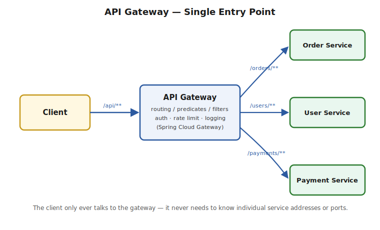

# Part 4 — API Gateway

> **Note:** your source article's table of contents listed "API Gateway" as topic 3, but the article itself never actually covered it — it jumped straight from Circuit Breaker to Load Balancing. This file fills that gap from scratch.

> The problem an API Gateway solves, Spring Cloud Gateway routing/predicates/filters, Zuul (legacy), and the cross-cutting concerns a gateway typically owns. Interview Q&A at the end.

## The Problem It Solves

**Without a gateway:** a client (a mobile app, a browser SPA, an external partner) needs to know the address of every individual microservice it talks to, and every one of those services independently has to implement its own auth checks, rate limiting, logging, and CORS handling. That's N services each duplicating the same cross-cutting logic, and a client tightly coupled to your internal service topology.

**With a gateway:** every external request enters through **one** component, which routes it to the correct backend service, and centralizes the cross-cutting concerns that don't belong in each individual service's business logic.



> ⚠️ **Pitfall:** an API Gateway is **not** the same as service discovery (Part 1) or load balancing (Part 3), even though it may use both internally to reach the actual backend instance. A gateway's distinguishing job is being the single, addressable entry point for **external** traffic and owning **cross-cutting** concerns — it's a superset of "routing," not a synonym for it.

## Spring Cloud Gateway (Modern)

Built on Spring WebFlux (reactive, non-blocking) — the direct replacement for Netflix Zuul.

```xml
<dependency>
    <groupId>org.springframework.cloud</groupId>
    <artifactId>spring-cloud-starter-gateway</artifactId>
</dependency>
```

**Route configuration — three building blocks: Route, Predicate, Filter.**
```yaml
spring:
  cloud:
    gateway:
      routes:
        - id: order-service-route
          uri: lb://order-service          # lb:// = resolve via load balancer + service discovery
          predicates:
            - Path=/orders/**
          filters:
            - StripPrefix=1
            - AddRequestHeader=X-Gateway-Source, api-gateway

        - id: user-service-route
          uri: lb://user-service
          predicates:
            - Path=/users/**
          filters:
            - StripPrefix=1
```
- **Route** — the fundamental unit: an ID, a destination URI, a list of predicates, and a list of filters.
- **Predicate** — the condition that decides whether an incoming request matches this route (path, header, method, query param, time window, and more can all be predicates).
- **Filter** — modifies the request before it's forwarded, and/or the response before it's returned (add headers, strip a path prefix, rewrite the path, apply rate limiting, and so on).

**Java-based route configuration (equivalent, for when config needs to be dynamic/programmatic):**
```java
@Bean
public RouteLocator customRoutes(RouteLocatorBuilder builder) {
    return builder.routes()
        .route("order-service-route", r -> r.path("/orders/**")
            .filters(f -> f.stripPrefix(1)
                            .addRequestHeader("X-Gateway-Source", "api-gateway"))
            .uri("lb://order-service"))
        .build();
}
```

> ⚠️ **Pitfall — `lb://` is doing real work:** the `lb://order-service` URI scheme means "resolve `order-service` via the discovery client, then load-balance across its instances" — it's Parts 1 and 3 of this folder, invoked from inside the gateway. Writing `http://order-service` instead (dropping the `lb://` prefix) silently skips load balancing, which is a subtle, easy-to-miss misconfiguration.

## Zuul (Legacy)

Netflix Zuul (specifically Zuul 1) was the original Spring Cloud gateway solution — **servlet-based and blocking** (thread-per-request), unlike Spring Cloud Gateway's reactive/non-blocking model. Zuul is, like Hystrix and Ribbon, part of the Netflix OSS stack that's now in maintenance mode.

> ⚠️ **Pitfall:** if asked "Zuul vs Spring Cloud Gateway," the correct 10-YOE answer isn't just "Gateway is newer" — it's that Gateway's non-blocking, reactive foundation (built on Project Reactor/Netty) scales to far more concurrent connections per instance than Zuul's blocking servlet model, which matters specifically because a gateway sits in front of **all** traffic and is uniquely exposed to high concurrency. This is the same blocking-vs-non-blocking tradeoff that motivates WebFlux over traditional Spring MVC generally.

## Cross-Cutting Concerns a Gateway Typically Owns

- **Authentication/authorization** — validate a JWT or session token once, at the edge, before any backend service is even reached; backend services can then trust a forwarded identity header rather than each re-implementing token validation.
- **Rate limiting** — throttle by client/IP/API key to protect backend services from being overwhelmed, using something like Spring Cloud Gateway's built-in `RequestRateLimiter` filter (commonly backed by Redis).
- **Request/response transformation** — rewrite paths, add/strip headers, aggregate multiple backend calls into one client-facing response.
- **Centralized logging/metrics/tracing entry point** — a natural place to tag every request with a correlation/trace ID before it fans out to downstream services (ties into distributed tracing — see the Gap Analysis doc).
- **Cross-Origin Resource Sharing (CORS)** — handled once at the gateway instead of duplicated per service.

```java
// JWT validation filter sketch — a GlobalFilter runs on every route
@Component
public class JwtAuthFilter implements GlobalFilter, Ordered {
    @Override
    public Mono<Void> filter(ServerWebExchange exchange, GatewayFilterChain chain) {
        String token = exchange.getRequest().getHeaders().getFirst("Authorization");
        if (token == null || !isValid(token)) {
            exchange.getResponse().setStatusCode(HttpStatus.UNAUTHORIZED);
            return exchange.getResponse().setComplete();
        }
        return chain.filter(exchange); // valid — forward to the resolved route
    }

    @Override
    public int getOrder() { return -1; } // run early, before routing filters

    private boolean isValid(String token) { /* verify signature/expiry */ return true; }
}
```

> ⚠️ **Pitfall — the trap in "put everything at the gateway":** it's tempting to push all business-adjacent logic to the gateway since it's a convenient central point, but a gateway that grows business logic becomes a monolith in disguise — a single point of coupling and failure for every service behind it. The rule of thumb: the gateway owns concerns that are **identical across every service** (auth validation, rate limiting, CORS) — anything specific to one service's domain belongs in that service, not the gateway.

---

## Interview Q&A

**Q: What problem does an API Gateway solve that service discovery and load balancing don't already solve?**
Covered above — discovery and load balancing help a caller reach *a* healthy instance of *a known* service. A gateway is the single external entry point that routes across *different* services and centralizes cross-cutting concerns (auth, rate limiting, transformation) that would otherwise be duplicated in every service.

**Q: Walk through Spring Cloud Gateway's Route/Predicate/Filter model.**
Covered above — a Route is the addressable unit (ID + destination + predicates + filters); a Predicate decides if an incoming request matches the route; a Filter modifies the request/response as it passes through.

**Q: Zuul vs Spring Cloud Gateway — what's the real architectural difference, not just "one is older"?**
Covered above — Zuul 1 is servlet-based and blocking (thread-per-request); Spring Cloud Gateway is reactive and non-blocking (built on Reactor/Netty), which matters specifically because a gateway is uniquely exposed to very high total concurrency across all traffic.

**Q: What does `lb://service-name` mean in a Gateway route's URI, and what happens if you forget it?**
Covered above — it tells the gateway to resolve the destination via the discovery client and apply client-side load balancing across instances. Using a plain `http://` URI instead silently bypasses both, routing to a literal, non-load-balanced address.

**Q: Where do you draw the line on what logic belongs in the gateway vs in individual services?**
Covered above — concerns that are identical across every service (auth token validation, rate limiting, CORS) belong at the gateway; anything specific to one service's business domain does not, to avoid the gateway becoming a coupling bottleneck / monolith in disguise.
