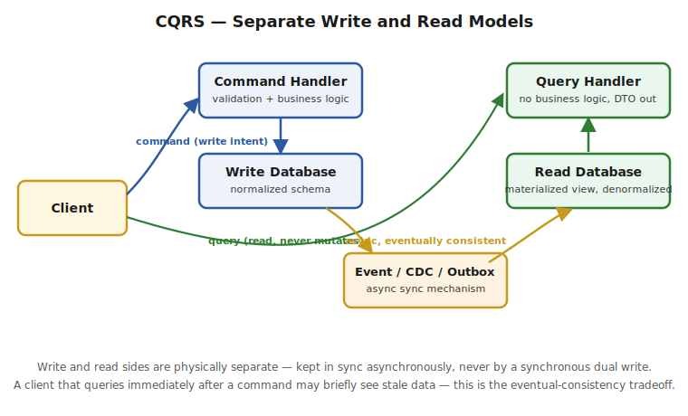

# Part 5 — CQRS (Command Query Responsibility Segregation)

> **Note:** your source article ends its own "How to Sync Databases with CQRS?" section with "we should sync these 2 databases and keep sync always" — without ever saying *how*. That's the single most important part of CQRS in practice, and it's the first thing an interviewer will push on, so it's covered in full below.

> What problem CQRS solves, Commands vs Queries, the materialized view pattern, the real database-sync mechanisms (event sourcing, CDC, outbox), the dual-write trap, eventual consistency, and when CQRS is overkill. Interview Q&A at the end.

## The Problem It Solves

**In a monolith with one database:** that single database has to serve two very different workloads at once — **complex read queries** (joins across many tables, aggregations, reporting) and **write operations** (validation, business rules, transactional updates). These workloads want opposite things from a schema: reads want denormalized, pre-joined, query-optimized shapes; writes want normalized, constraint-enforced, transactionally-safe shapes. As the application grows, a heavy reporting query can lock or slow down the same tables a checkout transaction is trying to write to — the two workloads actively compete for the same resource.

**CQRS's fix:** split the **read model** and **write model** into separate components — often (as your source article emphasizes) backed by **physically separate databases** — each optimized for its own workload, synchronized asynchronously rather than sharing one schema.



## Commands vs Queries

- **Commands** — task-based, intent-expressing operations that **change state** ("AddItemToCart", "PlaceOrder", "CancelSubscription") — not generic "update record" calls, but named business actions. A command handler validates the command, runs business logic, and persists the result to the **write** database. Commands are commonly processed **asynchronously** via a message broker (Kafka, RabbitMQ) rather than a synchronous request/response call, since the caller often only needs to know the command was *accepted*, not its full downstream effect.
- **Queries** — **never modify anything**. A query handler reads from the **read** database (already shaped for exactly this kind of question) and returns a DTO — no business logic, no side effects, just data retrieval.

> ⚠️ **Pitfall:** the "never modifies anything" rule for queries is absolute — a query handler that has any side effect (updating a "last viewed" timestamp, incrementing a view counter) has silently broken the CQRS contract and reintroduced exactly the write-contention-on-the-read-path problem the pattern exists to avoid. If you need to track access side effects, that's itself a command, dispatched separately.

## Materialized View Pattern — the Read Side

**What it is:** a materialized view stores the **actual computed result** of a query physically on disk (unlike a normal SQL view, which re-runs its underlying query every single time it's selected from). This is exactly what makes the read side fast — expensive joins and aggregations are computed **once**, ahead of time, not on every read request.

```sql
-- On-demand (manual) refresh
REFRESH MATERIALIZED VIEW sales_summary;

-- Scheduled (periodic) refresh, e.g. via pg_cron
SELECT cron.schedule(
  'refresh_sales_mv',
  '0 * * * *',   -- every hour
  $$REFRESH MATERIALIZED VIEW sales_mv$$
);
```

**The tradeoff a materialized view always makes:** the moment you refresh it, it starts going **stale** the instant the underlying write-side data changes again. A materialized view refreshed hourly is showing data that's up to an hour old by the time the next refresh runs.

> ⚠️ **Pitfall:** "materialized view" is not a synonym for "the CQRS read model" — it's **one specific technique** for building one, appropriate for read models that can tolerate periodic (not real-time) staleness, like a sales dashboard. A read model that needs to reflect writes within milliseconds (e.g. "show my order as placed immediately after I place it") needs a different sync mechanism — see below.

## How to Actually Sync the Two Databases

This is exactly where the source article stops — "we should sync these two databases" without saying how. Here are the three real mechanisms, in increasing order of how commonly they show up in interviews:

**1. Event Sourcing** — instead of the write side storing *current state* and separately notifying the read side, the write side's source of truth **is** an append-only log of every state-changing event that ever happened ("OrderPlaced", "OrderShipped", "OrderCancelled"). The read side is built by **replaying** these events into whatever denormalized shape a given query needs. This is the "purest" CQRS pairing (CQRS + Event Sourcing are often mentioned together, but they're independent patterns — you can do CQRS without full event sourcing, as the sections below show).

**2. Change Data Capture (CDC)** — a tool (commonly **Debezium**) watches the write database's transaction log (the same write-ahead log the database already uses for its own crash recovery) and streams every row-level change out as an event, typically onto Kafka. The read side consumes these events and updates its own denormalized store. The write side's application code doesn't have to know CDC exists at all — it just writes to its normal database normally, and Debezium reads the log.

**3. Outbox Pattern** — the write side explicitly writes a "this happened" event to an **outbox table**, in the **same local transaction** as the actual business data change (same database, same commit — so it's atomic by construction, not an afterthought). A separate publisher process (polling the outbox table, or CDC reading the outbox table specifically) then reliably publishes those events to Kafka for the read side to consume. See `Gap-Analysis-10YOE.md` in this folder for the full write-up — this is the same Outbox pattern that solves the "update DB + publish event" atomicity problem for Sagas (Part 1–4 of this folder), applied here to CQRS's read/write sync.

## The Dual-Write Trap — the Classic Interview Gotcha

**The naive, broken approach:** "just write to the write DB, then immediately also write to the read DB in the same request." This is a **dual write**, and it is fundamentally unsafe:

```java
// BROKEN — classic dual-write anti-pattern
@Transactional
public void placeOrder(Order order) {
    writeDb.save(order);          // succeeds
    readDb.save(toReadModel(order)); // ...then the process crashes right here
    // now writeDb has the order, readDb doesn't — permanently out of sync, no error raised anywhere
}
```
**Why it's broken:** the two writes go to two **different** databases, so they cannot share one transaction. If the process crashes, the network drops, or the second write simply fails while the first already committed, the two stores are now silently, permanently inconsistent — and there was no error the caller could have caught, because from the caller's perspective the first write already succeeded.

**The fix is exactly the mechanisms above** — CDC or the Outbox pattern make the write side's local database transaction the **only** synchronous, atomic step; propagation to the read side is always a separate, asynchronous, retryable step that doesn't depend on the read database being reachable at the moment of the write.

> ⚠️ **Pitfall — this is the single most-tested CQRS interview question at senior level:** if you propose "write to both databases in the request" as your sync strategy, that's an immediate red flag — it shows you haven't thought through partial failure. The strong answer names the dual-write problem explicitly, then reaches for CDC/Outbox/Event Sourcing specifically *because* they make the write-side commit the only atomic step, with everything else asynchronous and independently retriable.

## Eventual Consistency — the User-Facing Tradeoff

Because the read side is synced **asynchronously**, there's an unavoidable window — milliseconds to (worst case) minutes, depending on your sync mechanism and its health — where the write side has already accepted a change but the read side hasn't caught up yet. A user who submits an order and immediately refreshes an order-history *query* screen can, in principle, briefly not see their own just-placed order.

**Common mitigations:**
- Have the command's response return enough data for the client to render an optimistic "your order was placed" confirmation directly, without needing to immediately re-query the (possibly-lagging) read model.
- For UI flows that need strong read-your-own-writes guarantees, route that specific follow-up read to the **write** database instead of the read replica, just for that one case.

> ⚠️ **Pitfall:** don't present eventual consistency as a free lunch — it's a genuine UX tradeoff you're accepting in exchange for read/write scalability, and pretending otherwise in an interview reads as not having operated one of these systems for real.

## When CQRS Is Overkill

CQRS (and especially CQRS + Event Sourcing) adds real operational complexity: two data stores to run and monitor, a sync mechanism that can itself fail or lag, and genuinely harder local reasoning (state isn't just "what's in the table," it's "what's in the table, as of the last successful sync"). For a simple CRUD service with straightforward reads and writes on the same handful of tables, a single database with a well-indexed schema is simpler, easier to operate, and entirely sufficient.

> ⚠️ **Pitfall — the maturity signal interviewers look for:** naming CQRS as a default architectural choice for every service is a junior mistake dressed up as sophistication. The strong senior answer identifies the **specific symptom** that justifies it — read and write workloads with genuinely conflicting schema/scaling needs, or a read side that needs to serve very different query shapes than the write side's natural transactional model — and says "CQRS is a fit when that symptom shows up, not a default."

---

## Interview Q&A

**Q: What problem does CQRS solve that a single well-designed database can't?**
Covered above under "The Problem It Solves" — read and write workloads want opposite schema shapes (denormalized/query-optimized vs normalized/constraint-safe) and compete for the same resource in one database as load grows; CQRS splits them into independently optimized, independently scaled stores.

**Q: What's the actual difference between a Command and a Query in CQRS, and why does a Query having a side effect break the pattern?**
Covered above — Commands are task-based, state-changing, often async operations; Queries must be pure reads with zero side effects. A "query" that mutates state (e.g. updating a view counter) reintroduces write contention on what's supposed to be the pure-read path.

**Q: How do you keep the write and read databases in sync — and why is "just write to both" wrong?**
Covered above under "The Dual-Write Trap" — writing to both databases in one request is a dual write: the two stores can't share a transaction, so partial failure leaves them silently, permanently inconsistent with no error raised. The real answer is Event Sourcing, CDC (e.g. Debezium reading the write DB's transaction log), or the Outbox pattern — all of which make the write-side commit the only atomic step and treat propagation to the read side as a separate, asynchronous, retriable operation.

**Q: What's a materialized view, and what's its core limitation?**
Covered above — it stores a query's actual computed result instead of recomputing it live, making reads fast, at the cost of the data being only as fresh as its last refresh. Appropriate for read models that can tolerate periodic staleness, not ones needing millisecond freshness.

**Q: What's the user-facing cost of CQRS, and how do you mitigate it?**
Covered above under "Eventual Consistency" — a brief window where the write side has accepted a change the read side hasn't caught up to yet, which can surface as a user not immediately seeing their own write. Mitigate by returning enough data in the command response to render an optimistic confirmation, or by routing specific read-your-own-write queries to the write store directly.

**Q: When would you tell a team NOT to use CQRS?**
Covered above — when read and write workloads don't actually conflict and a single well-indexed database handles both comfortably; CQRS's operational complexity (two stores, a sync mechanism, harder local reasoning about "current" state) needs a concrete justifying symptom, not just architectural fashion.

**Q: How does CQRS relate to Event Sourcing — are they the same thing?**
No — related but independent. CQRS is about separating read and write *models*; Event Sourcing is about making an append-only event log the write side's *source of truth*, with current state derived by replaying events. You can do CQRS with a conventional write database (synced to the read side via CDC/Outbox) without full event sourcing, and the two are frequently conflated in casual discussion — naming the distinction explicitly is a strong signal.
