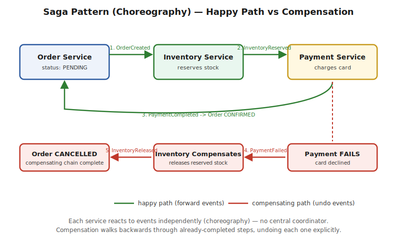

# Part 6 — Saga Pattern

> This is the pattern most candidates fail on at the 10-YOE level — not because the concept is hard, but because most prep material stops at "Choreography vs Orchestration" and never goes end-to-end through a real implementation, the failure modes, or the specific follow-up questions interviewers reach for. This file goes all the way through: the problem, both coordination styles, a complete worked example with real compensation logic, every common pitfall, and a tricky-question bank.

> The problem, local transactions + compensating transactions, Choreography vs Orchestration, an end-to-end small-application implementation (Order/Inventory/Payment via Kafka), saga state and correlation IDs, and the specific pitfalls that fail interviews. Interview Q&A at the end.

## The Problem It Solves

**In a monolith:** "place an order" — debit inventory, charge payment, create the order record — happens inside **one local ACID transaction**. If any step fails, the database rolls back everything automatically. You get atomicity for free.

**In microservices:** Order, Inventory, and Payment are now separate services with separate databases. There is no distributed transaction manager coordinating a single commit across all three in practice — two-phase commit (2PC) technically exists but is almost never used in real microservice systems, because it requires every participant to hold locks and stay available for the duration of the coordinator's decision, which is exactly the kind of tight coupling and availability risk microservices are trying to get away from.

**The Saga pattern's fix:** break the operation into a sequence of **local transactions**, each one committed independently in its own service's database. If a later step fails, you don't roll back — you can't, the earlier steps already committed elsewhere — instead you run explicit **compensating transactions** that semantically undo each already-completed step, in reverse order.



> ⚠️ **Pitfall — the definitional trap interviewers set immediately:** if you describe Saga as "a distributed transaction," you've already lost points. A Saga is explicitly **not** a transaction in the ACID sense — there's no isolation (other transactions can see partial saga state mid-flight — see the Isolation Gap section below) and no automatic rollback. It gives you **eventual consistency with explicit, hand-written compensation**, which is a fundamentally different (and weaker) guarantee than what "transaction" implies. Say this distinction out loud, unprompted — it's the single fastest way to signal real understanding in the first thirty seconds of this question.

## Choreography vs Orchestration

**Choreography** — no central coordinator. Each service subscribes to the events it cares about, does its local transaction, and publishes its own event for the next service to react to. Fully decentralized.

**Orchestration** — a dedicated orchestrator service explicitly calls each participant (or tells it what to do via commands), tracks the saga's current step, and contains all the compensation logic itself. Participants don't know about each other at all — they only know about the orchestrator.

| | Choreography | Orchestration |
|---|---|---|
| Coordination | Implicit — via events, no central brain | Explicit — a dedicated orchestrator owns the flow |
| Coupling between services | Low — each only knows the event shapes it consumes/produces | Services are coupled to the orchestrator's commands, not each other |
| Visibility of the overall flow | Poor — you have to mentally trace event chains across services to see the whole picture | Good — the entire flow lives in one place, in code |
| Best for | A small number of steps (3–4), simple linear flows | Longer/more complex flows, flows needing centralized retry/timeout logic |
| New failure mode it introduces | "Event chain sprawl" — hard to trace at scale, easy to create implicit cycles | The orchestrator itself is a new single point of failure/bottleneck to design around (though it doesn't hold locks, so it's not as fragile as a 2PC coordinator) |

> ⚠️ **Pitfall — this is a design tradeoff question, not a trivia question:** interviewers ask "which would you choose" specifically to see if you reason about the actual flow's shape rather than reciting a definition. The honest, senior answer: choreography for 2–4 steps where the event chain stays easy to hold in your head; orchestration once you're past that, or once you need centralized retry/timeout/alerting logic that would otherwise be duplicated across every participant. Don't present one as universally better.

## End-to-End Worked Example — Small Order System (Choreography, via Kafka)

**The scenario:** placing an order needs to (1) create the order, (2) reserve inventory, (3) charge payment. Any failure after step 1 must compensate backward.

**1. Order Service — starts the saga:**
```java
@Service
public class OrderService {
    private final OrderRepository orderRepository;
    private final KafkaTemplate<String, Object> kafka;

    @Transactional
    public String placeOrder(OrderRequest request) {
        String sagaId = UUID.randomUUID().toString(); // correlation ID — see below
        Order order = new Order(sagaId, request.getItems(), OrderStatus.PENDING);
        orderRepository.save(order); // local transaction #1 — commits here, nowhere else

        kafka.send("order-events", sagaId, new OrderCreated(sagaId, request.getItems(), request.getAmount()));
        return sagaId; // caller gets this back immediately — the saga runs asynchronously from here
    }

    @KafkaListener(topics = "payment-events")
    public void onPaymentEvent(PaymentEvent event) {
        Order order = orderRepository.findBySagaId(event.getSagaId());
        if (event instanceof PaymentCompleted) {
            order.setStatus(OrderStatus.CONFIRMED); // saga's happy-path terminal state
        } else if (event instanceof PaymentFailed) {
            order.setStatus(OrderStatus.CANCELLED);  // saga's compensated terminal state
        }
        orderRepository.save(order);
    }
}
```

**2. Inventory Service — reacts, reserves, and knows how to compensate:**
```java
@Service
public class InventoryService {
    @KafkaListener(topics = "order-events")
    public void onOrderCreated(OrderCreated event) {
        boolean reserved = inventoryRepository.tryReserve(event.getItems()); // local transaction #2
        if (reserved) {
            kafka.send("inventory-events", event.getSagaId(), new InventoryReserved(event.getSagaId(), event.getAmount()));
        } else {
            kafka.send("inventory-events", event.getSagaId(), new InventoryReservationFailed(event.getSagaId()));
        }
    }

    // COMPENSATING TRANSACTION — triggered if a LATER step fails
    @KafkaListener(topics = "payment-events")
    public void onPaymentFailed(PaymentFailed event) {
        inventoryRepository.releaseReservation(event.getSagaId()); // local transaction #2's undo
        kafka.send("inventory-events", event.getSagaId(), new InventoryReleased(event.getSagaId()));
    }
}
```

**3. Payment Service — the step that can actually fail for a real-world reason (declined card):**
```java
@Service
public class PaymentService {
    @KafkaListener(topics = "inventory-events")
    public void onInventoryReserved(InventoryReserved event) {
        boolean charged = paymentGateway.charge(event.getSagaId(), event.getAmount()); // local transaction #3
        if (charged) {
            kafka.send("payment-events", event.getSagaId(), new PaymentCompleted(event.getSagaId()));
        } else {
            kafka.send("payment-events", event.getSagaId(), new PaymentFailed(event.getSagaId()));
        }
    }
}
```

**Tracing the compensating path (this is the part most write-ups skip):** if `PaymentService` fails to charge the card, it publishes `PaymentFailed`. `InventoryService` — which already reserved the stock in step 2 — is listening for exactly that event, and its `onPaymentFailed` handler runs the **compensating transaction**: releasing the reservation it made earlier. `OrderService` is also listening for `PaymentFailed` and marks the order `CANCELLED`. Notice there was no rollback anywhere — three separate local transactions each committed, and the "undo" is a **fourth, explicit local transaction** (`releaseReservation`) that semantically reverses the second one.

> ⚠️ **Pitfall — this is the mistake that fails candidates most often:** treating compensation as "just call rollback on the other service." There is no rollback across services — a compensating transaction is **new code you write**, specific to each step, that produces the *business* effect of undoing the original action. For a reservation, that's straightforward (release the hold). For something like "SendConfirmationEmail," there's no true undo — the compensation might be "send a cancellation email" instead, which is a *semantically* opposite action, not a technical reversal. Some steps are genuinely **not compensable** at all (you can refund a payment, but you can't un-deliver a package that already shipped) — recognizing and calling out non-compensable steps explicitly is exactly the kind of answer that separates a strong candidate from one reciting definitions.

## Saga State and the Correlation ID

Notice every event above carries a `sagaId`. This is not optional — it's how every participant knows **which saga instance** an event belongs to, since many orders are in flight concurrently. In choreography, each service typically persists its own local state keyed by `sagaId` (e.g. Inventory's reservation table keyed by `sagaId`, not just item ID) so that a `PaymentFailed` event days—or even just seconds—later can find and undo the *correct* reservation.

**In orchestration**, this state is centralized instead: the orchestrator maintains an explicit **saga state table** (`sagaId`, current step, status, timestamps) — often literally implemented as a state machine, which makes "what step is this saga stuck on" a simple, single query instead of a cross-service tracing exercise.

## Orchestration Variant — Sketch

```java
@Service
public class OrderSagaOrchestrator {

    public void handle(OrderCreated event) {
        sagaStateRepo.save(new SagaState(event.getSagaId(), Step.INVENTORY_PENDING));
        commandBus.send(new ReserveInventoryCommand(event.getSagaId(), event.getItems()));
    }

    public void handle(InventoryReserved event) {
        sagaStateRepo.updateStep(event.getSagaId(), Step.PAYMENT_PENDING);
        commandBus.send(new ChargePaymentCommand(event.getSagaId(), event.getAmount()));
    }

    public void handle(InventoryReservationFailed event) {
        sagaStateRepo.updateStep(event.getSagaId(), Step.FAILED);
        commandBus.send(new CancelOrderCommand(event.getSagaId())); // no inventory was ever reserved — nothing else to compensate
    }

    public void handle(PaymentFailed event) {
        sagaStateRepo.updateStep(event.getSagaId(), Step.COMPENSATING);
        commandBus.send(new ReleaseInventoryCommand(event.getSagaId())); // explicit compensation, orchestrator-driven
        commandBus.send(new CancelOrderCommand(event.getSagaId()));
    }
}
```
**What changed vs choreography:** `InventoryService` and `PaymentService` no longer need to know about each other's events at all — they only respond to commands from the orchestrator and report results back to it. All the "what happens next, and what needs undoing" logic lives in exactly one place.

## Pitfalls — Why Candidates Actually Fail This Question

**1. Confusing Saga with 2PC / true ACID transactions.** Covered above — say the eventual-consistency, no-isolation distinction explicitly and early.

**2. The Isolation Gap — "can another transaction see a saga's partial state?"** Yes. Between `InventoryReserved` and `PaymentCompleted`, the order genuinely has reserved stock but hasn't been paid for — if another process queries inventory in that window, it sees the reservation as real (correctly), but the *order* is not yet confirmed. This is a real, accepted gap in Saga's guarantees, not a bug. Mitigations exist (semantic locks — mark the record as "pending" so other operations know to treat it specially; commutative updates designed so operation order doesn't matter) but full isolation is never achieved — know this gap exists and be ready to name it.

**3. Assuming compensation always succeeds.** What if `releaseReservation()` itself throws (DB down, network blip)? A saga with no answer to this gets **stuck** — inventory is held forever, the order is neither confirmed nor cancelled. The real answer: compensating transactions need their own retry policy (with backoff), and a **dead-letter queue + alerting** for compensations that exhaust retries — a stuck saga becomes an operational incident, not a silent failure.

**4. No timeout / no terminal state guarantee.** If `PaymentService` never responds at all (crashed, message lost), the saga can sit in `PENDING` forever with no one noticing. Production sagas need an explicit timeout per step (a scheduled job that finds sagas stuck past N minutes and either retries or force-compensates) — this is a detail almost never mentioned in tutorial-level Saga write-ups, and exactly the kind of operational maturity a 10-YOE interviewer is listening for.

**5. Not handling duplicate or out-of-order events.** At-least-once delivery (the Kafka default) means `PaymentCompleted` could be delivered twice, or in rare reordering scenarios, could theoretically be processed before `InventoryReserved` is fully committed locally. Every handler above needs to be **idempotent** (see `Gap-Analysis-10YOE.md` — item 5) — e.g. checking the order's current status before applying a transition, so a duplicate `PaymentCompleted` doesn't double-process.

**6. Choreography event sprawl at scale.** Past 4–5 steps, choreography's implicit event chains become genuinely hard to trace — "which services react to `PaymentFailed`, and in what order do their side effects actually happen" stops being answerable by reading any single file. This is precisely the argument for switching to orchestration, or at minimum adding distributed tracing (`Gap-Analysis-10YOE.md` — item 2) so the event chain is at least observable after the fact.

---

## Interview Q&A

**Q: Walk me through implementing the Saga pattern end-to-end for an order flow with Order, Inventory, and Payment services.**
Use the worked example above — three services, three local transactions (`OrderService` creates the order PENDING, `InventoryService` reserves stock, `PaymentService` charges the card), each publishing an event that triggers the next step, with `InventoryService` and `OrderService` both listening for `PaymentFailed` to run their respective compensating transactions (release reservation, mark order CANCELLED).

**Q: Choreography vs Orchestration — which would you choose, and why?**
Covered above — choreography for short (2–4 step), simple linear flows where low coupling matters most; orchestration once the flow grows past that, or once centralized retry/timeout/alerting logic is needed. Justify with the specific flow's shape, not a blanket preference.

**Q: Is a Saga the same as a distributed transaction? What guarantees is it missing compared to ACID?**
No — covered above under "The Problem It Solves" and "The Isolation Gap." A Saga gives eventual consistency via explicit compensation, not atomicity or isolation — other transactions can observe a saga's partial, in-flight state, which is a real, accepted gap, not an edge case to hand-wave past.

**Q: What happens if a compensating transaction itself fails?**
Covered above under pitfall #3 — the saga gets stuck without an explicit answer. Production systems need retries with backoff on compensations, plus a dead-letter queue and alerting once retries are exhausted, so a stuck saga surfaces as an operational incident rather than silently leaving resources held forever.

**Q: How do you handle duplicate or out-of-order events in a saga?**
Covered above under pitfall #5 — every event handler must be idempotent (check current state before applying a transition), since at-least-once delivery means any event can be redelivered. Cross-references the idempotency write-up in `Gap-Analysis-10YOE.md`.

**Q: How would you know which step a stuck saga is currently on, in production?**
In orchestration, this is a direct query against the orchestrator's saga state table (`sagaId` → current step). In choreography, there's no single source of truth for this by default — you need either a shared saga-state table each participant updates, or distributed tracing (correlation ID propagated through every event) to reconstruct the chain after the fact. This is a concrete reason orchestration is often preferred once operability matters as much as decoupling.

**Q: Not every step can be truly "undone" — how do you handle a non-compensable action, like an email that's already been sent?**
Covered above under the compensation pitfall — compensation is a **semantic** opposite (send a cancellation notice), not a literal technical rollback, and some actions (a package that already shipped) may not be compensable at all. Naming this limitation explicitly, rather than implying every step can always be cleanly undone, is what separates a strong answer from a memorized one.

**Q: What's the correlation ID / sagaId actually for, mechanically?**
Covered above — it's how every participating service (in choreography) or the orchestrator (in orchestration) knows which in-flight saga instance a given event belongs to, since many sagas run concurrently. Every event and every piece of per-step local state must be keyed by it.
