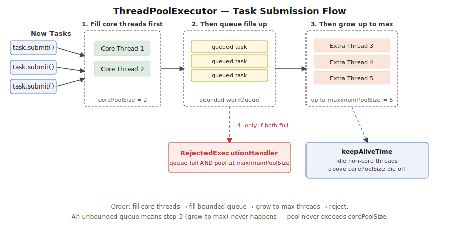

# Part 2 — Executors & Thread Pools

> Why thread pools exist, ThreadPoolExecutor internals, pool types, Callable/Future, rejection policies, shutdown, ForkJoin preview. Interview Q&A at the end.

## Why Thread Pools?

**Problem without a pool:** creating a thread costs real OS resources (see Part 1 — native allocation, stack memory, scheduler registration). 1000 requests → 1000 threads → massive memory overhead + wasted CPU on context switching.

**Solution:** pre-create N threads that wait for work, reuse them, cap max concurrency, and queue tasks when all threads are busy.

**Benefits:** reduced latency, bounded resource usage, higher throughput, task queuing instead of failure.



## ExecutorService

**What it does:** decouples task **submission** from task **execution** — you submit `Runnable`/`Callable` tasks, and the framework manages the underlying thread pool, queueing, and lifecycle, instead of you manually creating/managing `Thread` objects.

Key methods:
- `submit(Callable/Runnable)` — returns a `Future` for the result/completion.
- `execute(Runnable)` — fire-and-forget, no return value.
- `invokeAll(Collection<Callable>)` — run a batch, block until all complete.
- `invokeAny(Collection<Callable>)` — run a batch, return as soon as any one completes.
- `shutdown()` / `shutdownNow()` — lifecycle management.

> ⚠️ **Pitfall:** always pair `shutdown()` with `awaitTermination()` — forgetting to shut down an `ExecutorService` is a common real leak, since non-daemon pool threads keep the JVM alive indefinitely even after the app logically "should" have exited.

### submit() vs execute()

`execute(Runnable)` (from the base `Executor` interface) has no return value — any exception the task throws propagates to the pool's uncaught exception handler, often just logged/lost, invisible to the submitting code.

`submit(Callable/Runnable)` (from `ExecutorService`) returns a `Future<T>` — exceptions thrown inside the task are captured and re-thrown (wrapped in `ExecutionException`) when you call `future.get()`, making failures visible and handleable.

> ⚠️ **Pitfall:** tasks submitted via `execute()` that throw can fail silently with no obvious trace — a genuinely dangerous production pitfall. `submit()` + checking the `Future` surfaces failures properly.

## ThreadPoolExecutor Internals

```java
ThreadPoolExecutor executor = new ThreadPoolExecutor(
    2,                                     // corePoolSize
    5,                                     // maximumPoolSize
    60, TimeUnit.SECONDS,                  // keepAliveTime
    new LinkedBlockingQueue<>(10),         // workQueue
    new ThreadPoolExecutor.AbortPolicy()   // rejection handler
);
```
- **corePoolSize** — minimum threads kept alive, even idle.
- **maximumPoolSize** — hard ceiling on threads.
- **keepAliveTime** — how long an idle *non-core* thread waits before being killed.
- **workQueue** — where tasks wait once all core threads are busy.
- **handler** — what happens if a new task arrives when the queue is full *and* the pool is at `maximumPoolSize`.

**Task submission flow, in exact order:**
1. If fewer than `corePoolSize` threads exist, start a new thread — even if others are idle.
2. Once at `corePoolSize`, new tasks go into the `workQueue`.
3. If the queue is full and threads are below `maximumPoolSize`, spawn additional threads up to the max.
4. If the queue is full **and** at `maximumPoolSize`, the `RejectedExecutionHandler` kicks in.

> ⚠️ **Pitfall — the single most misunderstood detail about ThreadPoolExecutor:** it fills core threads → fills the queue → **then** grows to max → **then** rejects. Many engineers assume it scales to `maximumPoolSize` *before* filling the queue — it doesn't, unless the queue is bounded. This directly explains why a pool with a large `maximumPoolSize` but an **unbounded** queue will *never* actually use more than `corePoolSize` threads, no matter the load — a real, surprising production gotcha.

### Why Executors.newFixedThreadPool() gets criticized

`Executors.newFixedThreadPool(n)` and `Executors.newCachedThreadPool()` are thin factories that construct a `ThreadPoolExecutor` with hardcoded choices: `newFixedThreadPool` uses an **unbounded** `LinkedBlockingQueue`, and `newCachedThreadPool` uses an effectively **unbounded thread count** (`Integer.MAX_VALUE` max pool size).

Both defaults are risky in production: an unbounded queue means the pool never grows past `corePoolSize` no matter the load (tasks queue up indefinitely, risking OOM under sustained overload instead of surfacing backpressure); `newCachedThreadPool`'s unbounded thread count risks unbounded thread creation under bursty load.

**Recommended practice** (Effective Java guidance): construct `ThreadPoolExecutor` directly with explicit, bounded `corePoolSize`, `maximumPoolSize`, a **bounded** queue, and an explicit `RejectedExecutionHandler` — making overload an explicit, handled rejection rather than silent unbounded growth.

## Blocking Queue

**What it does:** a queue that makes a thread wait instead of failing when it tries to take from an empty queue, or put into a full one — this is what feeds tasks to worker threads.

- **Bounded queue** — fixed capacity, e.g. `ArrayBlockingQueue`.
- **Unbounded queue** — no fixed capacity, e.g. `LinkedBlockingQueue`.

## Types of Thread Pool Executors

**1. Fixed Thread Pool** — constant number of threads; extra tasks wait in the queue.
```java
ExecutorService executor = Executors.newFixedThreadPool(2);
executor.submit(() -> System.out.println("Task A on " + Thread.currentThread().getName()));
executor.submit(() -> System.out.println("Task B on " + Thread.currentThread().getName()));
executor.shutdown();
```
**Output:**
```
Task A on pool-1-thread-1
Task B on pool-1-thread-2
```
> ⚠️ **Pitfall:** tasks wait if all threads are busy — no fast-fail, just latency growth.

**2. Cached Thread Pool** — creates threads on demand, reuses idle ones, kills threads idle 60s+.
```java
ExecutorService executor = Executors.newCachedThreadPool();
```
> ⚠️ **Pitfall:** no upper bound on thread count — sustained heavy load can spawn enough threads to exhaust memory or crush the scheduler.

**3. Scheduled Thread Pool** — runs tasks after a delay or repeatedly.
```java
ScheduledExecutorService executor = Executors.newScheduledThreadPool(1);
executor.schedule(() -> System.out.println("Delayed task"), 2, TimeUnit.SECONDS);
```
**Output (after a 2s delay):**
```
Delayed task
```
Relates directly to Spring's `@Scheduled` — Spring's scheduling support is itself built on top of this same JDK mechanism (`scheduleAtFixedRate`/`scheduleWithFixedDelay` mirror Spring's `fixedRate`/`fixedDelay` semantics exactly).

**4. Single Thread Executor** — one worker thread, strict submission order.
```java
ExecutorService executor = Executors.newSingleThreadExecutor();
executor.submit(() -> System.out.println("First"));
executor.submit(() -> System.out.println("Second"));
```
**Output (always):**
```
First
Second
```

**5. Work-Stealing Thread Pool** — each worker has its own queue; idle workers steal from busy ones. Built on `ForkJoinPool` (Part 7).
```java
ExecutorService executor = Executors.newWorkStealingPool();
```
Best for recursive/divide-and-conquer work and parallel streams. Not ideal for blocking I/O.

## Callable vs Runnable

| | Runnable | Callable |
|---|---|---|
| Package | `java.lang` (since 1.0) | `java.util.concurrent` (since 1.5) |
| Return value | No | Yes — via `call()` |
| Checked exceptions | Cannot throw | Can throw |
| Method to override | `run()` | `call()` |

```java
ExecutorService executor = Executors.newSingleThreadExecutor();
Callable<Integer> callable = () -> 42;
Future<Integer> future = executor.submit(callable);
System.out.println("Result: " + future.get());
executor.shutdown();
```
**Output:**
```
Result: 42
```
> ⚠️ **Pitfall:** `submit()` accepts both, but only `Callable` gives you a `Future` carrying a real result — submitting a `Runnable` still gives a `Future<?>`, just one whose `get()` always returns `null` on success.

## invokeAll() and invokeAny()

```java
ExecutorService executor = Executors.newFixedThreadPool(3);
List<Callable<Integer>> tasks = List.of(() -> 1, () -> 2, () -> 3);

List<Future<Integer>> results = executor.invokeAll(tasks); // waits for ALL
for (Future<Integer> f : results) System.out.println(f.get());

Integer firstResult = executor.invokeAny(tasks); // returns as soon as ONE completes, cancels rest
System.out.println("First result: " + firstResult);
executor.shutdown();
```
**Output:**
```
1
2
3
First result: 1
```

## Rejection Policies

What happens when the queue **and** the pool are both full:
- **AbortPolicy** (default) — throws `RejectedExecutionException` on the submitting thread.
- **CallerRunsPolicy** — the submitting thread runs the task itself synchronously, providing natural backpressure (self-throttling the producer).
- **DiscardPolicy** — silently drops the task, no exception, no execution.
- **DiscardOldestPolicy** — evicts the oldest queued task to make room, then queues the new one.

> ⚠️ **Pitfall:** `CallerRunsPolicy` is frequently the best production choice specifically because it's self-throttling — it slows down the *producer* under sustained overload rather than either silently dropping work (`DiscardPolicy`) or failing loudly with no automatic recovery (`AbortPolicy`).

## Shutdown

`shutdown()` — stops accepting new tasks, lets everything already submitted finish naturally. `shutdownNow()` — attempts immediate stop, interrupts running tasks, cancels queued ones, returns the list of tasks that never ran.

> **Best practice:** call `shutdown()`, then `awaitTermination()` to actually wait for graceful shutdown to complete.

## Shutdown Hooks

```java
Runtime.getRuntime().addShutdownHook(new Thread(() -> {
    System.out.println("Cleaning up before JVM exit");
}));
```
A thread the JVM invokes automatically when shutting down (normal exit, `System.exit()`, or `SIGTERM`/Ctrl+C) — a last chance to flush logs, close connections, save state.

> ⚠️ **Pitfall:** shutdown hooks do **not** run on an abrupt JVM crash (native error, `kill -9`) — a best-effort mechanism, not an unconditional guarantee.

## ThreadGroup (legacy, discouraged)

A legacy class for organizing threads into a hierarchy, allowing bulk operations across a group. Discouraged because it doesn't compose with modern `ExecutorService`-based concurrency, and its bulk operations rely on deprecated/unsafe `Thread` methods (`stop()`, `suspend()`, `resume()`).

> The correct modern answer to "how would you manage a group of related threads" is an `ExecutorService`, not `ThreadGroup`.

## Thread Interruption in the Executor Framework

`Future.cancel(true)` attempts to interrupt an already-running task (sets the interrupt flag); `cancel(false)` only prevents the task from starting if it hasn't yet.

The task itself must **cooperate** — interruption is advisory, not forced preemption. A task must periodically check `Thread.currentThread().isInterrupted()` (or naturally propagate `InterruptedException` from a blocking call) and exit cleanly.

> ⚠️ **Pitfall:** "interruption is cooperative, not forced" is the core concept most miss — a task that never checks the interrupt flag simply won't stop no matter how many times `cancel(true)` is called. You can't safely force-kill a thread in modern Java.

---

## Interview Q&A

**Q: Explain the role of ExecutorService and the methods it provides.**
Covered above under "ExecutorService."

**Q: Difference between submit() and execute()?**
Covered above.

**Q: Explain the internal working of ThreadPoolExecutor.**
Covered above — the core/queue/max/reject ordering is the key detail.

**Q: How does the Executor Framework handle task interruption? Best practices?**
Covered above under "Thread Interruption in the Executor Framework." Best practices: never swallow `InterruptedException` silently (handle it, or re-set the flag with `Thread.currentThread().interrupt()`); design long-running tasks with periodic interruption checks; always `shutdown()` + `awaitTermination()`, with `shutdownNow()` as an escalation.

**Q: Difference between Callable and Runnable?**
Covered above.

**Q: Why does `Executors.newFixedThreadPool()` get criticized in favor of constructing `ThreadPoolExecutor` directly?**
Covered above.

**Q: What happens when a thread pool's queue is full and it's at max pool size?**
Covered above under "Rejection Policies."

**Q: What is a shutdown hook, and what is it used for?**
Covered above.

**Q: What is ThreadGroup, and why is it discouraged?**
Covered above.

**Q: When would you use a ScheduledThreadPool, and how does it relate to `@Scheduled` in Spring?**
Covered above under "Types of Thread Pool Executors."

**Q: Difference between Future and CompletableFuture?**
`Future<T>` retrieval is **blocking-only** via `get()` — no callback attachment, no combining multiple futures, no manual completion. `CompletableFuture<T>` adds non-blocking completion handling, fluent chaining/composition, and explicit manual completion. See the dedicated CompletableFuture guide for the full picture.
> ⚠️ **Pitfall:** "CompletableFuture doesn't block" is only true if you use its callback methods — calling `.get()` on a `CompletableFuture` blocks exactly like a plain `Future`.
