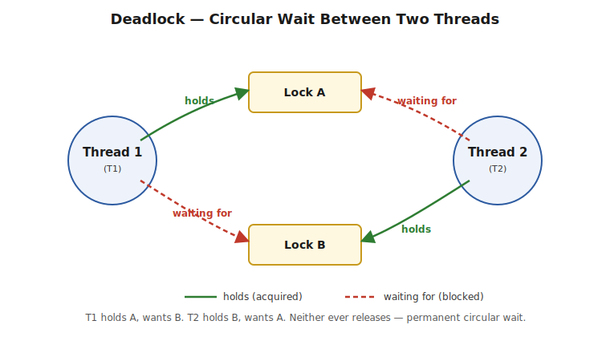

# Part 4 — Locks

> synchronized vs ReentrantLock, fairness, double-checked locking, ReadWriteLock, StampedLock, optimistic vs pessimistic locking, deadlock/livelock/starvation. Interview Q&A at the end.

## synchronized vs ReentrantLock

**What ReentrantLock does:** works like `synchronized` (only one thread in the critical section at a time), but as an explicit object you call `.lock()`/`.unlock()` on — unlocking extra features `synchronized` doesn't have.

| Feature | synchronized | ReentrantLock |
|---|---|---|
| Lock management | Automatic (JVM) | Manual |
| Lock release | Automatic | `unlock()` required |
| Exception safety | Automatic release | Must use `finally` |
| `tryLock()` | ❌ No | ✅ Yes |
| Timeout | ❌ No | ✅ Yes |
| Interruptible waiting | ❌ No | ✅ `lockInterruptibly()` |
| Fairness | ❌ No | ✅ Supported |
| Reentrant | ✅ Yes | ✅ Yes |
| Multiple Conditions | ❌ No | ✅ Yes |

**1. tryLock() — attempt without blocking:**
```java
Lock lock = new ReentrantLock();
if (lock.tryLock()) {
    try {
        System.out.println("Lock acquired, doing work");
    } finally { lock.unlock(); }
} else {
    System.out.println("Could not acquire lock, moving on");
}
```
**Output (no contention):**
```
Lock acquired, doing work
```

**2. tryLock(timeout) — wait, but only up to a limit:**
```java
if (lock.tryLock(2, TimeUnit.SECONDS)) {
    try { System.out.println("Got lock within 2s"); } finally { lock.unlock(); }
} else {
    System.out.println("Gave up waiting for lock");
}
```

**3. Fairness policy:**
```java
Lock fair = new ReentrantLock(true);   // first-come-first-served
Lock unfair = new ReentrantLock();     // default, higher throughput
```
By default (unfair), the JVM can let a thread "jump the queue" for better throughput ("barging"); with `fair`, waiting threads are served strictly FIFO.
> ⚠️ **Pitfall:** fair locks have lower throughput because they add scheduling overhead and prevent barging. Use fairness only when preventing starvation matters more than raw performance.

**4. Interruptible locking:**
```java
lock.lockInterruptibly(); // can be interrupted while waiting — NOT possible with synchronized
```

**5. Multiple condition variables:**
```java
Condition notFull = lock.newCondition();
Condition notEmpty = lock.newCondition();
```

**Exception safety — why `synchronized` can never leak a lock:** when an exception occurs inside a `synchronized` block, the JVM automatically releases the monitor as the thread exits, whether normally or via exception. The exception itself still propagates to the caller unchanged.

```java
// WRONG with ReentrantLock — lock leaks forever if doSomething() throws
lock.lock();
doSomething();
lock.unlock(); // never reached on exception!

// CORRECT
lock.lock();
try {
    doSomething();
} finally {
    lock.unlock();
}
```
> ⚠️ **Pitfall — the biggest mistake with ReentrantLock:** forgetting `unlock()` in a `finally` block. Unlike `ReentrantLock`, `synchronized` can never leak a lock, because the JVM releases it automatically on block exit, exception or not.

**Reentrancy** — both are reentrant: a thread that already owns the lock can acquire it again without deadlocking itself.
```java
lock.lock();
lock.lock();
try {
    // ...
} finally {
    lock.unlock();
    lock.unlock();
}
```

**When to use which:**
- **synchronized** — simple critical sections, automatic lock management, less error-prone, most business applications.
- **ReentrantLock** — when you need `tryLock()`, timeouts, interruptible acquisition, fairness, or multiple `Condition`s.

## Fair Locking in Practice

Multiple threads contending for a lock, with no guarantee the longest-waiting thread goes next by default — this is **unfair locking**, and it can lead to starvation, where a thread waits indefinitely while others repeatedly cut in line.

```java
Lock fairLock = new ReentrantLock(true); // fairness enabled
```
> ⚠️ **Pitfall:** fair locks trade throughput for starvation-prevention — only reach for `true` when starvation is the bigger risk to your system than raw speed.

## Double-Checked Locking

```java
class Singleton {
    private static volatile Singleton instance; // volatile is NOT optional
    public static Singleton getInstance() {
        if (instance == null) {                    // first check, no lock — fast path
            synchronized (Singleton.class) {
                if (instance == null) {             // second check, inside lock
                    instance = new Singleton();
                }
            }
        }
        return instance;
    }
}
```
**What it does:** reduces synchronization overhead in a lazy Singleton by locking only during first initialization. The first null check avoids locking once the instance exists; the second null check (inside the lock) ensures only one thread actually creates the instance if multiple threads passed the first check simultaneously.

**Why `volatile` is mandatory:** object creation isn't atomic — it involves memory allocation, constructor execution, and reference assignment. Without `volatile`, the JVM may reorder these steps, letting another thread observe a non-null reference to a **partially constructed** object. `volatile` prevents this reordering and guarantees safe publication.

> ⚠️ **Pitfall:** in modern Java, the **Initialization-on-Demand Holder Idiom** (a private static inner class holding the instance, relying on the JVM's guaranteed thread-safe class-loading) is generally preferred — it achieves the same lazy, lock-free-after-init behavior with no `volatile` subtlety at all.

## ReadWriteLock

**What it does:** splits locking into two modes — a **read lock** many threads can hold simultaneously, and a **write lock** only one thread can hold, with zero readers active. This is the key difference from `synchronized`/`ReentrantLock`, which only ever let *one* thread in, period.

**Exact rules:**
```
R1 + R2 + R3   ✅ allowed   — multiple readers can hold the read lock simultaneously
R1 + W         ❌ blocked   — a reader and a writer can never overlap
W1 + W2        ❌ blocked   — writers are always mutually exclusive
W1 alone       ✅ allowed   — a writer can hold the lock with zero readers present
```

```java
import java.util.concurrent.locks.ReentrantReadWriteLock;

public class Cache {
    private final Map<String, String> data = new HashMap<>();
    private final ReentrantReadWriteLock rwLock = new ReentrantReadWriteLock();
    private final Lock readLock = rwLock.readLock();
    private final Lock writeLock = rwLock.writeLock();

    public String get(String key) {
        readLock.lock();
        try {
            System.out.println(Thread.currentThread().getName() + " reading");
            return data.get(key);
        } finally {
            readLock.unlock();
        }
    }

    public void put(String key, String value) {
        writeLock.lock();
        try {
            System.out.println(Thread.currentThread().getName() + " writing");
            data.put(key, value);
        } finally {
            writeLock.unlock();
        }
    }

    public static void main(String[] args) {
        Cache cache = new Cache();
        cache.put("k1", "v1");
        new Thread(() -> cache.get("k1")).start();
        new Thread(() -> cache.get("k1")).start();
    }
}
```
**One possible output:**
```
main writing
Thread-0 reading
Thread-1 reading
```
> ⚠️ **Pitfall:** `ReentrantReadWriteLock` can starve writers under sustained heavy read load, since there's rarely a gap with zero active readers (unless you use `new ReentrantReadWriteLock(true)` for fairness).

## StampedLock

**What it does:** an even faster alternative to `ReadWriteLock` for read-heavy workloads, adding a third mode — **optimistic read** — that takes no lock at all; it just checks afterward whether anything changed. If nothing changed, you skip locking entirely; if something did, you fall back to a real read lock.

Introduced in Java 8. Every lock/unlock passes around a **stamp** (a `long` version number) — this is what makes "did anything change?" checkable.

Three modes: **Write Lock** (exclusive), **Read Lock** (shared), **Optimistic Read** (lock-free).

> ⚠️ **Pitfall — why not just ReadWriteLock?** Under sustained read load a writer can starve indefinitely. Also, every reader still pays CAS overhead on the shared reader-count even without blocking — `StampedLock`'s optimistic mode avoids even that cost.

**Optimistic Read, step by step:**
1. `tryOptimisticRead()` returns a stamp — no lock, no CAS, no blocking of writers at all.
2. The reader copies every needed field into local variables — untrustworthy so far, since a writer could be mutating mid-read.
3. `validate(stamp)` — if `true` (no write happened since step 1), the copied values are safe to use.
4. **If validation fails**, the optimistic read is discarded, and the reader falls back to a real `readLock()`.

```java
import java.util.concurrent.locks.StampedLock;

public class Point {
    private double x, y;
    private final StampedLock sl = new StampedLock();

    public void move(double deltaX, double deltaY) {
        long stamp = sl.writeLock();
        try {
            x += deltaX;
            y += deltaY;
        } finally {
            sl.unlockWrite(stamp);
        }
    }

    public double distanceFromOrigin() {
        long stamp = sl.tryOptimisticRead();
        double currentX = x, currentY = y;

        if (!sl.validate(stamp)) {
            stamp = sl.readLock();
            try {
                currentX = x;
                currentY = y;
            } finally {
                sl.unlockRead(stamp);
            }
        }
        return Math.sqrt(currentX * currentX + currentY * currentY);
    }

    public static void main(String[] args) {
        Point p = new Point();
        p.move(3, 4);
        System.out.println("Distance: " + p.distanceFromOrigin());
    }
}
```
**Output:**
```
Distance: 5.0
```
> ⚠️ **Pitfall:** `StampedLock` is **not reentrant** (unlike `ReentrantReadWriteLock`) and doesn't support `Condition` objects — reacquiring it recursively on the same thread will deadlock. Don't use it as a drop-in `ReentrantReadWriteLock` replacement without checking these constraints.

## Optimistic vs Pessimistic Locking (database/JPA context)

**Pessimistic Locking** — assumes conflicts are likely; acquires a lock **before** reading or updating the data; other transactions must wait until it's released; held until commit/rollback.
```java
@Lock(LockModeType.PESSIMISTIC_WRITE)
Account findById(Long id);
```
Generated SQL: `SELECT * FROM account WHERE id=1 FOR UPDATE;`
- **Advantages:** prevents conflicting updates, guarantees consistency.
- **Disadvantages:** lower concurrency, transactions may block, can lead to deadlocks.

**Optimistic Locking** — assumes conflicts are rare; no upfront lock; multiple transactions can read/modify concurrently; on commit, checks a `@Version` column to detect conflicts.
```java
@Entity
public class Account {
    @Id
    private Long id;
    private int balance;
    @Version
    private Integer version;
}
```
If the version changed, Hibernate throws `OptimisticLockException`.
- **Advantages:** better concurrency, no blocking, high throughput — ideal for read-heavy apps.
- **Disadvantages:** transaction may fail on version mismatch; app must retry or notify the user.

**When to use which:**
```
Optimistic  -> Read-heavy, conflicts rare, high concurrency needed
              (user profiles, product catalogs, blog posts)
Pessimistic -> Frequent updates, high contention, retry is expensive
              (bank accounts, wallet balances, stock inventory, ticket booking)
```
> ⚠️ **Pitfall:** optimistic locking doesn't *prevent* concurrent updates — it only *detects* conflicts at commit time via `@Version`, and you must handle `OptimisticLockException` by retrying or informing the user. Pessimistic locking holds a row-level lock until commit/rollback — long transactions reduce concurrency and can deadlock if different transactions acquire locks in different orders.

## Deadlock

**What it is:** two or more threads each waiting for a lock the other holds, so *neither* can ever proceed. The program doesn't crash — it just freezes forever on those threads.

Four conditions must **all** hold: **mutual exclusion**, **hold and wait**, **no preemption**, **circular wait**.



```java
public class DeadlockDemo {
    static final Object lockA = new Object();
    static final Object lockB = new Object();

    public static void main(String[] args) {
        Thread t1 = new Thread(() -> {
            synchronized (lockA) {
                System.out.println("Thread 1: holding Lock A...");
                try { Thread.sleep(100); } catch (InterruptedException e) {}
                System.out.println("Thread 1: waiting for Lock B...");
                synchronized (lockB) {
                    System.out.println("Thread 1: acquired Lock B!");
                }
            }
        });
        Thread t2 = new Thread(() -> {
            synchronized (lockB) {
                System.out.println("Thread 2: holding Lock B...");
                try { Thread.sleep(100); } catch (InterruptedException e) {}
                System.out.println("Thread 2: waiting for Lock A...");
                synchronized (lockA) {
                    System.out.println("Thread 2: acquired Lock A!");
                }
            }
        });
        t1.start();
        t2.start();
    }
}
```
**Output (then hangs forever):**
```
Thread 1: holding Lock A...
Thread 2: holding Lock B...
Thread 1: waiting for Lock B...
Thread 2: waiting for Lock A...
[program hangs here indefinitely]
```

**How to avoid it:**
- **Lock ordering** — always acquire multiple locks in the same global order everywhere in the codebase — eliminates circular wait entirely, the most robust fix.
- **tryLock() with timeout** — a thread that can't get the second lock within a bound gives up and releases what it holds, rather than waiting forever.
- **Reduce lock scope** — avoid holding two locks simultaneously where the nested requirement isn't essential.
- **Detect via thread dump** (`jstack <pid>`) — the JVM explicitly reports "Found one Java-level deadlock" naming the exact threads and locks. Programmatically, `ThreadMXBean.findDeadlockedThreads()` does the same in-process — useful for an automated health check.

> ⚠️ **Pitfall:** lock ordering is the most robust solution because it *prevents* deadlocks rather than just recovering from them. If asked "how would you detect this in production," the answer is a thread dump, not staring at logs.

## Livelock and Starvation

**Livelock** — threads keep actively responding to each other, but nothing gets done, like two people repeatedly stepping aside for each other in a hallway, forever. Unlike deadlock, threads are **not blocked** — they're busy the whole time, just unproductively.

**Starvation** — a thread is repeatedly denied a resource because other threads keep getting served ahead of it, often due to priority or aggressive acquisition patterns.

> ⚠️ **Pitfall — distinguishing all three:** Deadlock = threads permanently blocked, stuck. Livelock = threads permanently busy, but never progressing. Starvation = a thread simply never gets its turn, even though the system overall is making progress.

## Diagnosing Locks and Deadlocks

**Checking if the current thread holds a lock:**
```java
synchronized (lock) {
    System.out.println(Thread.holdsLock(lock)); // true
}

ReentrantLock reentrantLock = new ReentrantLock();
reentrantLock.lock();
try {
    System.out.println(reentrantLock.isHeldByCurrentThread()); // true
    System.out.println(reentrantLock.getHoldCount());          // 1
} finally {
    reentrantLock.unlock();
}
```
`Thread.holdsLock(obj)` is static, checks **only the calling thread**, and returns `true` only if it holds `obj`'s monitor. For `ReentrantLock`, use `isHeldByCurrentThread()` or `getHoldCount()` for reentrancy depth.
> ⚠️ **Pitfall:** `Thread.holdsLock()` cannot check whether *another* thread holds the lock — that requires thread-dump-based inspection instead.

**Getting a thread dump:**
- `jstack <pid>` — dumps stack traces of all threads, including lock ownership and automatic deadlock detection.
- `kill -3 <pid>` (Unix) — sends `SIGQUIT`; the JVM prints a thread dump to stdout/log without killing the process.
- `jcmd <pid> Thread.print` — modern unified diagnostic tool equivalent.
- Programmatically: `Thread.getAllStackTraces()` returns a `Map<Thread, StackTraceElement[]>` for in-process inspection.

> ⚠️ **Pitfall:** `jstack`/`SIGQUIT` explicitly reports **detected deadlocks** at the end of the dump — usually the first thing to check when investigating an unresponsive application.

---

## Interview Q&A

**Q: Difference between Optimistic and Pessimistic Locking?**
Covered above.

**Q: Difference between synchronized and ReentrantLock?**
Covered above — see the full feature comparison table.

**Q: Multiple threads contending for a lock — how do you ensure fair (FIFO) acquisition?**
Covered above under "Fair Locking in Practice."

**Q: What is double-checked locking, and why does it need volatile to actually work?**
Covered above.

**Q: What is StampedLock?**
Covered above.

**Q: ReentrantReadWriteLock vs StampedLock — what does "optimistic read" actually mean?**
Covered above — `StampedLock` adds a lock-free optimistic path that `ReentrantReadWriteLock` doesn't have; `StampedLock` isn't reentrant and doesn't support `Condition`, so it's not a drop-in replacement.

**Q: What is the Condition interface, and how does it improve on wait()/notify()?**
See Part 3.

**Q: ReadWriteLock — what are the exact concurrency rules between readers and writers?**
Covered above.

**Q: Walk through detecting and fixing a deadlock end-to-end.**
Covered above under "Deadlock."

**Q: How do you check if a thread holds a lock or not?**
Covered above under "Diagnosing Locks and Deadlocks."

**Q: How do you get a thread dump in Java?**
Covered above.
