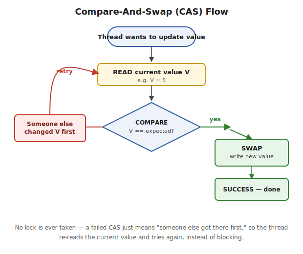

# Part 5 — Memory Model & Lock-Free Concurrency

> volatile, visibility vs atomicity, false sharing, CAS, the ABA problem, AtomicReference/LongAdder, Java Memory Model happens-before. Interview Q&A at the end.

## The Core Idea

`volatile` solves the **visibility** problem by ensuring updates made by one thread become visible to other threads, and by preventing harmful instruction reordering. It does **not** provide **atomicity** — operations like `count++` still require `AtomicInteger`, `synchronized`, or `Lock`. Lock-free concurrency solves atomicity a different way: via CAS (Compare-And-Swap), letting threads update shared data without ever blocking.

## volatile — Visibility and When to Use It

**What it does:** guarantees that a write to a `volatile` variable is immediately visible to every subsequent read of that same variable by any thread — establishing a **happens-before** relationship.

```java
volatile boolean running = true;

// Thread A
running = false;

// Thread B
while (running) {
    // exits after seeing false
}
```
Without `volatile`, Thread B might keep reading a stale cached `true` and never exit the loop.

**The guarantee goes further than just the volatile field itself:** a `volatile` write forces the *entire* set of variables visible to the writing thread at that point to be flushed to main memory, not just the `volatile` field — and symmetrically, a subsequent `volatile` read by another thread guarantees it sees the latest value of *every* one of those variables, not only the `volatile` one. This is precisely a **happens-before** edge (see the JMM section later in this file) — everything the writing thread did before the volatile write becomes visible to anything the reading thread does after the volatile read.

```java
class Config {
    private int timeout = 30;      // plain field
    private String mode = "default"; // plain field
    private volatile boolean ready = false; // volatile field

    void configure() {
        timeout = 60;       // (1) plain write
        mode = "fast";      // (2) plain write
        ready = true;       // (3) volatile write — publishes (1) and (2) too
    }

    void useConfig() {
        if (ready) {                      // volatile read
            System.out.println(timeout + " " + mode); // guaranteed to see 60 "fast", never 30 "default"
        }
    }
}
```
> ⚠️ **Pitfall:** this is why `volatile` is the idiomatic way to **safely publish** a fully-built object or a group of related fields — set every plain field first, then the `volatile` flag last. Readers who check the `volatile` flag are guaranteed to see the plain fields as they were at that point, even though those fields themselves are never marked `volatile`. Reversing the write order (setting `ready` before `timeout`/`mode`) breaks the guarantee entirely.

**Appropriate when:** (a) only one thread ever writes, others only read (a status flag like `volatile boolean running`), or (b) the variable's new value doesn't depend on its own previous value (no read-modify-write).

> ⚠️ **Pitfall:** the most common mistake is using `volatile` on a counter and assuming `count++` is now thread-safe — it isn't, since increment is a compound (read-then-write) operation. `volatile` only fixes visibility, not atomicity.

## Visibility vs Atomicity — the Precise Distinction

**Visibility** means changes made by one thread become visible to other threads. **Atomicity** means an operation executes as one indivisible unit, with no interference from other threads. `volatile` provides visibility and ordering guarantees, but **not** atomicity.

`count++` is not atomic because it's really three steps: read, modify, write. To achieve atomicity, use `synchronized`, `Lock`, or `Atomic*` classes — these provide **both** visibility and atomicity, whereas `volatile` alone only provides visibility.

## The "Not Atomic" counter++ Problem, Traced Step by Step

```java
class SharedResource {
    int counter = 0;
    public void increment() { counter++; } // NOT atomic — 3 separate steps
}
```
`counter++` is three separate CPU steps: **(1) Load** — read the current value. **(2) Increment** — add 1 in a register. **(3) Store** — write the register value back to memory. Because these are separate steps, another thread can interleave:

| Time | Thread A | Thread B | Memory |
|---|---|---|---|
| T1 | Load: reads 10 | — | 10 |
| T2 | — | Load: reads 10 | 10 |
| T3 | Increment: 10+1=11 | — | 10 |
| T4 | Store: writes 11 | — | 11 |
| T5 | — | Increment: 10+1=11 | 11 |
| T6 | — | Store: writes 11 **(LOST!)** | 11 |

Thread B loaded the value *before* Thread A's store landed — one increment is silently lost. Run two threads each incrementing 200 times (expecting 400 total) and you'll typically see something less than 400.

```java
// Fix 1 — synchronized (blocks, mutual exclusion)
class SharedResourceSync {
    private int counter = 0;
    public synchronized void increment() { counter++; }
    public synchronized int get() { return counter; }
}

// Fix 2 — lock-free via AtomicInteger (preferred under high contention)
class SharedResourceAtomic {
    private AtomicInteger counter = new AtomicInteger(0);
    public void increment() { counter.incrementAndGet(); }
    public int get() { return counter.get(); }
}

public class Demo {
    public static void main(String[] args) throws InterruptedException {
        SharedResourceAtomic resource = new SharedResourceAtomic();
        Runnable task = () -> { for (int i = 0; i < 1000; i++) resource.increment(); };
        Thread t1 = new Thread(task);
        Thread t2 = new Thread(task);
        t1.start(); t2.start();
        t1.join(); t2.join();
        System.out.println("Final count: " + resource.get());
    }
}
```
**Output:**
```
Final count: 2000
```
> ⚠️ **Pitfall:** this same problem is why `volatile int counter` alone does **not** fix a counter — `volatile` only guarantees visibility of the latest value, not atomicity of the compound read-modify-write. The interleaving in the table above happens regardless of visibility, because the problem is the three-step compound operation.

## False Sharing

**What it is:** CPU caches operate on **cache lines** (typically 64 bytes), not individual variables. If two unrelated variables written by *different* threads happen to land on the same cache line, a write by one thread invalidates the entire line in the other thread's core cache — even though the threads aren't logically sharing any data. This forces expensive cache-coherency traffic purely as a memory-layout side effect — a correctness-free but severe performance bug, often invisible until you profile at the cache level.

**Fix — padding:**
```java
class PaddedCounter {
    volatile long value;
    long p1, p2, p3, p4, p5, p6, p7; // padding to fill the rest of the cache line
}
```
Or use `@jdk.internal.vm.annotation.Contended` (`@Contended`), which the JVM handles automatically.

> ⚠️ **Pitfall:** false sharing is invisible in code review and most profilers unless you specifically look for cache-line contention. Classic real-world example: an array of per-thread counters, where adjacent array slots (adjacent in memory) are written by different threads — naive "one counter per thread in an array" designs are exactly where this bites.

## Lock-Free Mechanism (CAS)

**What it does:** lets multiple threads safely update shared data **without ever taking a lock** — instead of blocking a thread that can't get a lock, the hardware-level **CAS (Compare-And-Swap)** instruction lets a thread attempt an update and automatically fail/retry if someone else got there first.

**CAS takes 3 parameters:** the memory location, the value you expect is currently there, and the new value you want to write. The CPU writes the new value **only if** the current value still matches — otherwise it does nothing, and your code notices and retries.



```java
// Conceptually what AtomicInteger.incrementAndGet() does:
int current;
do {
    current = get();
} while (!compareAndSet(current, current + 1)); // retry if another thread changed it first
```

The processor: **Read** current value → **Compare** to expected → **Swap** if they match, else retry.

## Busy Spinning

**What it is:** a thread repeatedly checking a condition in a tight loop without calling `wait()`/`sleep()`, never yielding the CPU — burns cycles continuously instead of blocking.

**Rare legitimate use:** extremely low-latency scenarios (high-frequency trading, some lock-free data structures) where the expected wait time is shorter than a context-switch's cost — spinning briefly can be faster than sleeping for very short waits, at the cost of burning a full CPU core.

> ⚠️ **Pitfall:** this is a narrow, specialized optimization — default instinct in ordinary application code should always be to block properly (`wait`/`Lock`/blocking queues), not spin.

## The ABA Problem

**What it is:** CAS only checks whether the value *looks* the same as before — not whether it was *touched* in between.

1. Thread 1 reads value A.
2. Thread 1 is preempted.
3. Thread 2 changes A → B → back to A.
4. Thread 1 resumes, does CAS, sees A, assumes nothing changed — swap succeeds.

> ⚠️ **Pitfall:** for a plain counter, A→B→A is harmless (still logically correct). But for something like a lock-free stack (where the "value" is a node reference), this can corrupt the structure — a reused/recycled node reference can pass the CAS check while the actual underlying structure has changed.

**The fix — `AtomicStampedReference`:** pairs the value with a **stamp** (version counter) that increments on every update, so even if the value cycles A→B→A, the stamp has moved on and the CAS can tell state actually changed.

```java
import java.util.concurrent.atomic.AtomicStampedReference;

public class AbaFixDemo {
    public static void main(String[] args) {
        AtomicStampedReference<Integer> ref = new AtomicStampedReference<>(100, 0);

        int[] stampHolder = new int[1];
        Integer currentValue = ref.get(stampHolder);
        int currentStamp = stampHolder[0];

        boolean updated = ref.compareAndSet(currentValue, 200, currentStamp, currentStamp + 1);
        System.out.println("Updated: " + updated + ", new value: " + ref.getReference() + ", new stamp: " + ref.getStamp());
    }
}
```
**Output:**
```
Updated: true, new value: 200, new stamp: 1
```
(`AtomicMarkableReference` is the sibling variant — pairs the reference with a `boolean` mark instead of a version stamp, when you just need a yes/no "has this been touched" flag rather than a full version count.)

> ⚠️ **Pitfall:** don't just define CAS in an interview — the ABA problem is the specific follow-up senior interviewers reach for to test whether you understand CAS's actual limitation, not just its happy path.

## AtomicReference and LongAdder

**AtomicReference** — the same CAS idea as `AtomicInteger`, but for object references. Lets you atomically swap an entire object pointer without a lock.
```java
AtomicReference<String> configRef = new AtomicReference<>("v1");
boolean changed = configRef.compareAndSet("v1", "v2");
System.out.println("Changed: " + changed + ", value: " + configRef.get());
```
**Output:**
```
Changed: true, value: v2
```

**LongAdder vs AtomicLong — why LongAdder wins under high contention:** `AtomicLong` is a single CAS-guarded `long` — under high contention, many threads all retry their CAS loop against the *same* memory location, causing significant contention/cache-line bouncing as thread counts scale up. `LongAdder` (Java 8+) internally maintains an array of separate, padded `Cell`s (tying back to false sharing above); concurrent threads update **different cells**, dramatically reducing contention — `sum()` totals all cells only when you actually need the aggregate.

```java
LongAdder counter = new LongAdder();
counter.increment();
counter.increment();
counter.add(5);
System.out.println("Total: " + counter.sum());
```
**Output:**
```
Total: 7
```
> ⚠️ **Pitfall:** `LongAdder` trades off read cost (summing cells) for write scalability — use it specifically for **write-heavy, read-rarely** counters (metrics incremented constantly, read only occasionally on a dashboard). It doesn't support CAS-style operations like `compareAndSet` the way `AtomicLong` does. For a counter read as often as it's written, `AtomicLong` remains the simpler, equally valid choice.

## Volatile vs CAS

**The distinction:** `volatile` only guarantees a **visibility** — once written, other threads see the new value right away — it says nothing about doing a read-modify-write safely. **CAS** guarantees an entire read-modify-write cycle happens as one uninterruptible step (**atomicity**).

| Time | Thread A | Thread B | RAM | Why it fails |
|---|---|---|---|---|
| T1 | Reads 10 | — | 10 | volatile ensures visibility of latest value |
| T2 | — | Reads 10 | 10 | Both threads now hold local copy = 10 |
| T3 | Calculates 11 | Calculates 11 | 10 | Calculation happens in CPU registers, not RAM |
| T4 | Writes 11 | — | 11 | RAM updated by Thread A |
| T5 | — | Writes 11 | 11 | ❌ Lost update — should be 12 |

> **Interview one-liner:** `AtomicInteger.incrementAndGet()` uses CAS internally, guaranteeing atomicity + visibility while avoiding the blocking overhead of traditional locks.

## Java Memory Model — happens-before

**What it's actually explaining:** without coordination, the JVM/CPU are free to reorder instructions and cache values per-core for performance — meaning a write by Thread A might never become visible to Thread B, not because of *timing*, but because the JVM never guaranteed it would be. The **happens-before** relationship is the JVM's rule for exactly when a write is guaranteed visible to a later read on another thread.

**Key happens-before rules:**
- A `synchronized` block's exit happens-before the next thread's entry into a synchronized block on the *same* monitor.
- A `volatile` write happens-before every subsequent `volatile` read of that same field.
- `Thread.start()` happens-before anything the started thread does.
- Everything a thread does happens-before another thread's successful `Thread.join()` on it.

> ⚠️ **Pitfall:** this is *why* `synchronized`/`volatile` matter beyond "mutual exclusion" — without a happens-before edge, a value written by Thread A might never become visible to Thread B, not due to timing, but because the JVM/CPU never flushed it to shared memory, or Thread B's core is reading a stale cached copy.

---

## Interview Q&A

**Q: When is the volatile keyword used?**
Covered above.

**Q: Difference between visibility and atomicity in multithreading?**
Covered above.

**Q: What is false sharing, and how do you fix it?**
Covered above.

**Q: What is busy spinning, and when (rarely) is it actually useful?**
Covered above.

**Q: Explain the CAS loop behind AtomicInteger, and what the ABA problem is.**
Covered above.

**Q: LongAdder vs AtomicLong — why does LongAdder win under high contention?**
Covered above.

**Q: Trace through why counter++ isn't atomic — step by step, with a concrete race.**
Covered above under "The 'Not Atomic' counter++ Problem."

**Q: Does a volatile write only guarantee visibility of the volatile variable itself, or more than that?**
More than that — covered above. A `volatile` write flushes every variable visible to the writing thread at that point, not just the `volatile` field; a subsequent `volatile` read by another thread sees all of them at their latest values. This is the mechanism behind the common "publish a fully-built object via a volatile flag" pattern.
