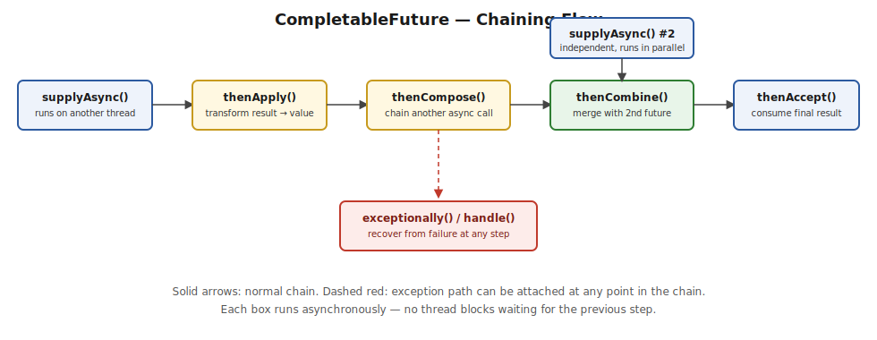

# Multithreading — Complete Interview Guide

> Consolidated from your 6 Multithreading posts + CompletableFuture post. Every method/concept is explained in plain English *before* the code, and every code block has its expected output. Missing topics/programs are marked 🆕. Diagrams are in `images/`.

## Table of Contents

- [Part 1 — Basics](#part-1--basics)
- [Part 2 — Thread Pools](#part-2--thread-pools)
- [Part 3 — CountDownLatch](#part-3--countdownlatch)
- [Part 4 — Locks](#part-4--locks)
- [Part 5 — Lock-Free Concurrency](#part-5--lock-free-concurrency)
- [Part 6 — Questions](#part-6--questions)
- [Part 7 — Critical Missing Topics 🆕](#part-7--critical-missing-topics-)
- [CompletableFuture](#completablefuture)

---

## Part 1 — Basics

### Process and Thread

In Java, a **process** is an executing instance of a Java application. When you run a `.java` program via the JVM, the OS creates a process and allocates resources — heap, stack, method area, CPU time, file handles. Each process runs in its own memory space, independent of other processes.

A JVM process gets memory split as: **Heap** (objects), **Stack** (method calls/local vars/references), **Method Area / Metaspace** (class metadata, statics), **Native Memory** (JVM internals, threads, direct buffers).

A **thread** is a lightweight process — the smallest independently schedulable sequence of instructions. One process starts with a single **main thread**, from which more threads can be spawned.

```java
public class MultithreadingLearning {
    public static void main(String[] args) {
        System.out.println("Thread Name: " + Thread.currentThread().getName());
    }
}
```
**Output:**
```
Thread Name: main
```

**Benefits:** task parallelism, responsiveness, resource sharing.
**Challenges:** deadlocks/race conditions, synchronization overhead, harder debugging.

**Context switching** — the CPU pausing one thread (saving state) and resuming another. Done by the **OS scheduler**, not the JVM itself, since Java threads map to native OS threads.

### Thread Creation Ways

Two ways: **implement Runnable** (preferred) or **extend Thread** (less flexible — uses up your one shot at single inheritance).

```java
// Way 1 — Runnable
public class MultithreadingLearning implements Runnable {
    public void run() {
        System.out.println("Code executed by: " + Thread.currentThread().getName());
    }
    public static void main(String[] args) {
        Thread thread = new Thread(new MultithreadingLearning());
        thread.start();
    }
}
```
**Output:**
```
Code executed by: Thread-0
```

```java
// Way 2 — extends Thread
public class MultithreadingLearning extends Thread {
    public void run() {
        System.out.println("Code executed by: " + Thread.currentThread().getName());
    }
    public static void main(String[] args) {
        new MultithreadingLearning().start();
    }
}
```
**Output:**
```
Code executed by: Thread-0
```

**Interview gold:** `start()` creates a new OS-level call stack and internally invokes `run()` on the new thread. Calling `run()` directly executes on the **current** thread — no new thread is created.

> ⚠️ **Pitfall:** `stop()`, `suspend()`, `resume()` are **deprecated** — unsafe, can leave shared objects in an inconsistent state, or cause permanent deadlock (`suspend()` holds locks while paused).

### Thread Lifecycle States


| State | Description |
|---|---|
| **New** | Created but not started — just an object in memory. |
| **Runnable** | Ready to run, waiting for CPU time. |
| **Running** | Actively executing. |
| **Blocked** | Waiting to acquire a lock held by another thread, or blocked on I/O. Releases all monitor locks it holds. |
| **Waiting** | After `wait()`/`join()` (no timeout) or `LockSupport.park()`. Releases the monitor lock. |
| **Timed Waiting** | Via `sleep(ms)`, `wait(ms)`, `join(ms)`. **`sleep(ms)` does NOT release the lock; `wait(ms)` DOES.** |
| **Terminated** | Finished executing; cannot be restarted. |

### Monitor Lock

A monitor lock ensures only one thread at a time executes a `synchronized` block/method on a given object.

```java
public class MonitorLockExample {
    public synchronized void task1() throws InterruptedException {
        System.out.println("Inside task1");
        Thread.sleep(1000);
    }
    public void task2() {
        System.out.println("task2, before synchronized");
        synchronized (this) { System.out.println("task2, inside synchronized"); }
    }
    public void task3() { System.out.println("task3"); }

    public static void main(String[] args) {
        MonitorLockExample obj = new MonitorLockExample();
        new Thread(() -> { try { obj.task1(); } catch (InterruptedException e) {} }).start();
        new Thread(obj::task2).start();
        new Thread(obj::task3).start();
    }
}
```
**One possible output:**
```
Inside task1
task3
task2, before synchronized
task2, inside synchronized
```
> Only the code **inside** a `synchronized` block waits on the lock. Unsynchronized code (like `task3()`) runs anytime, regardless of who holds the lock.

### Producer-Consumer using wait()/notifyAll()

```java
class SharedResource {
    private boolean isItemPresent = false;
    public synchronized void addItem() {
        isItemPresent = true;
        System.out.println("Producer produced item");
        notifyAll();
    }
    public synchronized void consumeItem() throws InterruptedException {
        while (!isItemPresent) {
            wait();
        }
        System.out.println("Consumer consumed item");
        isItemPresent = false;
    }
}
```
**One possible output:**
```
Producer produced item
Consumer consumed item
```
> ⚠️ **Pitfall — why `while` not `if`?** (1) **Spurious wakeups** — the JVM spec allows a thread to wake without a real `notify()`. (2) With `notifyAll()` and multiple consumers, more than one wakes but only one should proceed — re-checking prevents consuming a non-existent item.

### wait() vs notify() vs notifyAll()

All three live on `Object` (not `Thread`) and require holding the object's monitor (inside a `synchronized` block), or they throw `IllegalMonitorStateException`.

- **wait()** — releases the lock, moves to WAITING/TIMED_WAITING.
- **notify()** — wakes one *arbitrary* waiting thread; it must re-acquire the lock before proceeding.
- **notifyAll()** — wakes all waiting threads; only one at a time actually re-acquires the lock.

> ⚠️ **Pitfall:** Prefer `notifyAll()` over `notify()` in real code — `notify()` can wake the "wrong" thread when multiple threads wait for different conditions on the same object, causing missed signals.

### Thread Priority

A **hint** (1–10, default 5 via `Thread.NORM_PRIORITY`) to the scheduler — not a guarantee, and behavior is OS-dependent.

```java
Thread t1 = new Thread(() -> System.out.println("Thread 1 running"));
Thread t2 = new Thread(() -> System.out.println("Thread 2 running"));
t1.setPriority(Thread.MIN_PRIORITY); // 1
t2.setPriority(Thread.MAX_PRIORITY); // 10
t1.start();
t2.start();
```
**One possible output (order not guaranteed):**
```
Thread 2 running
Thread 1 running
```
> ⚠️ **Pitfall:** Don't design real concurrency logic around thread priority — output order here is a *likely* tendency, not a guarantee.

### Daemon Thread

A background/service thread (e.g. Garbage Collector, Finalizer, Signal dispatcher). The JVM does **not** wait for daemon threads before exiting.

```java
Thread daemonThread = new Thread(() -> {
    while (true) {
        System.out.println("Daemon thread running...");
    }
});
daemonThread.setDaemon(true);
daemonThread.start();
System.out.println("Main thread finished");
```
**Output (truncated — daemon loop is killed the instant main exits):**
```
Main thread finished
Daemon thread running...
Daemon thread running...
```
> ⚠️ **Pitfall:** Must call `setDaemon(true)` **before** `start()` — calling it after throws `IllegalThreadStateException`.

---

## Part 2 — Thread Pools

### Bounded-Buffer Producer-Consumer (real version)

Classic problem: producer/consumer share a **fixed-size** queue. Producer must wait if the buffer is full; consumer must wait if it's empty.

```java
public class SharedResource {
    Queue<Integer> queue = new LinkedList<>();
    int bufferSize;
    SharedResource(int bufferSize) { this.bufferSize = bufferSize; }

    public synchronized void producer(int i) throws InterruptedException {
        while (queue.size() == bufferSize) {
            wait();
        }
        queue.add(i);
        System.out.println("produced: " + i);
        notifyAll();
    }

    public synchronized void consumer() throws InterruptedException {
        while (queue.size() == 0) {
            wait();
        }
        System.out.println("data consumed: " + queue.remove());
        notify();
    }
}
```
**One possible output (bufferSize = 2, producing 1,2,3 while one consumer runs):**
```
produced: 1
produced: 2
data consumed: 1
produced: 3
data consumed: 2
data consumed: 3
```

### Why Thread Pools?

**Problem without a pool:** creating a thread costs real OS resources; 1000 requests → 1000 threads → memory overhead + wasted CPU on context switching.

**Solution:** pre-create N threads that wait for work, reuse them, cap max concurrency, queue tasks when all threads are busy.

**Benefits:** reduced latency, bounded resource usage, higher throughput, task queuing instead of failure.


### ThreadPoolExecutor

**What it does:** a pool of reusable worker threads that pick up submitted tasks from a queue, instead of spawning a brand-new OS thread per task.

```java
ExecutorService executor = Executors.newFixedThreadPool(3);
for (int i = 1; i <= 5; i++) {
    final int taskId = i;
    executor.submit(() ->
        System.out.println("Task " + taskId + " by " + Thread.currentThread().getName()));
}
executor.shutdown();
```
**One possible output (3 threads, 5 tasks — 2 tasks queue and reuse a freed thread):**
```
Task 1 by pool-1-thread-1
Task 2 by pool-1-thread-2
Task 3 by pool-1-thread-3
Task 4 by pool-1-thread-1
Task 5 by pool-1-thread-2
```

`ThreadPoolExecutor` is the general-purpose constructor behind all the `Executors.new...` factory methods, letting you configure every knob yourself instead of accepting a factory's defaults:

```java
ThreadPoolExecutor executor = new ThreadPoolExecutor(
    2,                                     // corePoolSize
    5,                                     // maximumPoolSize
    60, TimeUnit.SECONDS,                  // keepAliveTime
    new LinkedBlockingQueue<>(10),         // workQueue
    new ThreadPoolExecutor.AbortPolicy()   // rejection handler
);
```

- **corePoolSize** — the minimum number of threads kept alive at all times, even if idle.
- **maximumPoolSize** — the hard ceiling on threads, core + extra, that the pool will ever create.
- **keepAliveTime** — how long an idle *non-core* thread waits before the pool kills it off.
- **workQueue** — where tasks sit once all core threads are busy, waiting for a thread to free up.
- **handler** — what happens if a new task arrives when the queue is full *and* the pool is already at `maximumPoolSize`.

### Blocking Queue

**What it does:** a queue that makes a thread wait (block) instead of failing when it tries to take from an empty queue, or put into a full one — this is what feeds tasks to worker threads in a thread pool.

- **Bounded queue** — fixed capacity, e.g. `ArrayBlockingQueue`.
- **Unbounded queue** — no fixed capacity, e.g. `LinkedBlockingQueue`.

### Types of Thread Pool Executors

**1. Fixed Thread Pool** — a pool with a constant number of threads that never grows or shrinks; extra tasks simply wait in the queue until a thread frees up.
```java
ExecutorService executor = Executors.newFixedThreadPool(2);
executor.submit(() -> System.out.println("Task A on " + Thread.currentThread().getName()));
executor.submit(() -> System.out.println("Task B on " + Thread.currentThread().getName()));
executor.shutdown();
```
**Output:**
```
Task A on pool-1-thread-1
Task B on pool-1-thread-2
```
Best for web servers, DB operations, or any workload where you want to cap concurrency at a known, stable number.
> ⚠️ **Pitfall:** tasks wait if all threads are busy — no fast-fail, just latency growth.

**2. Cached Thread Pool** — creates a new thread on demand whenever no idle thread is available, reuses idle threads, and kills threads that have sat idle for 60 seconds.
```java
ExecutorService executor = Executors.newCachedThreadPool();
```
Great for many short-lived async tasks where load is bursty and unpredictable.
> ⚠️ **Pitfall:** has no upper bound on thread count — under sustained heavy load it can spawn so many threads that it exhausts memory (OutOfMemoryError) or crushes the OS scheduler.

**3. Scheduled Thread Pool** — runs tasks after a delay, or repeatedly at a fixed interval, instead of running them immediately.
```java
ScheduledExecutorService executor = Executors.newScheduledThreadPool(1);
executor.schedule(() -> System.out.println("Delayed task"), 2, TimeUnit.SECONDS);
```
**Output (after a 2-second delay):**
```
Delayed task
```

**4. Single Thread Executor** — exactly one worker thread, so every task you submit is guaranteed to run strictly in the order you submitted it, one at a time.
```java
ExecutorService executor = Executors.newSingleThreadExecutor();
executor.submit(() -> System.out.println("First"));
executor.submit(() -> System.out.println("Second"));
```
**Output (strictly in order, always):**
```
First
Second
```

**5. Work-Stealing Thread Pool** — a pool where each worker thread has its *own* queue, and an idle worker will "steal" a task from a busy worker's queue rather than sit idle. Introduced in Java 8, built on `ForkJoinPool`.
```java
ExecutorService executor = Executors.newWorkStealingPool();
```
Best for recursive/divide-and-conquer algorithms and parallel streams. **Not** ideal for blocking I/O tasks, since a blocked worker can't steal or be stolen from effectively.

---

## Part 3 — CountDownLatch

### What is CountDownLatch?

**What it does:** lets one or more threads wait until a set number of "events" (usually other threads finishing their work) have all happened, before they're allowed to proceed. Think of it as a countdown timer starting at N — everyone waiting is released the instant it hits zero.

`CountDownLatch` lives in `java.util.concurrent`, added in Java 5.

**Key features:**
- Initialized with a fixed count.
- Each event decrements the count via `countDown()`.
- Waiting threads block on `await()` until the count reaches zero.
- **One-time use** — once it hits zero, it cannot be reset or reused.

**When to use it:**
- Starting multiple threads at exactly the same moment.
- Waiting for several worker threads to finish before the main thread proceeds.
- Splitting a task into subtasks and waiting on all of them to complete.
- Simulating coordinated multi-thread scenarios in tests.

### Basic Usage Example

```java
CountDownLatch latch = new CountDownLatch(3);
for (int i = 0; i < 3; i++) {
    Thread t = new Thread(new WorkerThread(latch));
    t.start();
}
System.out.println("Main waiting...");
latch.await();
System.out.println("All operations done, resuming.");

class WorkerThread implements Runnable {
    CountDownLatch latch;
    WorkerThread(CountDownLatch latch) { this.latch = latch; }
    public void run() {
        try {
            Thread.sleep(1000);
            System.out.println(Thread.currentThread().getName() + " finished");
        } catch (InterruptedException e) {
        } finally {
            latch.countDown();
        }
    }
}
```
**One possible output:**
```
Main waiting...
Thread-0 finished
Thread-1 finished
Thread-2 finished
All operations done, resuming.
```

**Advantages:** simplifies thread coordination, improves performance by only proceeding when needed, more readable than raw wait/notify.

**Disadvantages:** one-time use only (can't reset), incorrect usage risks deadlock, less flexible than `CyclicBarrier`/`Semaphore`.

### Waiting with Timeout

**What it does:** instead of waiting forever, `await(timeout, unit)` gives up and returns `false` if the countdown hasn't reached zero within the given time — useful so a slow/stuck worker can't hang your whole program.

```java
if (latch.await(5, TimeUnit.SECONDS)) {
    System.out.println("All workers finished within timeout.");
} else {
    System.out.println("Timeout reached before all workers finished.");
}
```
**Output (if workers take longer than 5s):**
```
Timeout reached before all workers finished.
```

---

## Part 4 — Locks

### ReentrantLock

**What it does:** works like `synchronized` (only one thread in the critical section at a time), but as an explicit object you call `.lock()`/`.unlock()` on — which unlocks extra features `synchronized` doesn't have.

**1. tryLock() — attempt the lock without blocking.** If another thread already holds it, `tryLock()` returns `false` immediately instead of making your thread wait.
```java
Lock lock = new ReentrantLock();
if (lock.tryLock()) {
    try {
        System.out.println("Lock acquired, doing work");
    } finally { lock.unlock(); }
} else {
    System.out.println("Could not acquire lock, moving on");
}
```
**Output (assuming no contention):**
```
Lock acquired, doing work
```

**2. tryLock(timeout) — wait, but only up to a limit.** Instead of blocking forever or not at all, wait up to a given duration for the lock, then give up.
```java
if (lock.tryLock(2, TimeUnit.SECONDS)) {
    try { System.out.println("Got lock within 2s"); } finally { lock.unlock(); }
} else {
    System.out.println("Gave up waiting for lock");
}
```

**3. Fairness policy — control who gets the lock next when multiple threads are waiting.** By default (`unfair`), the JVM can let a thread "jump the queue" for better throughput; with `fair`, waiting threads are served strictly first-come-first-served.
```java
Lock fair = new ReentrantLock(true);   // first-come-first-served
Lock unfair = new ReentrantLock();     // default, higher throughput
```

**4. Interruptible locking — let a waiting thread be woken up and cancelled.** A thread blocked on plain `synchronized` cannot be interrupted out of waiting; `lockInterruptibly()` can.
```java
lock.lockInterruptibly(); // can be interrupted while waiting — NOT possible with synchronized
```

**5. Multiple condition variables — wait for different things on the same lock.** `synchronized` only gives you one implicit wait-set per object; a `ReentrantLock` can create several independent `Condition`s (e.g. one for "queue not full", another for "queue not empty").
```java
Condition notFull = lock.newCondition();
Condition notEmpty = lock.newCondition();
```

### ReadWriteLock

**What it does:** splits locking into two modes instead of one — a **read lock** that many threads can hold simultaneously, and a **write lock** that only one thread can hold, with no readers active at the same time. This is the key difference from `synchronized`/`ReentrantLock`, which only ever let *one* thread in, period — even for two threads that both just want to read.

**Exact rules:**
- ✅ Multiple readers together — allowed
- ❌ Reader + Writer together — not allowed
- ❌ Multiple writers together — not allowed
- ✅ Writer alone — allowed

**Why it matters:** in most real systems reads vastly outnumber writes (e.g. a cache) — letting all the readers proceed concurrently, and only blocking everyone during the rare write, gives much higher throughput than a plain lock that forces even simultaneous readers to take turns.

```java
import java.util.concurrent.locks.ReentrantReadWriteLock;

public class Cache {
    private final Map<String, String> data = new HashMap<>();
    private final ReentrantReadWriteLock rwLock = new ReentrantReadWriteLock();
    private final Lock readLock = rwLock.readLock();
    private final Lock writeLock = rwLock.writeLock();

    public String get(String key) {
        readLock.lock();
        try {
            System.out.println(Thread.currentThread().getName() + " reading");
            return data.get(key);
        } finally {
            readLock.unlock();
        }
    }

    public void put(String key, String value) {
        writeLock.lock();
        try {
            System.out.println(Thread.currentThread().getName() + " writing");
            data.put(key, value);
        } finally {
            writeLock.unlock();
        }
    }

    public static void main(String[] args) {
        Cache cache = new Cache();
        cache.put("k1", "v1");
        new Thread(() -> cache.get("k1")).start();
        new Thread(() -> cache.get("k1")).start();
    }
}
```
**One possible output:**
```
main writing
Thread-0 reading
Thread-1 reading
```
> ⚠️ **Pitfall:** `ReentrantReadWriteLock` can starve writers under sustained heavy read load, since there's rarely a gap with zero active readers (unless you use the fairness constructor `new ReentrantReadWriteLock(true)`).

### StampedLock

**What it does:** an even faster alternative to `ReadWriteLock` for read-heavy workloads, by adding a third mode — **optimistic read** — that doesn't take a lock at all; it just checks afterward whether anything changed while you were reading. If nothing changed, you skip locking entirely; if something did change, you fall back to a normal (locked) read.

Introduced in Java 8. Every lock/unlock call passes around a **stamp** (a `long` version number), which is what makes the "did anything change?" check possible.

Three modes: **Write Lock** (exclusive), **Read Lock** (shared, like `ReadWriteLock`), **Optimistic Read** (lock-free, fastest).

> ⚠️ **Pitfall — why not just ReadWriteLock?** Under sustained read load a writer can starve indefinitely (never a gap with zero readers). Also, every reader still pays CAS overhead on the shared reader-count, even without blocking — `StampedLock`'s optimistic mode avoids even that cost.

**Optimistic Read — how it actually works, step by step:**
1. `tryOptimisticRead()` returns a stamp (version number) — **no lock, no CAS, no blocking of writers at all**.
2. The reader copies every field it needs into local variables — none of it can be trusted yet, since a writer could be mutating the object mid-read.
3. The reader calls `validate(stamp)`. If it returns `true` (no write happened since step 1), the locally-copied values are safe to use as-is.
4. **If validation fails** (a write did happen), the optimistic read is thrown away, and the reader falls back to a normal `readLock()` (a real, blocking lock) to redo the read safely.

```java
import java.util.concurrent.locks.StampedLock;

public class Point {
    private double x, y;
    private final StampedLock sl = new StampedLock();

    public void move(double deltaX, double deltaY) {
        long stamp = sl.writeLock();
        try {
            x += deltaX;
            y += deltaY;
        } finally {
            sl.unlockWrite(stamp);
        }
    }

    public double distanceFromOrigin() {
        long stamp = sl.tryOptimisticRead();
        double currentX = x, currentY = y;

        if (!sl.validate(stamp)) {
            stamp = sl.readLock();
            try {
                currentX = x;
                currentY = y;
            } finally {
                sl.unlockRead(stamp);
            }
        }
        return Math.sqrt(currentX * currentX + currentY * currentY);
    }

    public static void main(String[] args) {
        Point p = new Point();
        p.move(3, 4);
        System.out.println("Distance: " + p.distanceFromOrigin());
    }
}
```
**Output:**
```
Distance: 5.0
```

### Semaphore

**What it does:** controls how many threads can be inside a critical section **at the same time** — not just 1 like a lock, but any number N you choose. Think of it as N numbered entry passes: a thread must hold a pass to enter, and gives it back when done; if all passes are taken, the next thread waits.

**Use cases:** allow only 10 concurrent DB connections, only 5 concurrent outbound API calls, only 3 threads in a particular critical section.

```java
Semaphore semaphore = new Semaphore(2); // 2 permits

Runnable task = () -> {
    try {
        semaphore.acquire();
        System.out.println(Thread.currentThread().getName() + " accessing resource");
        Thread.sleep(500);
    } catch (InterruptedException e) {
    } finally {
        semaphore.release();
        System.out.println(Thread.currentThread().getName() + " released resource");
    }
};
for (int i = 0; i < 3; i++) new Thread(task).start();
```
**One possible output (3 threads compete for 2 permits — 3rd waits):**
```
Thread-0 accessing resource
Thread-1 accessing resource
Thread-0 released resource
Thread-2 accessing resource
Thread-1 released resource
Thread-2 released resource
```
> `Lock` = 1 thread only. `Semaphore` = N threads.

### 🆕 Semaphore vs Mutex

This came up in your interview yesterday, and it's a very common follow-up to the Semaphore topic above, so it belongs right here:

| | Mutex | Semaphore |
|---|---|---|
| **Permits** | Binary — locked or unlocked (1 permit) | Counting — N permits |
| **Ownership** | Owned by the thread that locked it — only that same thread can unlock it | No ownership — any thread can call `release()`, even one that never called `acquire()` |
| **Purpose** | Mutual exclusion (protect a critical section) | Resource-count limiting (cap concurrent access) |
| **Java equivalent** | `synchronized`, `ReentrantLock` | `java.util.concurrent.Semaphore` |
| **Reentrant?** | `ReentrantLock`/`synchronized` — yes, same thread can re-acquire | Not inherently reentrant — re-acquiring by the same thread just consumes another permit |

> ⚠️ **Pitfall — the point interviewers actually probe:** a `Mutex` has an **owner**; a `Semaphore` does not. This is why a `Semaphore` can be used for signaling *between* threads (e.g. thread A acquires, thread B releases) — a `Mutex`/`ReentrantLock` cannot be used this way, since only the locking thread is allowed to unlock it (`IllegalMonitorStateException` otherwise).

```java
// Semaphore used as a signal — a pattern impossible with Mutex/ReentrantLock,
// since here the releasing thread is NOT the one that acquired it
public static void main(String[] args) throws InterruptedException {
    Semaphore signal = new Semaphore(0); // starts with 0 permits — waiter blocks immediately

    Thread waiter = new Thread(() -> {
        try {
            System.out.println("Waiter: waiting for signal...");
            signal.acquire(); // blocks until signaler calls release()
            System.out.println("Waiter: signal received, proceeding");
        } catch (InterruptedException e) {}
    });

    Thread signaler = new Thread(() -> {
        try { Thread.sleep(1000); } catch (InterruptedException e) {}
        System.out.println("Signaler: sending signal");
        signal.release(); // signaler never called acquire()
    });

    waiter.start();
    signaler.start();
}
```
**Output:**
```
Waiter: waiting for signal...
Signaler: sending signal
Waiter: signal received, proceeding
```

### Condition

**What it does:** the modern, explicit-lock version of `wait()`/`notify()`. A `Condition` object represents one specific "thing threads might be waiting for" (e.g. "the queue is not empty"), created from a `Lock` via `lock.newCondition()`. Calling `condition.await()` releases the lock and waits; `condition.signal()`/`signalAll()` wakes waiters, same idea as `notify()`/`notifyAll()` but tied to a specific condition rather than the whole object.

```java
Lock lock = new ReentrantLock();
Condition condition = lock.newCondition();
boolean ready = false;

void waitForSignal() throws InterruptedException {
    lock.lock();
    try {
        while (!ready) condition.await();
        System.out.println("Proceeding after signal");
    } finally { lock.unlock(); }
}
void sendSignal() {
    lock.lock();
    try { ready = true; condition.signal(); } finally { lock.unlock(); }
}
```
**Output (once sendSignal() runs on another thread):**
```
Proceeding after signal
```

`signal()` wakes exactly one waiting thread. `signalAll()` wakes all of them.

---

## Part 5 — Lock-Free Concurrency

### Lock-Free Mechanism

**What it does:** lets multiple threads safely update shared data **without ever taking a lock** — instead of blocking a thread that can't get a lock, the hardware-level **CAS (Compare-And-Swap)** instruction lets a thread attempt an update and automatically fail/retry if someone else got there first. No thread is ever "stuck waiting on a lock" — at worst it retries.

**CAS takes 3 parameters:** the memory location, the value you expect is currently there, and the new value you want to write. The CPU writes the new value **only if** the current value still matches what you expected — otherwise it does nothing, and your code notices and retries.


### The "Not Atomic" counter++ Problem

**Why this matters:** `counter++` looks like one operation, but the CPU actually does it in 3 separate steps: **Load** the current value → **Increment** it → **Assign** the new value back. Because another thread can interleave between those steps, two threads can both read the same starting value and one thread's increment gets silently thrown away.

| Time | Thread A | Thread B | Counter in memory |
|---|---|---|---|
| T1 | Load: reads 10 | — | 10 |
| T2 | — | Load: reads 10 | 10 |
| T3 | Increment: 10+1=11 | — | 10 |
| T4 | Assign: writes 11 | — | 11 |
| T5 | — | Increment: 10+1=11 | 11 |
| T6 | — | Assign: writes 11 **(data lost!)** | 11 |

> ⚠️ **Pitfall:** one increment is completely overwritten — expected 12, got 11.

```java
// Not thread-safe
class SharedResourceUnsafe {
    int counter = 0;
    public void increment() { counter++; } // race condition
}

// Fix 1 — synchronized (blocks, mutual exclusion)
class SharedResourceSync {
    private int counter = 0;
    public synchronized void increment() { counter++; }
    public synchronized int get() { return counter; }
}

// Fix 2 — lock-free via AtomicInteger (non-blocking, uses CAS)
class SharedResourceAtomic {
    private AtomicInteger counter = new AtomicInteger(0);
    public void increment() { counter.incrementAndGet(); }
    public int get() { return counter.get(); }
}

public class Demo {
    public static void main(String[] args) throws InterruptedException {
        SharedResourceAtomic resource = new SharedResourceAtomic();
        Runnable task = () -> { for (int i = 0; i < 1000; i++) resource.increment(); };
        Thread t1 = new Thread(task);
        Thread t2 = new Thread(task);
        t1.start(); t2.start();
        t1.join(); t2.join();
        System.out.println("Final count: " + resource.get());
    }
}
```
**Output:**
```
Final count: 2000
```
`AtomicInteger.incrementAndGet()` does the Load-Increment-Assign cycle as one atomic CAS operation internally, so no update can ever be silently lost, and — being non-blocking — it scales better under high contention than `synchronized`, which works correctly too but makes losing threads wait.

### CAS Logic and Implementation

**What it does:** implements the "retry if someone beat you to it" idea as a loop — keep reading the current value and trying to swap in your new value, until a swap actually succeeds (meaning nobody changed it in between).

```java
do {
    expectedValue = read(memoryLocation);
    newValue = expectedValue + 1;
} while (!CAS(memoryLocation, expectedValue, newValue));
```

The processor: **Read** current value → **Compare** to expected → **Swap** if they match, else retry.

### The ABA Problem

**What it is:** a subtle bug in CAS-based code — CAS only checks whether the value *looks* the same as before, not whether it was *touched* in between.

1. Thread 1 reads value A.
2. Thread 1 is preempted (paused).
3. Thread 2 changes A → B → back to A.
4. Thread 1 resumes, does CAS, sees A, assumes nothing changed — swap succeeds.

> ⚠️ **Pitfall:** the value looks unchanged, but system *state* may have changed (e.g. in a linked list, a node could've been deleted and a different node inserted with the same value). Solved using a version number or timestamp alongside the value.

**How the fix works:** `AtomicStampedReference` pairs your value with a **stamp** (a version counter) that increments on every update — so even if the value cycles A→B→A, the stamp has moved on, and the CAS below can tell the state actually changed.

```java
import java.util.concurrent.atomic.AtomicStampedReference;

public class AbaFixDemo {
    public static void main(String[] args) {
        AtomicStampedReference<Integer> ref = new AtomicStampedReference<>(100, 0);

        int[] stampHolder = new int[1];
        Integer currentValue = ref.get(stampHolder);
        int currentStamp = stampHolder[0];

        // CAS checks BOTH value AND stamp — A→B→A no longer looks "unchanged"
        boolean updated = ref.compareAndSet(currentValue, 200, currentStamp, currentStamp + 1);
        System.out.println("Updated: " + updated + ", new value: " + ref.getReference() + ", new stamp: " + ref.getStamp());
    }
}
```
**Output:**
```
Updated: true, new value: 200, new stamp: 1
```

### 🆕 AtomicReference and LongAdder

**AtomicReference — what it does:** the same CAS-based idea as `AtomicInteger`, but for object references instead of numbers. It lets you atomically swap out an entire object pointer (e.g. swap a config object for a newer version) without a lock.
```java
AtomicReference<String> configRef = new AtomicReference<>("v1");
boolean changed = configRef.compareAndSet("v1", "v2"); // atomically swap only if still "v1"
System.out.println("Changed: " + changed + ", value: " + configRef.get());
```
**Output:**
```
Changed: true, value: v2
```

**LongAdder — what it does:** for counters under *very* high contention, even `AtomicInteger`/`AtomicLong` become a bottleneck, because every thread is still CAS-retrying against the exact same memory address. `LongAdder` (Java 8+) spreads writes across several internal "cells" so different threads usually update different cells with no contention at all, and only combines them into a single total when you actually read the sum.
```java
LongAdder counter = new LongAdder();
counter.increment();
counter.increment();
counter.add(5);
System.out.println("Total: " + counter.sum());
```
**Output:**
```
Total: 7
```
> ⚠️ **Pitfall / interview follow-up:** `LongAdder` trades off read cost (summing cells) for write scalability — great for hit-counters/metrics where you increment far more often than you read, bad for cases needing the current value on every single operation.

### Volatile vs CAS

**The distinction, in plain terms:** `volatile` only guarantees that once a thread writes a value, other threads will *see* that new value right away (a **visibility** guarantee) — it says nothing about doing a read-modify-write safely. `CAS` guarantees that an entire read-modify-write cycle happens as a single, uninterruptible step (an **atomicity** guarantee).

> ⚠️ **Pitfall — crucial rule:** `volatile` only makes *single* reads/writes atomic. It does **not** make compound operations like `count = count + 1` atomic — the increment is still three separate steps under the hood, `volatile` or not.

| Time | Thread A | Thread B | RAM | Why it fails |
|---|---|---|---|---|
| T1 | Reads 10 | — | 10 | volatile ensures visibility of latest value |
| T2 | — | Reads 10 | 10 | Both threads now hold local copy = 10 |
| T3 | Calculates 11 | Calculates 11 | 10 | Calculation happens in CPU registers, not RAM |
| T4 | Writes 11 | — | 11 | RAM updated by Thread A |
| T5 | — | Writes 11 | 11 | ❌ Lost update — should be 12 |

> **Interview one-liner:** `AtomicInteger.incrementAndGet()` uses CAS internally, guaranteeing atomicity + visibility while avoiding the blocking overhead of traditional locks.

---

## Part 6 — Questions

### ThreadLocal — real example

**What it does:** gives every thread its own private, independent copy of a variable — even though every thread accesses it through the exact same `ThreadLocal` object, each thread reads/writes only its own copy, with zero interference between threads.

**Real-time example:** in a web app, each user request/session needs its own auth token/preferences. `ThreadLocal` ensures the thread handling a given request sees only its own session data, with no interference from other requests being handled by other threads.

```java
public class ThreadLocalDemo {
    private static final ThreadLocal<Integer> threadLocalValue = ThreadLocal.withInitial(() -> 1);

    public static void main(String[] args) {
        Runnable task = () -> {
            threadLocalValue.set(threadLocalValue.get() + 10);
            System.out.println(Thread.currentThread().getName() + ": " + threadLocalValue.get());
        };
        new Thread(task).start();
        new Thread(task).start();
    }
}
```
**Output (each thread sees its own independent value):**
```
Thread-0: 11
Thread-1: 11
```
> ⚠️ **Pitfall (missing in original — added):** in thread-pool-based servers (Tomcat, etc.), threads are reused across requests. If you forget to call `threadLocalValue.remove()` at the end of a request, stale data leaks into the next request handled by the same pooled thread — a classic memory-leak / data-leak bug. Always clean up in a `finally` block.

### ReentrantLock vs synchronized

ReentrantLock adds: **tryLock()** (non-blocking attempt), **interruptible waiting**, **tryLock(timeout)**, and a **fairness policy** — none of which plain `synchronized` supports (see Part 4 for the full explanation of each).

```java
ReentrantLock lock = new ReentrantLock();
lock.lock();
try {
    System.out.println("Critical section");
} finally { lock.unlock(); }
```
**Output:**
```
Critical section
```

### ForkJoinPool and RecursiveTask

**What it does:** built for "divide and conquer" problems — you split a big task into smaller subtasks, recursively, until they're small enough to solve directly, then combine the results back up. `ForkJoinPool` is the thread pool that runs these subtasks in parallel; `RecursiveTask<V>` is what you extend when your subtask needs to return a result (use `RecursiveAction` instead if it doesn't).

`fork()` schedules a subtask to run asynchronously; `join()` blocks until that subtask's result is ready — this is what lets one branch compute while another branch is being split further.

```java
class FibonacciTask extends RecursiveTask<Integer> {
    private final int n;
    FibonacciTask(int n) { this.n = n; }
    protected Integer compute() {
        if (n <= 1) return n;
        FibonacciTask f1 = new FibonacciTask(n - 1);
        f1.fork();
        FibonacciTask f2 = new FibonacciTask(n - 2);
        return f2.compute() + f1.join();
    }
    public static void main(String[] args) {
        ForkJoinPool pool = new ForkJoinPool();
        System.out.println("Fibonacci(10) = " + pool.invoke(new FibonacciTask(10)));
    }
}
```
**Output:**
```
Fibonacci(10) = 55
```

**How work-stealing works:** each worker thread has its own task queue; when a worker runs out of tasks, instead of sitting idle it "steals" a task from the back of a busier worker's queue — keeping every CPU core fed with work.

### Phaser

**What it does:** a more flexible version of `CountDownLatch`/`CyclicBarrier` for multi-phase work, where the number of participating threads can change between phases (threads can register and deregister dynamically, which the other two don't support).

```java
Phaser phaser = new Phaser(1); // register self
System.out.println("Phase before: " + phaser.getPhase());
phaser.arriveAndAwaitAdvance(); // signal arrival at this phase, wait for everyone else registered
System.out.println("Phase after: " + phaser.getPhase());
phaser.arriveAndDeregister(); // signal arrival and leave, so future phases don't wait on this thread
```
**Output:**
```
Phase before: 0
Phase after: 1
```

### CyclicBarrier

**What it does:** makes a fixed group of threads all wait at a common checkpoint until every one of them has arrived, then releases them all at once — and unlike `CountDownLatch`, it's **reusable**: once everyone passes through, the barrier resets and can be used again for the next phase of work.

```java
CyclicBarrier barrier = new CyclicBarrier(3, () -> System.out.println("All parties arrived!"));
Runnable task = () -> {
    try {
        System.out.println(Thread.currentThread().getName() + " waiting at barrier");
        barrier.await();
    } catch (Exception e) {}
};
for (int i = 0; i < 3; i++) new Thread(task).start();
```
**One possible output:**
```
Thread-0 waiting at barrier
Thread-1 waiting at barrier
Thread-2 waiting at barrier
All parties arrived!
```
> **CountDownLatch vs CyclicBarrier:** CountDownLatch is one-time-use, and it's usually one/few threads waiting on N *events* (which could be anything). CyclicBarrier is reusable, and it's specifically N *threads* waiting for each other to all reach the same point.

### Callable vs Runnable

| | Runnable | Callable |
|---|---|---|
| Package | `java.lang` (since 1.0) | `java.util.concurrent` (since 1.5) |
| Return value | No | Yes — via `call()` |
| Checked exceptions | Cannot throw | Can throw |
| Method to override | `run()` | `call()` |

`Callable` exists because `Runnable.run()` can't return anything or throw a checked exception — if your background task needs to hand back a result (or report a failure via a real exception), `Callable` is the one to implement.

```java
ExecutorService executor = Executors.newSingleThreadExecutor();
Callable<Integer> callable = () -> 42;
Future<Integer> future = executor.submit(callable);
System.out.println("Result: " + future.get());
executor.shutdown();
```
**Output:**
```
Result: 42
```

### Future vs CompletableFuture

- **Completion handling:** `Future.get()` blocks the calling thread until the result is ready — there's no way to say "run this callback once it's done" without blocking. `CompletableFuture` lets you register a callback (`thenAccept()`, etc.) that runs automatically on completion, with no blocking required.
- **Composition:** `CompletableFuture` lets you chain multiple async steps together fluently (`.thenApply().thenCompose()...`); plain `Future` has no way to attach a follow-up step at all.
- **Explicit completion:** `CompletableFuture` can be completed manually from outside (`complete()`/`completeExceptionally()`), useful for bridging non-Future-based async APIs into the `CompletableFuture` world.

> See the dedicated [CompletableFuture](#completablefuture) section below for the full picture with runnable examples of every method mentioned here.

### Class-level Locks

**What it does:** just like every *object* has its own monitor lock for `synchronized` instance methods, every *class* has one shared lock (tied to the `Class` object itself) used by `static synchronized` methods — so all threads calling any static synchronized method on that class, regardless of which instance they're working with, still take turns on that one shared class-level lock.

```java
class Counter {
    static int count = 0;
    static synchronized void increment() {
        count++;
        System.out.println(Thread.currentThread().getName() + " incremented to " + count);
    }
}
```
**One possible output:**
```
Thread-0 incremented to 1
Thread-1 incremented to 2
```

### thenApply vs thenAccept vs thenRun (CompletableFuture)

A quick preview — see the full [CompletableFuture](#completablefuture) section below for runnable examples of all three:

- **thenApply(Function)** — takes the previous result **in**, and returns a **new, transformed value** — use it when the next step needs to produce something from the result (e.g. turn a raw number into a formatted string).
- **thenAccept(Consumer)** — takes the previous result **in**, but returns **nothing** — use it when the next step just needs to *do something with* the result (e.g. print it, save it) without producing a new value.
- **thenRun(Runnable)** — doesn't even get the previous result **at all** — use it when the next step is just "now that this is done, go do this other unrelated thing" (e.g. log "task finished").

### Virtual Threads vs Platform Threads

**Platform thread — what it is:** a thread backed 1-to-1 by a real OS thread. Creating one is relatively expensive (a real kernel-level system call), and the OS scheduler manages it directly.

**Virtual thread (Java 21+) — what it does:** a thread that's managed and scheduled by the *JVM* instead of the OS, and is cheap enough to create millions of. Many virtual threads share a small pool of underlying platform threads — when a virtual thread blocks (e.g. on I/O), the JVM parks it and frees up the platform thread underneath to run a different virtual thread, instead of that platform thread just sitting idle.

> **Why it matters:** in a typical request → external API/DB call → response flow, the thread spends most of its life just *waiting* for I/O — a huge underutilization of OS threads if you're using one platform thread per request. Virtual threads make that wait nearly free, so you can have far more concurrent in-flight requests than you have real CPU threads.

```java
// Platform thread
Thread platform = Thread.ofPlatform().start(() -> System.out.println("platform thread: " + Thread.currentThread()));

// Virtual thread (Java 21+)
Thread virtual = Thread.ofVirtual().start(() -> System.out.println("virtual thread: " + Thread.currentThread()));
```
**Output:**
```
platform thread: Thread[#21,Thread-0,5,main]
virtual thread: VirtualThread[#22]/runnable@ForkJoinPool-1-worker-1
```

### Thread Pool Q&A Set

**Why thread pools?** Thread creation/destruction is expensive; pools reuse threads, cap max threads (preventing exhaustion), and improve throughput.

**newFixedThreadPool vs newCachedThreadPool:** Fixed = bounded threads + queue, good for CPU-bound work. Cached = threads created on demand with no queue, good for I/O-bound short-lived tasks — but risks unbounded thread growth.

**When queue AND threads are both full — Rejection Policy:** this decides what happens to a task that shows up when there's truly no room left anywhere.
- **AbortPolicy** (default) — throws `RejectedExecutionException`, so the caller finds out the task was refused.
- **CallerRunsPolicy** — the *calling* thread runs the task itself, synchronously, as a natural way to slow down the caller instead of dropping work.
- **DiscardPolicy** — silently drops the task with no error at all.
- **DiscardOldestPolicy** — evicts the oldest queued task to make room, then queues the new one.

**shutdown() vs shutdownNow():** `shutdown()` stops accepting new tasks but lets everything already submitted finish naturally. `shutdownNow()` tries to stop immediately — it interrupts running tasks, cancels queued ones, and hands you back the list of tasks that never got to run.

> **Best practice:** call `shutdown()`, then `awaitTermination()` to actually wait for the graceful shutdown to finish.

**When to use ScheduledThreadPool:** periodic/delayed tasks — cache refresh, health checks, retry-after-delay jobs.

---

## Part 7 — Critical Missing Topics 🆕

> These are gaps in the original series that senior interviewers ask about often — added here as their own part since they didn't fit cleanly into Parts 1–6.

### Deadlock

**What it is:** a state where two or more threads are each waiting for a lock the other one holds, so *neither* can ever proceed — the program doesn't crash, it just freezes forever on those threads.

Four conditions must **all** hold simultaneously for a deadlock to occur: **mutual exclusion** (the resource can't be shared), **hold and wait** (a thread holds one resource while waiting for another), **no preemption** (a resource can't be forcibly taken away from a thread), **circular wait** (a cycle of threads each waiting on the next one's resource).


```java
public class DeadlockDemo {
    static final Object lockA = new Object();
    static final Object lockB = new Object();

    public static void main(String[] args) {
        Thread t1 = new Thread(() -> {
            synchronized (lockA) {
                System.out.println("Thread 1: holding Lock A...");
                try { Thread.sleep(100); } catch (InterruptedException e) {}
                System.out.println("Thread 1: waiting for Lock B...");
                synchronized (lockB) {
                    System.out.println("Thread 1: acquired Lock B!");
                }
            }
        });

        Thread t2 = new Thread(() -> {
            synchronized (lockB) {
                System.out.println("Thread 2: holding Lock B...");
                try { Thread.sleep(100); } catch (InterruptedException e) {}
                System.out.println("Thread 2: waiting for Lock A...");
                synchronized (lockA) {
                    System.out.println("Thread 2: acquired Lock A!");
                }
            }
        });

        t1.start();
        t2.start();
    }
}
```
**Output (then hangs forever — never terminates):**
```
Thread 1: holding Lock A...
Thread 2: holding Lock B...
Thread 1: waiting for Lock B...
Thread 2: waiting for Lock A...
[program hangs here indefinitely]
```

**How to avoid deadlock:**
- **Lock ordering** — always acquire multiple locks in the same global order across all threads (e.g. always Lock A before Lock B, everywhere in the codebase) — this breaks the circular-wait condition.
- **tryLock() with timeout** — use `ReentrantLock.tryLock(timeout)` instead of blocking indefinitely; back off and retry on failure instead of holding forever.
- **Avoid nested locks** where possible — restructure so a thread never needs to hold one lock while requesting another.
- **Detect via thread dump** (`jstack <pid>`) — the JVM explicitly reports "Found one Java-level deadlock" with the exact cycle of threads and locks involved.

> ⚠️ **Pitfall — a very common follow-up:** "How would you detect this in production?" The answer is a **thread dump**, not staring at logs — `jstack` shows exactly which threads are BLOCKED and on what monitor, and directly reports deadlock cycles.

### Livelock and Starvation

**Livelock — what it is:** threads keep actively responding to each other, but nothing ever actually gets done — like two people repeatedly stepping aside for each other in a hallway, forever, neither one ever getting through. Unlike deadlock, the threads are **not blocked or stuck** — they're busy the whole time, just unproductively.

**Starvation — what it is:** a thread is repeatedly denied access to a resource because other threads keep getting served ahead of it — often because those other threads have higher priority, or are simply more aggressive about acquiring the resource first.

> ⚠️ **Pitfall — distinguishing the three in an interview:** Deadlock = threads permanently blocked, stuck. Livelock = threads permanently busy, but never progressing. Starvation = a thread simply never gets its turn, even though the system as a whole is making progress.

### Thread Interruption

**What it does:** `Thread.interrupt()` doesn't forcibly kill or stop a thread — all it does is set a boolean flag on that thread. It's entirely up to the target thread's own code to check that flag (or handle the `InterruptedException` that gets thrown if it was blocked in `sleep()`/`wait()`/`join()`) and decide how to respond, e.g. by exiting cleanly.

```java
Thread worker = new Thread(() -> {
    while (!Thread.currentThread().isInterrupted()) {
        // do work
    }
    System.out.println("Worker exiting cleanly due to interruption");
});
worker.start();
Thread.sleep(100);
worker.interrupt();
```
**Output:**
```
Worker exiting cleanly due to interruption
```
> ⚠️ **Pitfall:** if a thread is blocked in `sleep()`/`wait()`/`join()` when interrupted, those methods throw `InterruptedException` immediately **and clear the interrupted flag** — a common bug is swallowing that exception silently (`catch (InterruptedException e) {}`), losing the interruption signal entirely. Best practice: either handle it meaningfully or re-set the flag with `Thread.currentThread().interrupt()` before returning.

### ConcurrentHashMap vs Hashtable vs Collections.synchronizedMap

**What ConcurrentHashMap does differently:** `Hashtable` and `Collections.synchronizedMap()` both make a map thread-safe by putting **one single lock** around the entire map — meaning only one thread can touch the map at all, even for two threads reading completely different keys. `ConcurrentHashMap` locks at a much finer grain (per bucket/segment), so unrelated operations on different parts of the map can run truly in parallel.

| | `HashMap` | `Hashtable` | `Collections.synchronizedMap` | `ConcurrentHashMap` |
|---|---|---|---|---|
| Thread-safe? | No | Yes | Yes | Yes |
| Locking granularity | N/A | Entire map (one lock) | Entire map (one lock) | Bucket/segment-level (fine-grained) |
| Null keys/values | Allowed | Not allowed | Depends on backing map | Not allowed |
| Performance under contention | N/A | Poor (single lock) | Poor (single lock) | Good (fine-grained + CAS) |

```java
ConcurrentHashMap<String, Integer> map = new ConcurrentHashMap<>();
map.put("a", 1);
map.computeIfAbsent("b", k -> 2);
map.merge("a", 10, Integer::sum);
System.out.println(map);
```
**Output:**
```
{a=11, b=2}
```
> ⚠️ **Pitfall:** `ConcurrentHashMap` guarantees thread-safety for individual operations (`put`, `get`, `computeIfAbsent`), but **compound actions across multiple calls** (like "check size, then add if under limit") are still not atomic unless you use its atomic compound methods (`computeIfAbsent`, `merge`, `compute`).

### CopyOnWriteArrayList

**What it does:** every time you mutate the list (`add`, `remove`, `set`), instead of modifying the existing array in place, it creates a brand-new copy of the entire underlying array with the change applied, and swaps the reference. This means readers iterating the list never see a half-finished write, and never throw `ConcurrentModificationException` — they're always safely reading a stable, unchanging snapshot.

```java
CopyOnWriteArrayList<String> list = new CopyOnWriteArrayList<>();
list.add("a");
list.add("b");
for (String s : list) {
    list.add("c"); // safe — iterator works on the old snapshot, no ConcurrentModificationException
}
System.out.println(list);
```
**Output:**
```
[a, b, c, c]
```
> ⚠️ **Pitfall:** great for **read-heavy, write-rare** scenarios (e.g. a list of event listeners). Terrible for write-heavy workloads — every single write copies the entire array, which is O(n) per write.

### invokeAll() and invokeAny()

**What they do:** both submit a whole batch of `Callable` tasks to an executor at once, but they wait differently. `invokeAll()` blocks until **every** task in the batch finishes, and gives you back a `Future` for each one. `invokeAny()` blocks only until **the first** task finishes successfully, immediately cancels the rest, and gives you back just that one result.

```java
ExecutorService executor = Executors.newFixedThreadPool(3);
List<Callable<Integer>> tasks = List.of(() -> 1, () -> 2, () -> 3);

// invokeAll — waits for ALL to complete, returns a List<Future>
List<Future<Integer>> results = executor.invokeAll(tasks);
for (Future<Integer> f : results) System.out.println(f.get());

// invokeAny — returns as soon as ONE completes successfully, cancels the rest
Integer firstResult = executor.invokeAny(tasks);
System.out.println("First result: " + firstResult);

executor.shutdown();
```
**Output:**
```
1
2
3
First result: 1
```

### Java Memory Model — happens-before (brief)

**What it's actually explaining:** without any coordination, the JVM/CPU are free to reorder instructions and cache values per-core for performance — meaning a write made by Thread A might never become visible to Thread B at all, not because of *timing*, but because the JVM never guaranteed it would be. The **happens-before** relationship is the JVM's rule for exactly when a write is guaranteed visible to a later read on another thread.

**Key happens-before rules:**
- A `synchronized` block's exit happens-before the next thread's entry into a synchronized block on the *same* monitor.
- A `volatile` write happens-before every subsequent `volatile` read of the same field.
- `Thread.start()` happens-before anything the started thread does.
- Everything a thread does happens-before another thread's successful `Thread.join()` on it.

> ⚠️ **Pitfall — this is *why* `synchronized`/`volatile` matter beyond "mutual exclusion":** without a happens-before edge, a value written by Thread A might never become visible to Thread B — not due to a race on *when*, but because the JVM/CPU never flushed it to shared memory in the first place, or Thread B's CPU core is reading a stale cached copy.

### synchronized Reentrancy

**What it means:** if a thread already holds a lock, and it calls another method that requires the *same* lock, Java lets it right through instead of deadlocking the thread against itself. This is what "reentrant" means — the same thread can re-enter a lock it already owns.

```java
class Reentrant {
    synchronized void outer() {
        System.out.println("In outer");
        inner();
    }
    synchronized void inner() {
        System.out.println("In inner — same thread re-acquired the lock");
    }
}
new Reentrant().outer();
```
**Output:**
```
In outer
In inner — same thread re-acquired the lock
```
> Without reentrancy, this exact pattern would deadlock a thread against itself the moment `outer()` called `inner()`.

---

## CompletableFuture

### What is CompletableFuture?

**What it does:** represents the result of an asynchronous computation that hasn't finished yet — similar to `Future`, but with the crucial addition that you can **attach callbacks** ("when this finishes, do X"), **chain** multiple async steps together, and **combine** multiple independent futures, all without ever having to block a thread just to wait.



### Basic Usage — supplyAsync() and thenAccept()

**supplyAsync(Supplier)** kicks off a computation on a background thread (by default, from `ForkJoinPool.commonPool()`) and immediately hands you back a `CompletableFuture` representing its eventual result — your calling thread does *not* wait for it.

**thenAccept(Consumer)** registers a callback that runs automatically once the future completes, receiving the result — but producing no new value itself (it's for side effects like printing or saving, not transformations).

```java
CompletableFuture<String> future = CompletableFuture.supplyAsync(() -> {
    return "Result from async task";
});
future.thenAccept(result -> System.out.println("Received: " + result));
Thread.sleep(100); // give the async task time to finish before main exits
```
**Output:**
```
Received: Result from async task
```

### Chaining with thenApply()

**thenApply(Function)** takes the result of the previous stage and **transforms it into a new value**, returning a new `CompletableFuture` wrapping that transformed value — this is how you build a pipeline of async transformations.

```java
CompletableFuture<Integer> future = CompletableFuture
    .supplyAsync(() -> 10)
    .thenApplyAsync(result -> result * 2);
System.out.println(future.get());
```
**Output:**
```
20
```

### 🆕 thenApply vs thenCompose

- **thenApply(Function<T,R>)** — for **synchronous transformations** returning a plain value. If your function itself returns a `CompletableFuture`, using `thenApply` produces an ugly nested `CompletableFuture<CompletableFuture<R>>` — because `thenApply` just wraps whatever you return, and you returned a future.
- **thenCompose(Function<T,CompletableFuture<R>>)** — for **chaining another async call**. It "flattens" the result instead of nesting futures — the same relationship as `map` vs `flatMap` on a Stream/Optional.

```java
static CompletableFuture<String> getUserId() {
    return CompletableFuture.supplyAsync(() -> "user123");
}
static CompletableFuture<String> getUserName(String userId) {
    return CompletableFuture.supplyAsync(() -> "Fetched name for " + userId);
}

public static void main(String[] args) throws Exception {
    // WRONG — nested: CompletableFuture<CompletableFuture<String>>
    CompletableFuture<CompletableFuture<String>> nested = getUserId().thenApply(id -> getUserName(id));

    // RIGHT — flattened: CompletableFuture<String>
    CompletableFuture<String> flattened = getUserId().thenCompose(id -> getUserName(id));
    System.out.println(flattened.get());
}
```
**Output:**
```
Fetched name for user123
```

### thenCombine() — merging two independent futures

**What it does:** once *both* of two separate, unrelated futures complete, runs a function that takes both of their results and combines them into one new result. Use this when two async operations don't depend on each other at all and can run in parallel, but you need both results together at the end.

```java
CompletableFuture<Integer> priceFuture = CompletableFuture.supplyAsync(() -> 100);
CompletableFuture<Double> taxRateFuture = CompletableFuture.supplyAsync(() -> 0.18);

CompletableFuture<Double> totalFuture = priceFuture.thenCombine(
    taxRateFuture,
    (price, taxRate) -> price + (price * taxRate)
);
System.out.println("Total: " + totalFuture.get());
```
**Output:**
```
Total: 118.0
```

### allOf() — running tasks in parallel and waiting for all

**What it does:** takes any number of independent futures and gives you back one future that completes only once **every one** of them has completed — the standard way to say "run these N things in parallel, then proceed once they're all done."

```java
CompletableFuture<Void> task1 = CompletableFuture.runAsync(() -> System.out.println("Task 1"));
CompletableFuture<Void> task2 = CompletableFuture.runAsync(() -> System.out.println("Task 2"));
CompletableFuture<Void> combined = CompletableFuture.allOf(task1, task2);
combined.join();
System.out.println("Both done");
```
**One possible output:**
```
Task 1
Task 2
Both done
```

### anyOf() — reacting to whichever finishes first

**What it does:** unlike `allOf()` (wait for every future), `anyOf()` completes as soon as **any single one** of the given futures completes — useful for "whichever responds first" patterns, like querying two mirrored services and using whichever answers faster.

```java
CompletableFuture<String> serviceA = CompletableFuture.supplyAsync(() -> {
    try { Thread.sleep(200); } catch (InterruptedException e) {}
    return "Response from A";
});
CompletableFuture<String> serviceB = CompletableFuture.supplyAsync(() -> "Response from B");

CompletableFuture<Object> fastest = CompletableFuture.anyOf(serviceA, serviceB);
System.out.println(fastest.get());
```
**Output:**
```
Response from B
```

### Exception Handling — exceptionally()

**What it does:** runs **only if** an earlier stage in the chain threw an exception, and lets you supply a fallback value so the chain can continue with a sensible default instead of failing entirely. If nothing threw, `exceptionally()` is simply skipped.

```java
CompletableFuture<Integer> future = CompletableFuture.supplyAsync(() -> {
    if (true) throw new RuntimeException("Something went wrong");
    return 10;
}).exceptionally(ex -> {
    System.out.println("Recovered from: " + ex.getMessage());
    return -1;
});
System.out.println("Final: " + future.get());
```
**Output:**
```
Recovered from: java.lang.RuntimeException: Something went wrong
Final: -1
```

### 🆕 handle() and whenComplete()

These three all react to a stage finishing, but differ in what they can see and do:

- **exceptionally(Function<Throwable,T>)** — runs **only on failure**, gives you a fallback value.
- **handle(BiFunction<T,Throwable,R>)** — runs on **both** success and failure; you get both the result (or `null` if it failed) and the exception (or `null` if it succeeded), and you can transform either outcome into a new result.
- **whenComplete(BiConsumer<T,Throwable>)** — runs on **both** success and failure, purely as a side effect (logging, metrics). It cannot change the result, and if the stage failed, the original exception still propagates onward afterward.

```java
CompletableFuture<Integer> future = CompletableFuture.<Integer>supplyAsync(() -> {
    throw new RuntimeException("failed");
}).handle((result, ex) -> {
    if (ex != null) {
        System.out.println("Handled failure: " + ex.getMessage());
        return -1;
    }
    return result;
});
System.out.println("Result: " + future.get());
```
**Output:**
```
Handled failure: java.lang.RuntimeException: failed
Result: -1
```

### Async Method Variants — thenApplyAsync, thenAcceptAsync, etc.

**What the "Async" suffix changes:** every chaining method (`thenApply`, `thenAccept`, `thenCompose`, ...) has an `...Async` twin. Without it, the callback might run on whichever thread happened to complete the *previous* stage (which could even be your own main thread, if the future was already done by the time you attached the callback). With the `...Async` suffix, the callback is guaranteed to run on the executor's thread pool (`ForkJoinPool.commonPool()` by default, or a custom one you supply) — giving you predictable, decoupled execution.

```java
CompletableFuture<Integer> future = CompletableFuture.supplyAsync(() -> 10)
    .thenApplyAsync(result -> result * 2)
    .thenAcceptAsync(result -> System.out.println("Result: " + result));
future.get();
```
**Output:**
```
Result: 20
```

> ⚠️ **Pitfall (missing in original — added):** relying on the non-Async variants makes your code's threading behavior inconsistent and hard to reason about, since it depends on timing. Prefer the `...Async` variants (with an explicit executor) whenever the exact execution thread matters.

### 🆕 Custom Executor — don't block the shared pool

**What it does:** every `...Async` method takes an optional second argument, an `Executor`, telling it which thread pool to run the callback on — instead of the default shared `ForkJoinPool.commonPool()`.

```java
ExecutorService customExecutor = Executors.newFixedThreadPool(4);
CompletableFuture<String> future = CompletableFuture.supplyAsync(() -> {
    System.out.println("Running on: " + Thread.currentThread().getName());
    return "done";
}, customExecutor);
System.out.println(future.get());
customExecutor.shutdown();
```
**Output:**
```
Running on: pool-1-thread-1
done
```
> ⚠️ **Pitfall:** running blocking I/O tasks on the default common pool can starve it — since it's also used internally by parallel streams and other libraries elsewhere in your app, a few slow blocking tasks can stall unrelated code across your whole JVM. **Always supply a dedicated `Executor` for I/O-bound async work in production code.**

### completedFuture() — wrapping a value you already have

**What it does:** creates a `CompletableFuture` that's already finished, wrapping a value you already have in hand — useful when some API expects a `CompletableFuture<T>` but you don't actually need to do any async work (e.g. a cache hit, or a test stub).

```java
CompletableFuture<String> alreadyDone = CompletableFuture.completedFuture("cached-value");
alreadyDone.thenAccept(System.out::println);
```
**Output:**
```
cached-value
```

### 🆕 get() vs join()

Both block the calling thread and return the result, but differ in how they report failure:

| | `get()` | `join()` |
|---|---|---|
| Checked exception | Throws checked `ExecutionException`/`InterruptedException` — must be caught or declared | Throws unchecked `CompletionException` — no forced handling |
| Common use | Traditional `Future`-style code | Stream pipelines / lambdas where checked exceptions are awkward to handle |

```java
CompletableFuture<Integer> failed = CompletableFuture.supplyAsync(() -> { throw new RuntimeException("boom"); });
try {
    failed.get();
} catch (Exception e) {
    System.out.println("get() threw: " + e.getClass().getSimpleName());
}
try {
    failed.join();
} catch (Exception e) {
    System.out.println("join() threw: " + e.getClass().getSimpleName());
}
```
**Output:**
```
get() threw: ExecutionException
join() threw: CompletionException
```

### 🆕 Timeouts — orTimeout() and completeOnTimeout() (Java 9+)

**What they do:** both put a time limit on how long you'll wait for a future to complete, but react differently when the deadline passes. `completeOnTimeout(fallback, ...)` quietly substitutes a fallback value and lets the chain continue normally. `orTimeout(...)` instead completes the future **exceptionally** with a `TimeoutException`, treating a timeout as a real failure that needs handling.

```java
CompletableFuture<String> slow = CompletableFuture.supplyAsync(() -> {
    try { Thread.sleep(2000); } catch (InterruptedException e) {}
    return "slow result";
});

CompletableFuture<String> withFallback = slow.completeOnTimeout("fallback value", 500, TimeUnit.MILLISECONDS);
System.out.println(withFallback.get());
```
**Output:**
```
fallback value
```

### 🆕 Real-World Use Case — Parallel Microservice Calls

A common production pattern: call 3 independent downstream services in parallel instead of one after another, then combine their results once all three return — this is the concrete justification for "why bother with CompletableFuture over sequential blocking calls?"

```java
ExecutorService executor = Executors.newFixedThreadPool(3);

CompletableFuture<String> userServiceCall = CompletableFuture.supplyAsync(() -> {
    // simulate network call
    return "User: Sabari";
}, executor);

CompletableFuture<String> orderServiceCall = CompletableFuture.supplyAsync(() -> {
    return "Orders: 5";
}, executor);

CompletableFuture<String> paymentServiceCall = CompletableFuture.supplyAsync(() -> {
    return "Payments: $250";
}, executor);

CompletableFuture<Void> allCalls = CompletableFuture.allOf(userServiceCall, orderServiceCall, paymentServiceCall);

CompletableFuture<String> combinedResponse = allCalls.thenApply(v ->
    userServiceCall.join() + " | " + orderServiceCall.join() + " | " + paymentServiceCall.join()
);

System.out.println(combinedResponse.get());
executor.shutdown();
```
**Output:**
```
User: Sabari | Orders: 5 | Payments: $250
```
> Sequentially, this would take `t1 + t2 + t3` total time; running the three calls in parallel via `allOf()` takes roughly `max(t1, t2, t3)` — the entire point of using `CompletableFuture` for I/O-bound work.

---

*Corrections & additions summary: rewrote every method/concept to lead with a plain-English "what it does" explanation before any code (previously several sections, especially in Part 4, Part 6, and CompletableFuture, jumped straight to code); added expected output for every code example across all 7 parts and CompletableFuture; verified Part 1–6 topic assignment against your live posts (no changes needed); added Part 7 covering Deadlock, Livelock/Starvation, Thread Interruption, ConcurrentHashMap vs Hashtable vs synchronizedMap, CopyOnWriteArrayList, invokeAll()/invokeAny(), Java Memory Model happens-before, and synchronized reentrancy; substantially expanded CompletableFuture with thenCompose, thenCombine, anyOf(), handle()/whenComplete(), get() vs join(), timeouts, custom executor pitfall, and a real-world parallel-microservice-calls example; generated 5 original diagrams (thread lifecycle, deadlock, CAS flow, thread pool architecture, CompletableFuture chaining) saved in `images/`.*
