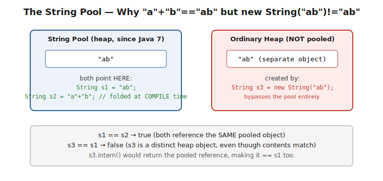
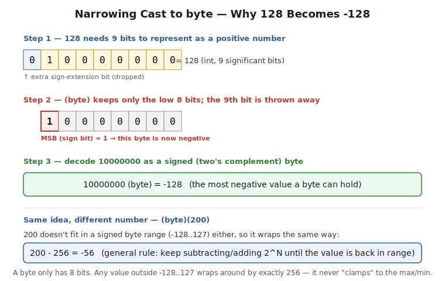
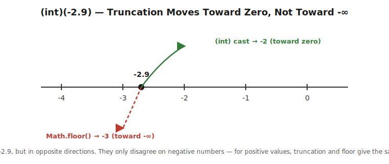
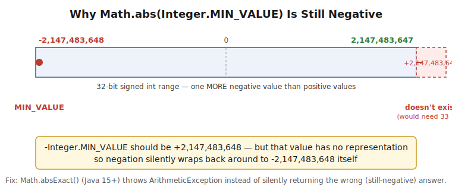
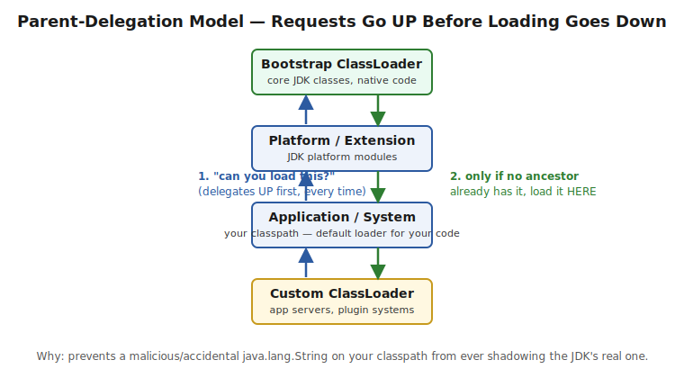
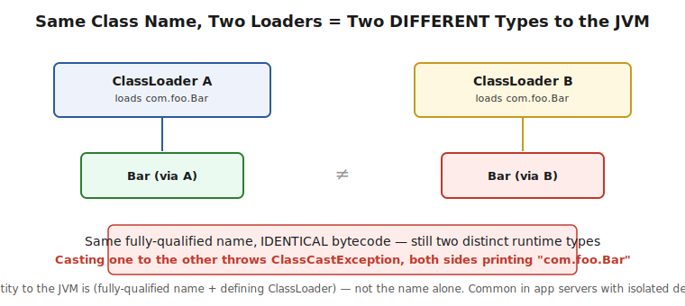
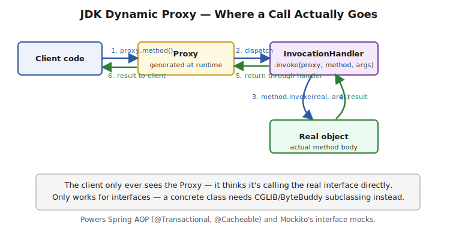
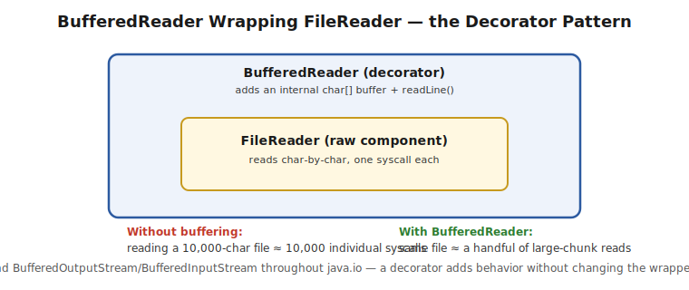
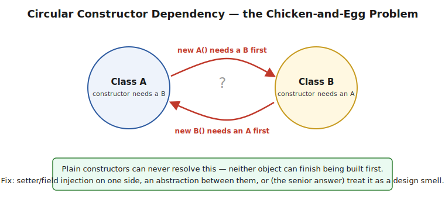

# ☕ Chapter 2 — Core Java (Topic-wise)

> Segregated from the original 59-question flat list into thematic sections for easier revision.
> **Bold** = key answer point. `⚠️ Pitfall` = interview trap / common mistake.

**Deep-dive companion files in this folder** (same style — explanation, worked Java code, pitfalls):
[Reflection](./Reflection.md) · [Enum](./Enums.md) · [Generics](./Generics.md) · [Exception Handling](./Exception-Handling.md) · [StringBuilder & Immutability](./StringBuilder-Immutability.md) · [OOP Fundamentals](./OOP-Fundamentals.md)

**See also:** [Java8-Features/](../Java8-Features/) — a dedicated folder for Streams API, Lambdas & Functional Interfaces, and Method References (kept separate since it's substantial enough to warrant its own set of parts).

---

## 1. JVM Startup, Main Method & Program Execution

### Q1. Explain `System.out.println`
- `System.out` is a **`static final PrintStream`** field on `java.lang.System`, initialized by the JVM at startup wrapping standard output.
- `println()` writes the string representation + platform line separator, and **auto-flushes on newline**.
- Ultimately routes through `FileOutputStream` → file descriptor 1 (stdout).

> ⚠️ **Pitfall:** `System.out`/`err`/`in` **can be reassigned at runtime** via `System.setOut()` — relevant for redirecting output in tests.

### Q2. Why is `System.out` considered thread-safe?
- `PrintStream` methods are **`synchronized` on the stream instance** — a single `println()` call won't have its output garbled/interleaved.
- Does **not** guarantee ordering *between* separate calls from different threads.

> ⚠️ **Pitfall:** "Thread-safe" here = won't corrupt a single write, **not** deterministic multi-line ordering across threads.

### Q3. Can we execute a program without a `main()` method?
- Pre-Java 7: a static initializer block + `System.exit()` could run before the "no main" error — **closed in Java 7+**.
- Modern Java: `public static void main(String[] args)` is mandatory.
- Java 21+ preview "implicit classes/instance main methods" reduces boilerplate only, not the requirement itself.

> ⚠️ **Pitfall:** Don't state the static-initializer trick as still working today.

### Q29. What happens when `main()` is run?
- JVM starts → loads main class (bootstrap → platform → application loader) → runs **static initializers in declaration order** → invokes `main(String[])` on the main thread.
- JVM stays alive as long as any **non-daemon thread** runs; shutdown hooks run before exit.

> ⚠️ **Pitfall:** `main` returning ≠ JVM exiting immediately if other non-daemon threads are alive.

### Q30. What happens under the hood after `System.out.println("Hello")`?
- **Compile** (`javac` → bytecode) → **Class Load** (classloader + verify + prepare/init) → **Execute** (interpret, then JIT hot paths to native code) → `println` writes via `PrintStream` → OS stdout fd.

> ⚠️ **Pitfall:** Structure the answer in clear stages — interviewers check mental-model organization, not just facts.

### Q6. Can `throws` be used with `run()` or `main()`?
- `main`: **yes** — `throws Exception` legal; uncaught exception → JVM prints stack trace, exits non-zero.
- `Runnable.run()`: **no** — interface declares no `throws`; overriding method can't widen checked exceptions.

> ⚠️ **Pitfall:** Ties directly to the "can't widen checked exceptions when overriding" OOPS rule.

### Q7. What happens if you call `Thread.wait()` in main?
- `wait()` is on `Object`, requires holding the monitor lock.
- No lock held → `IllegalMonitorStateException`.
- Held correctly → **the calling thread** (main, here) blocks until notified/interrupted.

> ⚠️ **Pitfall:** `someThread.wait()` doesn't make "the thread object" wait specially — it makes **whichever thread calls it** wait on that object's monitor.

### Q4. JDK 14-compiled program run on JDK 8 runtime?
- **`UnsupportedClassVersionError`** at class-loading — bytecode version embedded in `.class` must be ≤ JVM's supported version.

> ⚠️ **Pitfall:** Mention `--release`/`-source`/`-target` flags as the practical fix.

### Q5. Java 8-compiled app on JDK 11 runtime?
- Generally **yes**, backward compatible.
- Caveats: removed APIs (JAXB/Java EE modules removed from JDK 11+), internal API (`sun.*`) restrictions.

> ⚠️ **Pitfall:** Don't say "always works unconditionally" — name the JAXB/Java EE removal explicitly.

---

## 2. Object Class, Equality & Cloning

### Q9. What is the `Object` class?
- **Root of the class hierarchy** — every class implicitly extends it.
- Provides `equals`, `hashCode`, `toString`, `getClass`, `wait`/`notify`/`notifyAll`.

> ⚠️ **Pitfall:** None of `Object`'s methods are abstract — default working implementations exist for every class.

### Q10. Important methods in `Object`
- `equals(Object)`, `hashCode()` — must be overridden **together, consistently**.
- `toString()`, `getClass()`, `clone()` (protected, needs `Cloneable`), `wait/notify/notifyAll`, `finalize()` (**deprecated since Java 9**).

> ⚠️ **Pitfall:** Listing `finalize()` without the deprecation caveat signals outdated knowledge.

### Q11. Default `hashCode()` of an object
- Implementation-specific, often identity-related — **not guaranteed to be the literal memory address**.
- Consistent for the same object across its lifetime.

> ⚠️ **Pitfall:** Don't state "it's literally the memory address" as absolute fact.

### Q42. `==` vs `.equals()` — the real difference
- `==` on primitives compares value; on references compares **identity**.
- `.equals()` defines **logical equality** (defaults to identity unless overridden).
- Without override, `.equals()` behaves identically to `==`.

> ⚠️ **Pitfall:** Pair with the `Integer` cache gotcha (Q48) — `Integer a=127,b=127; a==b` → `true`, but `200` → `false`.

### Q46. Full `equals()`/`hashCode()` contract
```
equals() contract:
1. Reflexive   : x.equals(x) → true
2. Symmetric   : x.equals(y) ⟺ y.equals(x)
3. Transitive  : x.equals(y) ∧ y.equals(z) → x.equals(z)
4. Consistent  : repeated calls return same result (no state change)
5. Null-safe   : x.equals(null) → false (never throws)

hashCode() contract:
6. Same object       → same hashCode (within one JVM run)
7. equals()==true     → hashCode() MUST also be equal (mandatory)
8. Same hashCode      → equals() may be true OR false (collisions fine)
```
```java
@Override
public boolean equals(Object o) {
    if (this == o) return true;
    if (!(o instanceof Employee e)) return false; // null-safe + type check
    return id == e.id && Objects.equals(name, e.name);
}
@Override
public int hashCode() { return Objects.hash(id, name); }
```

> ⚠️ **Pitfall — HIGH VALUE:** Most candidates only know rule 7. Reciting **all 5 equals() rules + both hashCode() rules** unprompted is a strong depth signal. Also mention: **Java 14+ Records auto-generate both correctly**.

### Q26. Shallow copy vs deep copy (cloning)
- `Object.clone()` default = **shallow copy** — primitives by value, references shared with original.
- **Deep copy** recursively clones referenced mutable objects too.
- Shallow is safe for immutable fields only.

> ⚠️ **Pitfall:** Concrete failure: `order2.getItems().add(x)` also mutates `order1`'s list under shallow copy.

### Q27. [Follow-up] Implementing a deep copy
```java
@Override
public Order clone() {
    Order copy = (Order) super.clone();
    copy.items = new ArrayList<>(this.items);
    return copy;
}
```
- Alternatives: serialization-based deep copy, or (preferred by many) **copy constructors / static factory methods** instead of `clone()` entirely.

> ⚠️ **Pitfall:** Voice the informed opinion — Effective Java calls `Cloneable`/`clone()` "largely broken."

### Q28. What is `CloneNotSupportedException`?
- Checked exception from `Object.clone()` if the class doesn't implement `Cloneable` (a **marker interface** with no methods, checked at runtime by native `clone()`).

> ⚠️ **Pitfall:** This is exactly why `Cloneable` is considered an awkward interface — it doesn't declare `clone()` itself, just gates `Object.clone()`'s runtime behavior.

---

## 3. Strings, Memory & Security

### Q8. What is the String Pool?
- Special memory region (heap since Java 7, previously PermGen) caching unique **String literals**.
- Literals auto-interned at compile/class-load time; `new String(...)` bypasses the pool; `.intern()` manually pools.

**In plain words:** think of the pool as a shared shelf of unique String values. Every time you write a literal like `"ab"` in your source code, the compiler checks the shelf first — if `"ab"` is already there, your variable just points to that existing copy instead of a new one. `"a"+"b"` is written as two separate literals, but since both halves are known at **compile time**, the compiler folds them into a single `"ab"` literal before the program even runs — so it resolves to the exact same shelf entry as a plain `"ab"` literal, which is why `==` reports `true`. `new String("ab")`, on the other hand, is an explicit runtime instruction to build a brand-new object on the regular heap, deliberately bypassing the shelf — so even though its contents are identical, it's a different object, and `==` reports `false`.



> ⚠️ **Pitfall:** Classic gotcha — `"a"+"b" == "ab"` → often `true` (constant folding), `new String("ab") == "ab"` → `false`. Have both examples ready.

### Q13. Why is `char[]` preferred over `String` for passwords?
- Strings are **immutable + pooled** — may live in memory indefinitely, invisible to app control.
- `char[]` can be **explicitly zeroed** (`Arrays.fill(pw, '0')`) right after use.
- Strings show up more easily in heap dumps/logs/stack traces.

**In plain words:** once you create a `String` holding a password, you have **no way to force it out of memory early** — because Strings are immutable, there's no "clear this string's contents" operation, and you don't control exactly when the garbage collector reclaims it. So the plaintext password could realistically sit in memory for an unpredictable amount of time, visible to anyone who takes a heap dump. A `char[]`, by contrast, is a plain mutable array — the moment you're done with it, you can call `Arrays.fill(pw, '0')` to actively overwrite every character in place, right then, on your own schedule, rather than hoping the GC gets to it soon. That's the real distinguishing reason — active, immediate zeroing — not simply "Strings are immutable" (which is true, but doesn't by itself explain *why* immutability is the problem here).

> ⚠️ **Pitfall — KEY POINT:** The real reason is **active zeroing capability**, not "strings are immutable" alone — an interviewer wants to hear that you understand *why* immutability matters here specifically (no way to actively clear it), not just that Strings happen to be immutable.

### Q53. Floating point pitfalls — NaN, Infinity, 0.1+0.2
```java
0.1 + 0.2 == 0.3;     // FALSE — 0.30000000000000004
Double.NaN == Double.NaN;  // FALSE! NaN never equals itself
Double.isNaN(nan);         // TRUE — the ONLY correct check
1.0 / 0.0;   // POSITIVE_INFINITY, no exception
10 / 0;      // ArithmeticException (int division DOES throw)
0.0 / 0.0;   // NaN
```
For money: use `BigDecimal` with the **String constructor**, never the double constructor:
```java
new BigDecimal("0.1").add(new BigDecimal("0.2")); // correct
new BigDecimal(0.1);                               // WRONG — imprecision baked in
```

**In plain words, why each surprise happens:**
- **`0.1 + 0.2 != 0.3`:** `double` stores numbers in binary floating point, and just like `1/3` has no exact finite decimal representation, `0.1` and `0.2` have no exact finite *binary* representation — they're stored as the closest approximation the format allows. Adding two approximations doesn't necessarily land exactly on the approximation of `0.3`, so the tiny rounding errors show up as `0.30000000000000004`.
- **`NaN == NaN` is `false`:** `NaN` ("Not a Number") represents the result of an undefined operation like `0.0/0.0` — by design (IEEE 754, the standard Java's floating point follows), `NaN` is defined to compare unequal to *everything*, including another `NaN`, specifically so that an accidental undefined result can never silently look like a normal, valid comparison passing. This is exactly why `Double.isNaN(x)` exists — it's the only reliable way to check.
- **`new BigDecimal(0.1)` is wrong:** the `double` constructor path takes the *already-imprecise* binary approximation of `0.1` and locks that imprecision into the `BigDecimal`, rather than the value `0.1` you actually meant. The `String` constructor instead parses the decimal digits `"0.1"` directly, with no binary floating-point step in between, giving you the exact value you wrote.

> ⚠️ **Pitfall — HIGH VALUE:** `nan == nan` being `false` catches people off guard. `new BigDecimal(0.1)` "looking correct" while being wrong is a real production bug.

---

## 4. Casting & Type Conversion

### Q35. Casting — two broad categories
- **Primitive casting** (int/double/char etc.) vs **reference/object casting** (related class/interface types).
- Primitive casting can lose data; reference casting never touches the object's bytes.

> ⚠️ **Pitfall:** Don't conflate the two categories in your answer.

### Q36. Widening (implicit) cast
- `byte → short → int → long → float → double` (char folds into int side). Automatic, generally no data loss.

> ⚠️ **Pitfall:** `int→float` / `long→float/double` **can lose precision** even though "widening" — not always lossless.

### Q37. Narrowing (explicit) cast & overflow
- Requires explicit `(type)`. Overflow is **defined**: JLS specifies **modular truncation**, not clamping.
- `(byte)(1000d)` → `-24` (wraps, doesn't clamp to `Byte.MAX_VALUE`).

> ⚠️ **Pitfall:** Have the exact wrap-around number ready — reciting "might lose data" without a number is the weak answer.

### Q38. Reference (object) casting vs primitive casting
- Only changes **how you refer to** the object; heap object untouched.
- Only legal between inheritance-related types; unrelated classes → **compile-time error**.

### Q39. Upcasting
- Reference cast to a **supertype** — always safe, implicit, no `(Type)` needed.
- `Integer i=7; Number num=i; Object obj=i;` all implicit.

> ⚠️ **Pitfall:** After upcasting, you can only call methods on the **reference's static type**, even though the real object is still the subtype underneath.

### Q40. Downcasting
- Reference cast to a **subtype** — requires explicit cast; compiler can't verify at compile time.
- Wrong assertion → **`ClassCastException`** at runtime.
- Sibling trick: `B b=new B(); A a=b; C c=(C)a;` (B, C both extend A, unrelated) — **compiles**, throws at runtime.

> ⚠️ **Pitfall — MEMORIZE THIS:** The sibling-cast trick question — compiler only checks "plausible given declared type," not actual runtime correctness.

### Q51. `(byte)(128)` — walk-through
```java
byte b = (byte)(128); // -128
```
**In plain words:** a `byte` only has 8 bits to work with, and the highest of those 8 bits is reserved as the sign bit (0 = positive, 1 = negative) — this is called **two's complement**. The number 128 needs **9 bits** to write out as a positive number (`0 1000 0000`). When you cast to `byte`, Java doesn't resize or clamp anything — it just **keeps the low 8 bits and throws the 9th away**. What's left is `1000 0000`. Because the leftover top bit is now `1`, the JVM reads the whole thing as a *negative* number instead of the positive `128` you started with — and in two's complement, `1000 0000` happens to decode to exactly `-128`.



> ⚠️ **Pitfall:** Follow-up: `(byte)(200)` → `200-256 = -56`. General rule: keep ±`2^N` (256 for byte) until the value lands back in the valid -128..127 range — it wraps, it never clamps to `Byte.MAX_VALUE`.

### Q52. `(int)(-2.9)` — truncation vs rounding
```java
(int)(-2.9);  // -2, NOT -3
```
**In plain words:** `(int)` casting doesn't "round" at all — it just **chops off the decimal part**, always moving toward zero. For a positive number like `2.9`, chopping toward zero and rounding down (flooring) give the same answer (`2`). But for a **negative** number, they disagree: `-2.9` chopped toward zero lands on `-2` (a smaller magnitude, but a *larger* value on the number line), while `Math.floor(-2.9)` moves toward negative infinity and lands on `-3` (a *smaller* value). Same starting number, two different "correct" answers depending on which operation you actually call.



> ⚠️ **Pitfall — VERY COMMON MISTAKE:** Confusing truncation with flooring; they only diverge for negative numbers — for positive numbers, `(int)` cast and `Math.floor()` always agree.

### Q54. `Integer.MIN_VALUE` negation — overflow trap
```java
Math.abs(Integer.MIN_VALUE) == Integer.MIN_VALUE; // TRUE — still negative!
```
**In plain words:** a 32-bit signed `int` can represent 2,147,483,648 negative values but only 2,147,483,647 positive ones — one extra negative slot, because two's complement is asymmetric. `Integer.MIN_VALUE` is `-2,147,483,648`. Negating it should give `+2,147,483,648`, but that number is one more than the largest `int` can hold — there's simply no bit pattern for it. So the negation silently **wraps back around** to `-2,147,483,648`, the exact same (still negative) value you started with. `Math.abs()` on the most negative int is the one case where "absolute value" doesn't actually make the number non-negative.



> ⚠️ **Pitfall:** Use `Math.absExact()` (Java 15+) to throw `ArithmeticException` instead of silently returning the wrong (still-negative) result.

---

## 5. Wrapper Classes, Autoboxing & Boxing Performance

### Q41. Wrapper classes — why Java needs them
- Let primitives be treated as `Object` — needed for generics (`List<Integer>`), collections, reflection.
- **Autoboxing/unboxing** (Java 5+) makes conversion mostly invisible, but each boxing = new heap object (except cached range).

> ⚠️ **Pitfall:** `Long sum=0L; for(...) sum += i;` silently boxes/unboxes every iteration — use a primitive accumulator instead.

### Q47. How autoboxing actually works
```java
int → Integer : Integer.valueOf(int)   // compiler inserts this
Integer → int : integerObj.intValue()  // and this
```
No JVM magic — plain compiler-inserted method calls.

> ⚠️ **Pitfall:** It's `Integer.valueOf()`, **not** `new Integer()` — this is exactly what routes through the cache.

### Q48. Integer cache — exact rules
```
Integer   : -128 to 127 (default), tunable via -XX:AutoBoxCacheMax=N
Boolean   : TRUE/FALSE singletons, always
Byte      : -128 to 127 (ALL byte values — fixed)
Short     : -128 to 127 (fixed)
Long      : -128 to 127 (fixed, NOT configurable)
Character : 0 to 127 (fixed)
Double    : NO cache
Float     : NO cache
```

> ⚠️ **Pitfall — SCOPE LIMITATION:** Only `Integer.valueOf(int)` (autoboxing) uses the cache. `new Integer(5)` always creates new object. `Integer.parseInt("5")` returns a primitive, no boxing at all.

### Q49. Real memory overhead of boxing
```
int      : 4 bytes
Integer  : 16 bytes (12-byte header + 4-byte field) → 4x overhead
int[1000]     : ~4 KB
Integer[1000] : ~20 KB → 5x overhead
```

> ⚠️ **Pitfall:** Have exact byte numbers ready — quantified answer beats "boxing has overhead."

### Q50. Silent NPE trap — ternary with boxed types
```java
Integer x = null;
int y = x != null ? x : 0;  // NullPointerException!

Integer y = x != null ? x : 0; // FIX — keep result type as Integer
```
Ternary result type is determined from **both branches at compile time** — one branch `Integer`, other `int` → forces unboxing regardless of which branch runs.

> ⚠️ **Pitfall — GENUINELY SURPRISING:** The explicit null check makes it *look* safe; the bug is about static type determination, not runtime branch selection.

### Q55. Summing `List<Integer>` efficiently (avoiding boxing in streams)
```java
// BAD — boxes/unboxes every reduce step
int sum = list.stream().reduce(0, Integer::sum);

// GOOD — mapToInt converts once, upfront
int sum = list.stream().mapToInt(Integer::intValue).sum();
```

> ⚠️ **Pitfall:** Connects directly to Q49 — `mapToInt`/`mapToLong`/`mapToDouble` exist specifically to avoid per-step boxing cost.

---

## 6. Annotations

### Q15. How to create a custom annotation
```java
@Retention(RetentionPolicy.RUNTIME)
@Target(ElementType.METHOD)
public @interface Loggable {
    String value() default "";
}
```
Consumed via reflection at runtime or annotation processors at compile time.

> ⚠️ **Pitfall:** An annotation alone does nothing — it's inert until something actively reads it.

### Q16. Purpose of `@Retention`
- `SOURCE` (compiler-discarded), `CLASS` (default, kept in `.class` but not runtime-loaded), `RUNTIME` (reflection-visible).

> ⚠️ **Pitfall — REAL BUG:** Forgetting `RUNTIME` retention → reflection-based lookup silently finds nothing, no error.

### Q17. What does `@Target` do?
- Restricts which element types an annotation applies to; enforced at **compile time**.

> ⚠️ **Pitfall:** Can accept multiple types in an array: `@Target({METHOD, FIELD})`.

### Q58. Repeatable annotations
```java
@Repeatable(Roles.class)
@interface Role  { String value(); }
@interface Roles { Role[] value(); }

@Role("admin")
@Role("user")   // without @Repeatable → COMPILE ERROR
class UserController { }
```
Java 8+ lets the compiler auto-wrap repeated annotations into the container.

> ⚠️ **Pitfall:** `getAnnotationsByType()` returns all instances transparently regardless of `@Repeatable` vs manual container syntax.

### Q59. Annotation processors vs reflection-based reading

| | Reflection-based reading | Annotation Processor |
|---|---|---|
| When it runs | Runtime, every app start | Compile time, once |
| Output | Behavior (proxies, wiring) | **Generated source code** |
| Runtime cost | Real (reflection overhead) | **Zero** |
| Used by | Spring (classic), Jackson | Lombok, MapStruct, Dagger2, AutoValue |

> ⚠️ **Pitfall — KEY INSIGHT:** Lombok rewrites the **AST during compilation** — zero runtime reflection footprint. This tension is why Spring AOT/GraalVM native image exist in Spring Boot 3.x.

---

## 7. Class Loading, Reflection & Encapsulation

### Q18. `Class.forName()` vs `ClassLoader.loadClass()`
- `Class.forName(name)` loads **and initializes** (runs static initializer) by default.
- `ClassLoader.loadClass(name)` only **loads**, no initialization until first use.
- `Class.forName(name, initialize, loader)` overload can mimic lazy behavior.

> ⚠️ **Pitfall:** JDBC driver registration relies specifically on `Class.forName()` triggering the static initializer that self-registers with `DriverManager`.

### Q19. Types of class loaders
- **Bootstrap** (core JDK, native code), **Platform/Extension**, **Application/System** (classpath, default for user code), **Custom** (app servers, plugins).
- **Parent-delegation model**: request delegates up to parent first.

**In plain words:** there's a small chain of loaders, each responsible for a different "layer" of classes — Bootstrap (the JDK's own core classes) sits at the top, then Platform, then your Application/System loader, then any Custom loader a framework adds. When any loader is asked to load a class, it doesn't just load it itself right away — it first **asks its parent** to try, and that parent asks *its* parent, all the way up to Bootstrap. Only if no ancestor already has that class does the request come back down and get loaded at the level that was originally asked. This "ask up before loading down" rule is the parent-delegation model.



> ⚠️ **Pitfall:** Explain *why* delegation exists — it guarantees that even if your own classpath accidentally (or maliciously) contains a file named `java.lang.String`, the request for `java.lang.String` gets delegated all the way up to Bootstrap first, which already has the real one — so your fake copy is never used, no matter where it sits on the classpath.

### Q20. Can a class be loaded by two ClassLoaders?
- **Yes** — same FQN loaded by two unrelated loaders → JVM treats as **two distinct types**.
- Causes `ClassCastException` with **identical-looking class names on both sides**.

**In plain words:** to the JVM, a class's real identity isn't just its name — it's the **combination** of (fully-qualified name + the specific ClassLoader that loaded it). So if two different, unrelated loaders both load a class named `com.foo.Bar` — even from the exact same `.class` file, byte-for-byte identical — the JVM treats the two results as **two completely separate types** that happen to share a name. If you try to cast an object built by one `Bar` into the other `Bar`, you get a `ClassCastException` — and the confusing part is the error message shows `com.foo.Bar` on both sides, since the printed name doesn't include which loader produced it. This typically shows up in app servers or plugin systems that intentionally give each deployed application its own isolated loader.



> ⚠️ **Pitfall — STRONG SENIOR SIGNAL:** Recognizing this exact symptom pattern instantly — a `ClassCastException` where both sides of the message print the identical class name is the tell that two ClassLoaders are involved, not a simple type mismatch.

### Q44. Class loading — 3 phases in order
```
1. LOADING        — ClassLoader reads .class, creates Class object on heap
2. LINKING
   a. Verification — bytecode correctness check
   b. Preparation   — static fields set to DEFAULTS (0/null), not real values
   c. Resolution    — symbolic → direct references
3. INITIALIZATION — static initializers + assignments, TEXTUAL ORDER, ONCE, thread-safe
```

> ⚠️ **Pitfall:** Preparation-vs-Initialization is the detail most collapse into one step — defaults happen first, real values later.

### Q45. When does class initialization trigger?
```
- First instance creation (new)
- First static method call
- First static field READ/WRITE (except compile-time constants)
- When a subclass initializes (parent ALWAYS initializes first)
- Class.forName() (reflection)
```

> ⚠️ **Pitfall:** Compile-time constants (`static final int X = 5`) are **inlined** by the compiler — accessing them does NOT trigger the owning class's initialization.

### Q21. Using Reflection to break encapsulation
```java
Field f = obj.getClass().getDeclaredField("privateField");
f.setAccessible(true);
Object value = f.get(obj);
f.set(obj, newValue);
```
Used legitimately by DI frameworks, ORMs, test frameworks — but can violate invariants.

> ⚠️ **Pitfall:** Java 9+ module system can **block** this for non-`opens` packages — no longer an unconditional bypass.

### Q43. [Follow-up] Accessing a private constructor from outside
```java
Constructor<Singleton> constructor = Singleton.class.getDeclaredConstructor();
constructor.setAccessible(true);
Singleton instance = constructor.newInstance();
```
Same mechanism as Q21 — a private constructor is a **convention-level** safeguard, not absolute.

> ⚠️ **Pitfall:** Same Java 9+ module caveat applies.

### Q56. [Follow-up] Java 9+ module restriction on reflection & bypass
- Strong encapsulation: classes in a named module aren't reflectively accessible from outside **even with `setAccessible(true)`** → throws `InaccessibleObjectException`.
```java
// module-info.java
module com.example.myapp {
    opens com.example.internal to spring.core, com.fasterxml.jackson.databind;
}
// Emergency JVM flag:
// --add-opens java.base/java.lang=ALL-UNNAMED
```

> ⚠️ **Pitfall — WORTH MENTIONING UNPROMPTED:** This is a primary reason most Spring Boot apps don't actually adopt JPMS for application code — reflection-heavy frameworks rely on exactly this access.

### Q57. [Follow-up] Real risk of breaking encapsulation via reflection
```java
Field f = String.class.getDeclaredField("value"); // Java 8, pre-module restriction
f.setAccessible(true);
char[] val = (char[]) f.get(internedHelloString);
val[0] = 'X'; // MUTATES the shared, pooled "hello" String!
```
Mutating an **interned/pooled** String corrupts it for **every piece of code in the JVM** referencing that literal.

> ⚠️ **Pitfall — GENUINELY CATASTROPHIC, NOT THEORETICAL:** Have this ready when asked "why does immutability matter" beyond thread-safety.

### Q23. Troubleshooting `ClassNotFoundException`/`NoClassDefFoundError` post-deploy
- Check classpath/dependency mismatches, fat-jar/shaded-jar misconfigurations.
- `NoClassDefFoundError`: check if the class's **static initializer failed earlier** — search logs for an earlier `ExceptionInInitializerError`.
- Check classloader isolation (Q20) in app servers.
- Verify artifact contents: `jar tf app.jar | grep ClassName`.

> ⚠️ **Pitfall — MOST MISSED STEP:** Searching backward in logs for the original triggering static-initializer failure, instead of staring at the current stack trace.

---

## 8. Dynamic Proxies

### Q22. Dynamic proxies — what and how used
```java
MyInterface proxy = (MyInterface) Proxy.newProxyInstance(
    classLoader,
    new Class<?>[]{ MyInterface.class },
    (proxyObj, method, args) -> {
        System.out.println("before " + method.getName());
        Object result = method.invoke(realObject, args);
        System.out.println("after");
        return result;
    });
```
`java.lang.reflect.Proxy` generates a runtime class implementing interfaces, routing calls through an `InvocationHandler`. Powers Spring AOP, Mockito interface mocks.

**In plain words:** the client code holds a reference typed as the interface, but the actual object behind it is a synthetic `Proxy` class the JVM generated on the fly — the client never sees or touches the real object directly. Every method call on that reference gets intercepted and routed to your `InvocationHandler.invoke(proxy, method, args)` method first. Inside `invoke()`, you decide what happens — typically some "before" logic, then `method.invoke(realObject, args)` to actually run the real method, then some "after" logic — before returning the result back out through the same chain to the original caller. This interception point is exactly where Spring inserts things like transaction management or caching without you writing that logic into your own class.



> ⚠️ **Pitfall:** Only works for **interfaces** — proxying a concrete class needs CGLIB-style subclassing (what Spring falls back to for `@Transactional` without an interface).

### Q33. Role of `ClassLoader` in dynamic proxy creation
- `Proxy.newProxyInstance()` needs a `ClassLoader` because it **generates a new class at runtime** that must be defined into a classloader's namespace.
- Typically pass the target interface's own classloader.

> ⚠️ **Pitfall:** The question as usually phrased compares Proxy to itself (confused framing) — the real meaningful contrast is **JDK dynamic proxies (interface-based) vs. CGLIB/ByteBuddy (class subclassing)**, which is what Spring's `@Transactional`/`@Cacheable` decision hinges on.

---

## 9. I/O

### Q34. Role of `BufferedReader`; why preferred over `FileReader`
- `FileReader` reads char data directly — inefficient, near-per-char syscalls.
- `BufferedReader` wraps another `Reader`, buffers larger chunks, drastically reduces I/O ops. Adds `readLine()`.

**In plain words:** `new BufferedReader(new FileReader("file.txt"))` isn't inheritance — `BufferedReader` isn't a subclass of `FileReader`. It's **wrapping**: `BufferedReader` holds a reference to the `FileReader` you gave it, and adds a large internal in-memory buffer in front of it. Instead of asking the OS for one character at a time (a real, relatively expensive system call each time), `BufferedReader` asks the OS for a big chunk once, holds it in memory, and serves your `read()`/`readLine()` calls out of that in-memory chunk until it's exhausted — then goes back to the OS for the next chunk. Same underlying data, dramatically fewer actual I/O operations.



> ⚠️ **Pitfall — ARCHITECTURAL SIGNAL:** Frame as the **Decorator pattern** applied to I/O — same pattern behind `BufferedOutputStream`/`BufferedInputStream` throughout `java.io`. The decorator wraps the original object and adds behavior, without the original needing to change or the caller needing a different interface.

---

## 10. Marker Interfaces & Design Concepts

### Q12. Marker interfaces
- Interfaces with **no methods** — tag a class for metadata other code checks via `instanceof`. E.g. `Serializable`, `Cloneable`, `RandomAccess`.
- Since Java 5, annotations have largely superseded them for new APIs.

> ⚠️ **Pitfall:** Explain *why* — annotation = pure metadata; marker interface = permanently affects the type hierarchy (`instanceof`), sometimes deliberately desired (like `Serializable`).

### Q31. Circular constructor dependency between two classes
- Plain constructors can't resolve — genuine chicken-and-egg problem.
- Fixes: setter/field injection for one side, introduce an abstraction, or (senior answer) treat it as a **design smell** — extract a coordinating third class.
- Spring: constructor-injection cycles fail context startup by default; setter injection is a workaround, not the real fix.

**In plain words:** if `A`'s constructor requires a fully-built `B` as an argument, and `B`'s constructor requires a fully-built `A`, neither one can ever finish being constructed first — building `A` needs a `B` that doesn't exist yet, and building that `B` needs an `A` that doesn't exist yet either. It's not a bug in your code so much as a structural deadlock in the design. Since neither object can be "first," a plain constructor-only approach has no valid order to run in. The workarounds all do the same thing at heart: delay one side of the wiring until *after* both objects already exist as bare instances (setter/field injection), or restructure so neither class needs the *other concrete class* directly (introduce an interface, or a third coordinating class both depend on).



> ⚠️ **Pitfall — SENIOR ANSWER:** The real fix is recognizing poor separation of concerns, not just reciting the wiring hack — two classes needing each other at construction time is usually a sign they should be redesigned, not just patched with setter injection.

### Q32. "Ghost methods" — compiler optimization?
- Not a standard Java term — **say so honestly** rather than inventing a definition.
- Closest real concepts: **bridge methods** (generic type erasure / covariant returns) or **synthetic methods** (compiler-generated, e.g. nested-class private access).

**In plain words:** "ghost methods" isn't real Java terminology — if you're asked this, the term itself is likely a red herring or a mis-phrased question, and the strongest answer is admitting you haven't heard that exact phrase rather than guessing a definition. What the interviewer is *probably* getting at is one of two real, compiler-generated things: a **bridge method** (an invisible method the compiler adds to keep polymorphism working correctly after generic type erasure — see `core-java/Generics.md`'s Bridge Methods section for a full worked example), or a **synthetic method** (any compiler-generated method not written by the developer, such as the hidden accessor methods that let a nested class reach a private field of its enclosing class).

> ⚠️ **Pitfall:** The right interview instinct — admit unfamiliarity with the exact term, then pivot to the closest real concept you do know (bridge methods or synthetic methods) rather than inventing a plausible-sounding but wrong definition.

---

## 11. Debugging & Production Troubleshooting (Experience-Based)

### Q14. JUnit fails as expected, but step-over debugging doesn't reproduce it
- Timing-sensitive/concurrency bugs — debugger changes thread interleaving.
- JIT compilation differences — debugger may force interpreted mode.
- Stale shared static state between test runs.
- Non-deterministic dependencies (system time, random seed, filesystem order).

> ⚠️ **Pitfall — LEAD WITH THESE:** Race conditions + JIT timing differences are the two most likely intended answers.

### Q24. Performance optimizations you've implemented
- Connection/thread pool tuning (HikariCP sized to real concurrency).
- Reducing N+1 in JPA/Hibernate (batch fetch, `@EntityGraph`, projection DTOs).
- Caching hot data (Redis/Caffeine, TTLs, cache-aside).
- JVM tuning (heap sizing, G1 vs ZGC, `-Xlog:gc`).
- Async/non-blocking I/O (`CompletableFuture` for parallel downstream calls).
- Profile before optimizing (async-profiler, JFR).

> ⚠️ **Pitfall:** This is experience-based — have **one concrete story with measurable before/after** (e.g. P99 latency X→Y), not just a generic list.

### Q25. Production server stopped logging & unresponsive — investigation steps
1. **Thread dump first** (`jstack <pid>` / `kill -3 <pid>`) — check deadlocks, all threads stuck on same resource.
2. Check GC logs for a long/continuous full GC ("stop-the-world").
3. Check OS resource exhaustion — disk full, fd limits, swapping.
4. Check if request queue/thread pool is saturated (no timeout on external calls).

> ⚠️ **Pitfall — ALWAYS FIRST STEP:** Thread dump before restarting — restarting destroys the evidence needed to fix the root cause.

---

*Source: Notion "Chapter 2 — Core Java" (59 questions). Original toggle order preserved via Q-numbers for cross-reference; grouped here by topic for revision efficiency.*
