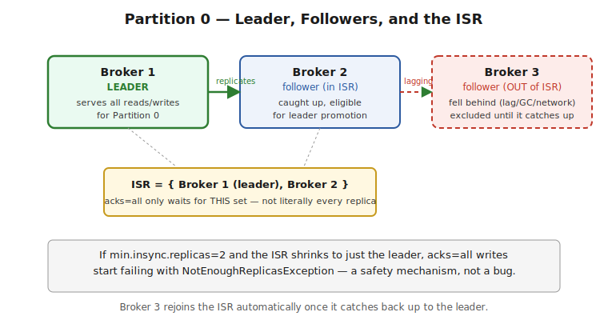

# Part 1 — Architecture & Core Concepts

> Brokers, topics and partitions as the unit of parallelism, the append-only commit log model, offsets, replication via the in-sync replica (ISR) set, leader/follower mechanics, and controller election. Interview Q&A at the end.

## The Big Picture — What Kafka Actually Is

**What it is:** Kafka is a distributed, partitioned, replicated commit log. Producers append records to topics; consumers read those records independently, at their own pace, from wherever they last left off. Unlike a traditional message queue, reading a message does **not** remove it — Kafka retains records for a configured period (or forever, with compaction), and multiple independent consumers can each read the exact same data at different offsets simultaneously.

```
Producers  →  [ Topic: orders (3 partitions) ]  →  Consumer Group A (order-service)
                                                  →  Consumer Group B (analytics-service)
                                                  →  Consumer Group C (fraud-detection)
```
Each consumer group reads the topic independently and tracks its own position — this is the core architectural difference from a queue, where a message is gone once one consumer takes it.

## Topics and Partitions — the Unit of Parallelism

**What a partition is:** a topic is a logical name; a **partition** is the actual physical unit — an ordered, immutable, append-only sequence of records, stored as a set of segment files on disk. A topic with 6 partitions is really 6 independent logs, potentially spread across 6 different brokers.

```
Topic: orders (3 partitions)

Partition 0: [msg0][msg1][msg2][msg3]...  →  offset increases left to right
Partition 1: [msg0][msg1][msg2]...
Partition 2: [msg0][msg1][msg2][msg3][msg4]...
```
**Ordering is only guaranteed within a single partition**, never across partitions of the same topic. This is the single most important architectural fact in Kafka — it's the reason partition **count** is a capacity-planning decision (more partitions = more parallelism) and partition **key** choice is a correctness decision (same key must land on the same partition if order between those specific records matters).

> ⚠️ **Pitfall — "Kafka preserves order" is only half true:** Kafka preserves order *per partition*, not per topic. If you need all events for a given `orderId` to be processed in order, you must key by `orderId` so they consistently land on the same partition — sending unkeyed (round-robin) records to a multi-partition topic gives you **no** cross-record ordering guarantee at all.

## Offsets — the Consumer's Bookmark

**What it is:** every record within a partition has a monotonically increasing **offset** — its position in that partition's log. An offset is meaningful only in the context of (topic, partition) — offset 42 in partition 0 and offset 42 in partition 1 are unrelated records.

```java
// A ConsumerRecord carries its own coordinates
ConsumerRecord<String, String> record = ...;
record.topic();      // "orders"
record.partition();  // 1
record.offset();     // 42
```
Consumers track "the next offset to read" per partition, and **committing** an offset is how a consumer group records its progress (stored in Kafka's internal `__consumer_offsets` topic, not in Zookeeper for modern Kafka). See Part 3 for the full mechanics of when/how offsets get committed and why that timing is where most reliability bugs live.

## Brokers, Replication, and the ISR

**What a broker is:** a single Kafka server process — it hosts some subset of partitions (as leader for some, follower/replica for others) and handles all reads/writes for the partitions it leads.

**Replication:** each partition has a **replication factor** (commonly 3 in production) — one broker holds the **leader** replica (all reads and writes go through it), and the others hold **follower** replicas that continuously fetch from the leader to stay in sync.

```
Partition 0, replication factor 3:

Broker 1 (LEADER)   — serves all reads/writes for partition 0
Broker 2 (follower)  — replicates from the leader
Broker 3 (follower)  — replicates from the leader
```
**The In-Sync Replica (ISR) set** is the subset of replicas (leader + followers) that are "caught up enough" (within `replica.lag.time.max.ms`) to be considered safe to promote to leader without data loss. A follower falling too far behind (slow disk, network partition, GC pause) gets **kicked out of the ISR** until it catches back up — this is exactly the mechanism `acks=all` relies on (see Part 2): "all" means all *current ISR members*, not literally every replica ever configured.

```
Healthy: ISR = {Broker1(leader), Broker2, Broker3}          — full redundancy
Degraded: ISR = {Broker1(leader), Broker2}                   — Broker3 fell behind, temporarily excluded
```



> ⚠️ **Pitfall — the ISR shrinking silently weakens your durability guarantee:** if `min.insync.replicas=2` and the ISR shrinks to just the leader (1 member), producers using `acks=all` will start getting `NotEnoughReplicasException` — which is the *correct*, safe behavior (Kafka refusing to accept writes it can't durably replicate), but it's frequently misdiagnosed as "Kafka is broken" rather than "a follower fell behind and the safety net did its job." Monitor **under-replicated partitions** as a first-class production metric, not an afterthought.

## Leader Election and the Controller

**What happens when a leader dies:** one of the in-sync followers is promoted to leader. This decision is made by the **controller** — a single broker in the cluster elected to coordinate cluster-wide metadata (which broker leads which partition, handling broker join/leave events).

**Modern Kafka (KRaft mode, Kafka 3.3+ default, replacing Zookeeper):** the controller role itself is now managed via a Raft consensus quorum of controller nodes internal to Kafka, rather than depending on an external Zookeeper ensemble — removing an entire separate distributed system from the deployment.

> ⚠️ **Pitfall — know that Zookeeper is gone (or going):** older material (and some still-running production clusters) describes Zookeeper as coordinating broker metadata and controller election. Since KRaft became the default (Kafka 3.3+, with Zookeeper removed entirely in Kafka 4.0), describing Zookeeper as a hard architectural dependency is outdated — worth stating the current KRaft model explicitly rather than defaulting to the old mental model, especially in a 2026 interview.

## Consumer Groups — a Preview

**What it is:** a consumer group is a named set of consumers cooperatively reading a topic, where Kafka guarantees **each partition is consumed by exactly one consumer within the group at a time**. This is how Kafka achieves both broadcast (different groups each get the full data) and horizontal scaling (consumers within one group split the partitions among themselves) from the same underlying log.

```
Topic: orders (3 partitions), Consumer Group "order-service" with 3 consumers:

Consumer A → Partition 0
Consumer B → Partition 1
Consumer C → Partition 2
```
If a 4th consumer joins this group, it sits idle — you cannot have more active consumers than partitions within one group for that topic. Part 3 covers this, rebalancing, and partition assignment strategy in full depth.

> ⚠️ **Pitfall — partition count is a hard ceiling on group parallelism:** a common production mistake is scaling out consumer instances (e.g., in Kubernetes, bumping replica count) without first increasing partition count — beyond `partition count` consumers, the extras are simply idle. Partition count should be planned around the *maximum* parallelism you'll ever need, since increasing it later doesn't rebalance existing keyed data cleanly (see Part 5's note on this).

---

## Interview Q&A

**Q: What ordering guarantee does Kafka actually provide?**
Ordering is guaranteed only *within a single partition*, never across partitions of the same topic. Records with the same key always land on the same partition (via the default hash-based partitioner), so keying is the mechanism for ensuring related records stay ordered relative to each other.

**Q: What is the ISR, and why does `acks=all` depend on it rather than "all replicas"?**
The In-Sync Replica set is the subset of a partition's replicas that are currently caught up enough to be safely promoted to leader without data loss. `acks=all` means the write is acknowledged once every *current* ISR member has it — if a follower has fallen behind and been excluded from the ISR, it isn't part of that guarantee, which is why the ISR can legitimately shrink to just the leader under `min.insync.replicas=1` and still accept writes (at reduced durability).

**Q: A follower broker is lagging — what actually happens?**
If it falls behind past `replica.lag.time.max.ms`, it's removed from the ISR. It keeps trying to catch up and rejoins the ISR once it does. While it's out of the ISR, `acks=all` writes no longer wait on it — durability is temporarily reduced to whatever's left in the ISR, and if the ISR shrinks below `min.insync.replicas`, producers start getting `NotEnoughReplicasException`.

**Q: What replaced Zookeeper in modern Kafka, and why does it matter to know?**
KRaft mode (Kafka's own Raft-based consensus among controller nodes) replaced Zookeeper for cluster metadata and controller election, default since Kafka 3.3 and the only option since Kafka 4.0. It matters because describing Zookeeper as a required dependency is now outdated information that signals stale Kafka knowledge in an interview.

**Q: Can a consumer group have more consumers than partitions?**
Yes, but the extras sit idle — Kafka guarantees at most one consumer per partition within a group, so partition count is a hard ceiling on that group's real parallelism. Scaling consumer instances beyond partition count doesn't increase throughput.
