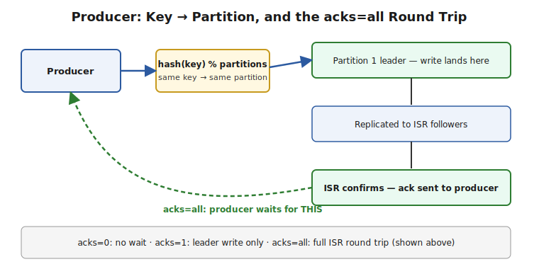

# Part 2 — Producers

> How records get assigned to partitions, the `acks` durability knob, batching and `linger.ms`, the idempotent producer, and how producer retries interact with ordering. Interview Q&A at the end.

## Partitioning Strategy — Where Does a Record Actually Go?

**Default behavior (Java client, `DefaultPartitioner` / sticky partitioner since 2.4+):**
- **With a key:** `partition = hash(key) % numPartitions` — same key always goes to the same partition (as long as partition count doesn't change).
- **Without a key:** records are distributed using the **sticky partitioner** — batches of records stick to one partition at a time (to improve batching efficiency) before switching to another, rather than strict round-robin per record.

```java
ProducerRecord<String, String> record = new ProducerRecord<>("orders", "customer-123", payload);
// "customer-123" hashes to a specific partition -- every record with this key lands there
```
**Custom partitioner:** implement `Partitioner` when you need routing logic beyond hash-of-key (e.g., routing VIP customers to a dedicated partition for priority processing).

> ⚠️ **Pitfall — changing partition count breaks key-to-partition stability:** `hash(key) % numPartitions` means adding partitions to an existing topic changes which partition *new* messages for an existing key land on, while old messages for that key stay on the original partition. This silently breaks the "all records for this key are ordered together" guarantee across the old/new partition boundary — plan partition count upfront rather than growing it casually on a keyed, order-sensitive topic.

## `acks` — the Core Durability vs Latency Trade-off

```
acks=0   — fire and forget. Producer doesn't wait for any broker acknowledgment. Fastest, weakest guarantee (silent data loss on broker failure).
acks=1   — leader acknowledges after writing to its own log, before followers replicate. Fast, but a leader crash before replication loses the record.
acks=all — leader acknowledges only after the write is replicated to every current ISR member (governed by min.insync.replicas). Slowest, strongest guarantee.
```
```java
Properties props = new Properties();
props.put(ProducerConfig.ACKS_CONFIG, "all");
props.put(ProducerConfig.RETRIES_CONFIG, Integer.MAX_VALUE); // rely on delivery.timeout.ms to bound total time, not a retry count
```



> ⚠️ **Pitfall — `acks=all` alone doesn't guarantee durability without `min.insync.replicas`:** if `min.insync.replicas=1` (the default in many setups), `acks=all` with an ISR that has shrunk to just the leader still succeeds — "all of the ISR" was satisfied by just the leader. For genuine multi-broker durability, you need **both** `acks=all` **and** `min.insync.replicas >= 2` (commonly 2 with replication factor 3, tolerating one broker failure).

## Batching and `linger.ms` — Trading Latency for Throughput

**What it does:** the producer doesn't send one record per network call — it buffers records into per-partition batches and sends a batch when either `batch.size` (bytes) is reached or `linger.ms` (a small deliberate wait) elapses, whichever comes first.

```java
props.put(ProducerConfig.BATCH_SIZE_CONFIG, 32768);   // 32KB batches
props.put(ProducerConfig.LINGER_MS_CONFIG, 10);        // wait up to 10ms to fill a batch before sending anyway
props.put(ProducerConfig.COMPRESSION_TYPE_CONFIG, "lz4"); // compress whole batches -- much better ratio than per-record
```
**Why `linger.ms > 0` is usually a good trade, even though it adds latency:** a small deliberate delay (single-digit milliseconds) dramatically improves throughput and compression ratio (compressing a full batch beats compressing tiny individual records) — for most systems, a few milliseconds of added latency is a trivial cost against a real throughput/cost win, especially with compression enabled.

> ⚠️ **Pitfall — `linger.ms=0` isn't "no batching," it's "no waiting for more":** even at `linger.ms=0`, whatever records happen to already be queued for a partition when the network is free get batched together — `linger.ms` only controls whether the producer waits *longer* to accumulate more before sending, not whether batching happens at all.

## The Idempotent Producer — Solving Duplicate Writes from Retries

**The problem it solves:** with `acks=all` and retries enabled, a genuinely ambiguous failure (the write succeeded but the acknowledgment was lost to a network blip) causes the producer to retry — which, without idempotence, can write the **same record twice**.

```java
props.put(ProducerConfig.ENABLE_IDEMPOTENCE_CONFIG, true); // default true since Kafka 3.0 when unset
```
**How it works:** the producer is assigned a unique **Producer ID (PID)**, and every record it sends carries a per-partition **sequence number**. The broker tracks the last sequence number it committed per (PID, partition) and silently deduplicates a retry carrying a sequence number it's already seen — turning "at-least-once producer retries" into "effectively-exactly-once producer writes," without the producer or broker needing any application-level dedup logic.

> ⚠️ **Pitfall — idempotence is per-producer-session, not a magic global guarantee:** if the producer process restarts, it gets a **new** PID — the broker's dedup window resets. Idempotence protects against retries *within* one producer's active session (the common case: transient network blips), not against an application-level bug that calls `send()` twice for logically the same business event. That's a different problem (see Part 4's transactions and outbox-pattern coverage for the actual dual-write problem).

## Producer Retries and Ordering — the `max.in.flight.requests` Trap

**The subtle ordering bug:** if a producer has multiple requests in flight simultaneously (`max.in.flight.requests.per.connection > 1`, default 5) and an earlier request fails and retries while a later one succeeds first, records can be **written out of the order they were sent** — even within the same partition.

```java
// DANGEROUS combination pre-Kafka-3.0-defaults: out-of-order writes possible on retry
props.put(ProducerConfig.MAX_IN_FLIGHT_REQUESTS_PER_CONNECTION, 5);
props.put(ProducerConfig.ENABLE_IDEMPOTENCE_CONFIG, false);
props.put(ProducerConfig.RETRIES_CONFIG, 3);
```
**The fix:** with the idempotent producer enabled (`enable.idempotence=true`, the modern default), Kafka tracks sequence numbers **per producer** and preserves ordering correctly even with up to 5 in-flight requests — the broker rejects an out-of-order sequence number rather than silently accepting it, and the client library handles the retry sequencing correctly. Idempotence isn't just about dedup — it's also what makes `max.in.flight.requests.per.connection > 1` safe for ordering.

> ⚠️ **Pitfall — this is exactly why `enable.idempotence=true` should be treated as a default-on setting, not an opt-in tweak:** disabling it to "simplify" producer config, without also dropping `max.in.flight.requests.per.connection` to 1, reintroduces a genuine, hard-to-reproduce ordering bug that only manifests under retry conditions — exactly the kind of bug that's fine in testing and breaks in production under real network flakiness.

---

## Interview Q&A

**Q: How does Kafka decide which partition a keyed record goes to, and what happens if you later add partitions to that topic?**
`hash(key) % numPartitions` for the default partitioner. Adding partitions changes the modulus, so new messages for an existing key can land on a different partition than older messages for that same key did — silently breaking cross-record ordering for that key across the boundary. Partition count should be planned upfront on order-sensitive topics.

**Q: What's the difference between `acks=1` and `acks=all`, and what config do you also need for `acks=all` to actually guarantee multi-broker durability?**
`acks=1` only waits for the leader's own write; a leader crash before replication loses the record. `acks=all` waits for the current ISR, but that alone isn't enough — you also need `min.insync.replicas >= 2` (with replication factor 3), otherwise the ISR can shrink to just the leader and `acks=all` is satisfied trivially by one broker.

**Q: What problem does the idempotent producer solve, and what does it NOT solve?**
It solves duplicate writes caused by producer-level retries after an ambiguous failure (write succeeded, ack lost) — via a per-producer-session PID plus per-partition sequence numbers the broker deduplicates against. It does not solve application-level duplicate sends (calling `.send()` twice for the same business event), and the dedup window resets on producer restart since a new PID is assigned.

**Q: Why is `linger.ms` a throughput lever, not just an unnecessary added delay?**
A short deliberate wait lets the producer accumulate a fuller batch before sending, which both reduces the number of network round-trips and dramatically improves compression ratio (compressing a full batch beats many tiny per-record compressions). For most workloads, a few milliseconds of added latency is a good trade for meaningfully better throughput and lower network/storage cost.

**Q: Can producer retries cause out-of-order writes, and how is that normally prevented?**
Yes — with `max.in.flight.requests.per.connection > 1` and a non-idempotent producer, a retried earlier request can land after a later request that succeeded first. Enabling `enable.idempotence=true` (Kafka's modern default) fixes this via per-producer sequence numbers that let the broker enforce correct ordering even with multiple in-flight requests, rather than requiring you to drop in-flight requests to 1 and sacrifice throughput.
