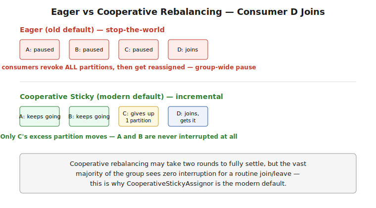
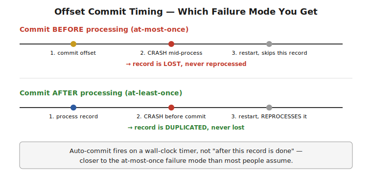

# Part 3 — Consumers & Consumer Groups

> Consumer groups and partition assignment, rebalancing (eager vs cooperative sticky), offset commit strategies and exactly where reliability bugs actually live, and the `max.poll.interval.ms` / `session.timeout.ms` heartbeat mechanics. Interview Q&A at the end.

## Consumer Groups — Recap and the Coordinator

**What it is:** a consumer group is a set of consumers sharing a `group.id`, cooperatively splitting a topic's partitions so each partition is owned by exactly one group member at a time. A designated broker (the **group coordinator**) tracks group membership and drives rebalancing.

```java
Properties props = new Properties();
props.put(ConsumerConfig.GROUP_ID_CONFIG, "order-service");
props.put(ConsumerConfig.BOOTSTRAP_SERVERS_CONFIG, "broker1:9092,broker2:9092");
KafkaConsumer<String, String> consumer = new KafkaConsumer<>(props);
consumer.subscribe(List.of("orders"));
```

## Partition Assignment Strategies

```
RangeAssignor (older default)     — assigns contiguous partition ranges per topic; can unevenly load consumers across MULTIPLE topics
RoundRobinAssignor                — spreads partitions evenly across consumers, but not sticky (large reshuffles on rebalance)
StickyAssignor                     — balances evenly AND minimizes partition movement across rebalances
CooperativeStickyAssignor (modern default) — sticky assignment + incremental (cooperative) rebalancing protocol
```
**Why "sticky" matters in practice:** a naive reassignment strategy can reshuffle *every* partition across *all* consumers on a single rebalance, even when only one consumer joined or left — forcing every consumer to pause, drop its local state (if any), and reload from a possibly-different partition. A sticky assignor minimizes actual partition movement, touching only what's strictly necessary.

## Rebalancing — Eager vs Cooperative

**Eager rebalancing (the old default protocol):** on any membership change (a consumer joins, leaves, or is considered dead), **every** consumer in the group gives up **all** its partitions ("stop the world"), and a fresh assignment is computed and handed out. Every consumer pauses processing during this window, even ones whose partition assignment doesn't actually change.

```
Eager rebalance timeline:
  1. Membership change detected
  2. ALL consumers revoke ALL partitions
  3. Coordinator computes new assignment
  4. ALL consumers receive new assignment, resume
  → global pause for the whole group, every time, regardless of blast radius
```



**Cooperative (incremental) rebalancing (`CooperativeStickyAssignor`, modern default):** only the partitions that actually need to move are revoked and reassigned — consumers keep processing their unaffected partitions throughout. It may take two rebalance rounds to fully settle, but the vast majority of the group experiences zero interruption for a typical single-consumer join/leave event.

> ⚠️ **Pitfall — a "rebalance storm" is a real, recurring production incident, not a one-off:** if consumer instances are flapping (crashing and restarting repeatedly — often from a downstream slowdown causing `max.poll.interval.ms` timeouts, see below), the group can enter a cycle of near-continuous rebalancing, during which throughput craters because every affected consumer is mid-reassignment rather than processing. Diagnosing "why is consumer lag climbing" should always include checking rebalance frequency in consumer group logs/metrics, not just assuming a processing slowdown.

## Offset Commit Strategies — Where Reliability Bugs Actually Live

**The fundamental tension:** you must decide *when* to commit an offset relative to *when* you finish processing the record — and the two orderings produce opposite failure modes.

```java
// Auto-commit (default enabled) -- commits on a timer, independent of whether processing actually finished
props.put(ConsumerConfig.ENABLE_AUTO_COMMIT_CONFIG, true);
props.put(ConsumerConfig.AUTO_COMMIT_INTERVAL_MS_CONFIG, 5000);
```
```java
// Manual commit AFTER processing -- the safer default for at-least-once semantics
props.put(ConsumerConfig.ENABLE_AUTO_COMMIT_CONFIG, false);
while (true) {
    ConsumerRecords<String, String> records = consumer.poll(Duration.ofMillis(500));
    for (ConsumerRecord<String, String> record : records) {
        process(record);       // do the work FIRST
    }
    consumer.commitSync();     // commit only after the whole batch is actually processed
}
```



**The two failure modes, precisely:**
- **Commit before processing finishes, then crash:** the offset is already advanced, but the record was never actually processed — **message loss**.
- **Process fully, then crash before committing:** on restart, the consumer re-reads from the last committed offset and reprocesses the already-handled record — **duplicate processing** (at-least-once).

> ⚠️ **Pitfall — auto-commit's default timing is closer to the message-loss failure mode than people assume:** auto-commit fires on a wall-clock timer, not "after this poll's records are done processing" — if your processing takes longer than the auto-commit interval, or you're doing async processing where `poll()` returns before work is done, you can commit an offset for a record that hasn't finished (or even started) processing yet. For anything where losing a message is worse than reprocessing one, disable auto-commit and commit manually, after processing, every time.

## `max.poll.interval.ms` and `session.timeout.ms` — Two Different Failure Detectors

```
session.timeout.ms       — heartbeat-based liveness check, sent on a background thread; detects a genuinely DEAD/hung consumer process.
max.poll.interval.ms     — measures time BETWEEN calls to poll(); detects a consumer that's ALIVE but stuck processing too long.
```
```java
props.put(ConsumerConfig.SESSION_TIMEOUT_MS_CONFIG, 45000);
props.put(ConsumerConfig.MAX_POLL_INTERVAL_MS_CONFIG, 300000); // 5 min -- generous headroom for slow-but-legitimate processing
props.put(ConsumerConfig.MAX_POLL_RECORDS_CONFIG, 500);         // smaller batches finish faster, reducing max.poll.interval.ms risk
```
**Why both exist:** a consumer can be perfectly alive (heartbeat thread happily reporting in) while its main processing loop is stuck in a slow downstream call — `session.timeout.ms` alone wouldn't catch that. `max.poll.interval.ms` exists specifically to catch "technically alive, but not actually making progress," and exceeding it triggers the group to treat the consumer as dead and rebalance its partitions away, even though the process itself never crashed.

> ⚠️ **Pitfall — a slow downstream call inside the poll loop can trigger a rebalance, which then makes things worse:** if per-record processing occasionally spikes in latency (a slow DB call, a downstream service degrading), exceeding `max.poll.interval.ms` triggers a rebalance that pulls that consumer's partitions away mid-processing — right when the system is already struggling. Sizing `max.poll.records` down and/or moving genuinely slow work off the poll thread (to an async executor, with careful offset-commit sequencing) is the real fix, not just raising the timeout indefinitely.

---

## Interview Q&A

**Q: What's the difference between eager and cooperative (incremental) rebalancing, and why does it matter for production traffic?**
Eager rebalancing revokes every partition from every consumer on any membership change, pausing the whole group even for consumers whose assignment doesn't change. Cooperative rebalancing only moves the partitions that actually need to move, letting unaffected consumers keep processing — dramatically reducing the throughput impact of routine scaling events or transient consumer restarts.

**Q: Auto-commit is enabled by default — what's the actual risk with it?**
It commits on a wall-clock timer, independent of whether the records from the most recent poll have finished processing. If processing takes longer than the commit interval, or happens asynchronously, an offset can be committed for a record that hasn't actually been processed yet — and a crash at that point loses the message rather than just reprocessing it.

**Q: What's the difference between `session.timeout.ms` and `max.poll.interval.ms`?**
`session.timeout.ms` is a heartbeat-based check (on a background thread) that detects a truly dead or hung consumer process. `max.poll.interval.ms` measures the time between successive `poll()` calls on the main thread and detects a consumer that's alive but stuck — e.g., in a slow downstream call — and not actually making progress on the partitions it owns.

**Q: What's a "rebalance storm" and how would you diagnose one?**
A cycle of near-continuous rebalancing caused by consumers repeatedly failing liveness checks (often `max.poll.interval.ms` timeouts from a downstream slowdown) and rejoining, which itself further degrades throughput since affected consumers spend their time mid-reassignment rather than processing. Diagnose by checking rebalance frequency/logs in the consumer group, not just assuming the slowdown is purely a processing-capacity issue.

**Q: You commit offsets manually, after processing — can you still get duplicate processing?**
Yes — if the consumer crashes after finishing processing but before the commit call completes, the next consumer to take that partition re-reads from the last successfully committed offset and reprocesses that record. This is exactly what "at-least-once" delivery means: manual-commit-after-processing avoids message loss but doesn't eliminate the possibility of reprocessing.
