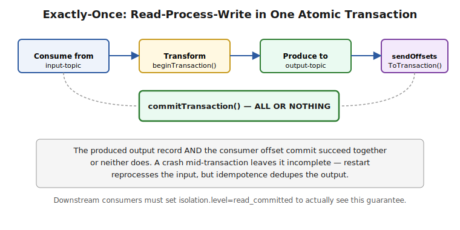

# Part 4 — Delivery Semantics & Reliability

> The three delivery semantics precisely defined, how idempotent producer + transactions combine into Kafka's exactly-once processing (EOS), the dual-write problem and the outbox pattern, and dead-letter queues. Interview Q&A at the end.

## The Three Delivery Semantics, Precisely

```
At-most-once   — a record may be LOST, never duplicated. (commit offset BEFORE processing)
At-least-once  — a record may be DUPLICATED, never lost.  (commit offset AFTER processing) -- Kafka's practical default
Exactly-once   — a record is processed EFFECTIVELY once, with no loss and no visible duplication -- requires explicit transactional setup
```
**Why "exactly-once" is a scoped guarantee, not a magic word:** end-to-end exactly-once semantics (EOS) in Kafka applies specifically to the **read-process-write** pattern *within* Kafka (consume from a topic, transform, produce to another topic) using the transactional APIs. It does **not** automatically extend to an arbitrary external side effect (writing to a database, calling a third-party API) — that's a fundamentally different problem (the dual-write problem, covered below), and claiming "Kafka gives me exactly-once end-to-end" without qualifying *which* systems are involved is a common, telling overstatement in interviews.

## Idempotent Producer + Transactions = Exactly-Once Semantics (EOS)

**Building blocks recap:** the idempotent producer (Part 2) deduplicates retries within one producer session via PID + sequence numbers. **Transactions** extend this to atomically group multiple writes — potentially across multiple partitions/topics, including a **consumer offset commit** — into one all-or-nothing unit.

```java
props.put(ProducerConfig.TRANSACTIONAL_ID_CONFIG, "order-processor-1"); // stable, unique per logical producer instance
KafkaProducer<String, String> producer = new KafkaProducer<>(props);
producer.initTransactions();

producer.beginTransaction();
try {
    producer.send(new ProducerRecord<>("enriched-orders", key, transformedValue));
    // atomically commit the CONSUMER offset as part of the SAME transaction
    producer.sendOffsetsToTransaction(offsetsToCommit, consumerGroupMetadata);
    producer.commitTransaction();
} catch (Exception e) {
    producer.abortTransaction();
}
```



**What this actually buys you:** the output record and the input offset commit either **both** happen or **neither** happens — a crash mid-way leaves the transaction incomplete, and on restart the same input record gets reprocessed, producing the same (deduplicated, thanks to idempotence) output — from the consumer's perspective on the *output* topic, it looks like the record was processed exactly once, because `isolation.level=read_committed` consumers never see the records from an aborted or incomplete transaction at all.

```java
// downstream consumer must opt in to see this guarantee
props.put(ConsumerConfig.ISOLATION_LEVEL_CONFIG, "read_committed");
```
> ⚠️ **Pitfall — EOS has a real performance cost, and "read_uncommitted" silently defeats it:** transactional writes add coordination overhead (a transaction coordinator, markers written to the log) — this is a genuine throughput trade-off, not free. Just as importantly: if a downstream consumer is left at the default `isolation.level=read_uncommitted`, it will see records from aborted transactions anyway, silently breaking the exactly-once guarantee the producer side worked to establish. EOS is a contract between *both* ends, not a producer-only setting.

## The Dual-Write Problem

**The problem:** a service that needs to both update its own database **and** publish a Kafka event for the same business action (e.g., "save the order" + "publish OrderCreated") cannot atomically do both — a database commit and a Kafka publish are two separate systems with no shared transaction. Any ordering of the two operations has a failure window:

```
DB write succeeds, then Kafka publish fails/crashes  → event never published, downstream systems never know
Kafka publish succeeds, then DB write fails/crashes  → event published for data that doesn't actually exist
```
**The standard fix — the Transactional Outbox pattern:** write the event to an `outbox` table **in the same local database transaction** as the business data change (a single-database transaction is atomic), then a separate process (a polling publisher, or Debezium-style Change Data Capture reading the DB's write-ahead log) reliably relays outbox rows to Kafka asynchronously.

```sql
BEGIN TRANSACTION;
  INSERT INTO orders (id, customer_id, status) VALUES (...);
  INSERT INTO outbox (id, aggregate_type, payload, published) VALUES (..., 'Order', '{"orderId": ...}', false);
COMMIT; -- both rows committed together, atomically, or neither is
```
> ⚠️ **Pitfall — this is precisely why "just publish after the DB commit" is a recognized anti-pattern, not a shortcut:** the naive "commit DB, then publish to Kafka" approach looks correct in happy-path testing and fails specifically during the failure windows that testing rarely exercises (a crash or network partition in the narrow gap between the two operations) — which is exactly why interviewers ask about it: it's a real, seen-in-production failure class, and the outbox pattern (see also `Microservice-Patterns/` for the related Saga pattern) is the recognized, tested answer.

## Dead-Letter Queues (DLQs) — Handling Poison Messages

**What it is:** a separate topic where records that repeatedly fail processing get routed instead of blocking the main consumer indefinitely — a "poison message" (malformed payload, a business-rule violation that will never succeed on retry) would otherwise stall the partition forever if the consumer keeps retrying the same offset without ever advancing.

```java
// Spring Kafka's DefaultErrorHandler with a DeadLetterPublishingRecoverer
DefaultErrorHandler errorHandler = new DefaultErrorHandler(
    new DeadLetterPublishingRecoverer(kafkaTemplate),
    new FixedBackOff(1000L, 3) // retry 3 times, 1s apart, THEN send to DLQ
);
```
**Why this matters for partition throughput specifically:** because ordering and delivery are per-partition, a single stuck record blocks **every** record behind it in that partition, not just itself — a DLQ (after a bounded number of retries) is what keeps a partition's throughput moving instead of one bad message wedging the whole partition.

> ⚠️ **Pitfall — a DLQ without monitoring is a silent data-loss mechanism:** routing a poison message to a DLQ "solves" the blocking problem but does nothing on its own to ensure anyone actually looks at, fixes, and reprocesses that message — a DLQ topic that nobody alerts on or periodically drains is functionally the same as dropping the message, just with extra steps and a false sense of safety.

---

## Interview Q&A

**Q: Define Kafka's three delivery semantics in terms of when the offset is committed relative to processing.**
At-most-once commits the offset before processing (a crash after commit but before/during processing loses the record). At-least-once commits after processing completes (a crash after processing but before commit causes reprocessing on restart — duplicated, never lost). Exactly-once requires transactional coordination beyond simple commit ordering.

**Q: What does "exactly-once semantics" actually cover in Kafka, and what's the common overstatement to avoid?**
It covers the read-process-write pattern within Kafka itself — consuming from one topic and producing to another, with the consumer offset commit and the produce atomically grouped via transactions, combined with the idempotent producer. It does not automatically extend to an arbitrary external side effect like a database write or a third-party API call — claiming full end-to-end exactly-once across systems outside Kafka's transactional boundary is the overstatement interviewers watch for.

**Q: A producer uses transactions, but a downstream consumer still sees duplicate/uncommitted records — why?**
The consumer is almost certainly left at the default `isolation.level=read_uncommitted`, which sees records from aborted or in-flight transactions. EOS requires the consumer to explicitly opt in with `isolation.level=read_committed` — it's a contract both sides must configure, not a producer-only setting.

**Q: What's the dual-write problem, and how does the transactional outbox pattern solve it?**
A service can't atomically update its own database and publish a Kafka event as two separate operations — any crash between the two leaves them inconsistent (event without data, or data without event). The outbox pattern writes the event as a row in an outbox table within the *same* local database transaction as the business data change (atomic by construction, since it's one database), then a separate relay process asynchronously publishes outbox rows to Kafka.

**Q: Why can one malformed message stall an entire Kafka partition, and what's the standard fix?**
Because ordering and consumption are strictly per-partition and sequential — a consumer stuck retrying one offset never advances past it, blocking every record behind it in that partition. The fix is a bounded retry count followed by routing the record to a dead-letter queue, which lets the partition's offset advance — paired with actual monitoring/alerting on the DLQ, since an unmonitored DLQ just moves the data-loss risk rather than eliminating it.
