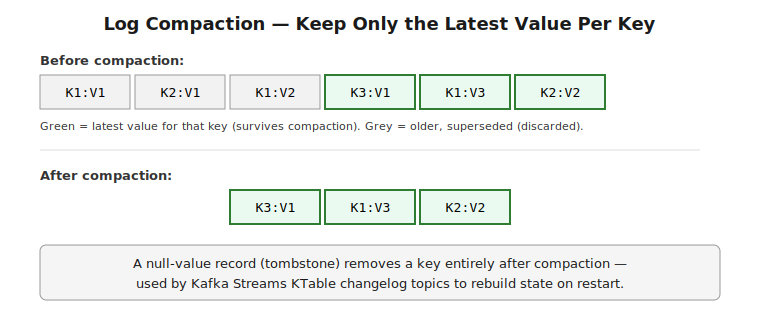

# Part 5 — Retention, Compaction & Performance

> Segment files and how retention actually deletes data, log compaction as a fundamentally different retention model, why Kafka's disk throughput is so high (page cache + zero-copy), and the production tuning knobs that come up most. Interview Q&A at the end.

## Segment Files — How a Partition Is Actually Stored

**What it is:** a partition's log isn't one giant file — it's split into **segments**, each a bounded-size file on disk (default 1GB, `log.segment.bytes`) plus an accompanying index file for fast offset lookup. Only the newest segment (the "active" segment) is being written to; older segments are immutable.

```
Partition 0 directory:
  00000000000000000000.log   (older segment, immutable)
  00000000000000000000.index
  00000000000000487213.log   (older segment, immutable)
  00000000000000487213.index
  00000000000000912047.log   ← ACTIVE segment, currently being appended to
  00000000000000912047.index
```
**Why this matters:** retention (time-based or size-based) operates at the **segment** granularity, not per-record — Kafka doesn't scan and delete individual expired records; it deletes entire segment files once every record in that segment is past the retention threshold. This is precisely why retention is cheap at scale (a file deletion, not a per-record scan) but also why retention isn't perfectly precise to the millisecond — a segment lingers until its *newest* record ages out.

```
log.retention.hours=168        # delete segments once fully older than 7 days
log.retention.bytes=-1         # (per-partition) size-based retention, -1 = unlimited
log.segment.bytes=1073741824   # 1GB per segment -- smaller segments = more granular retention, more file overhead
```
> ⚠️ **Pitfall — smaller segments aren't free:** reducing `log.segment.bytes` gives finer-grained, more prompt retention (since a segment can be deleted sooner after its newest record expires), but increases the number of open file handles and index files the broker manages — a real operational trade-off, not a strictly-better tuning knob to crank down.

## Log Compaction — a Fundamentally Different Retention Model

**What it is:** instead of deleting data by age, **compaction** (`cleanup.policy=compact`) retains only the **latest record per key**, discarding older records for the same key. This turns a topic into something closer to a changelog of a keyed dataset's current state, rather than a time-bounded event stream.

```
Before compaction (key: value):
  K1:V1  K2:V1  K1:V2  K3:V1  K1:V3  K2:V2

After compaction:
  K3:V1  K1:V3  K2:V2   (only the latest value per key survives; relative order among surviving keys is preserved)
```



**Why this exists — the canonical use case:** rebuilding state. Kafka Streams' internal `KTable` changelog topics use compaction specifically so that on restart, replaying the compacted topic reconstructs the *current* state of every key without replaying the entire history — you get "what's the latest value for every key" in one pass, not the full event history.

**Tombstones — deleting a key entirely:** a record with a `null` value for a given key is a **tombstone** — after compaction runs (and after `delete.retention.ms` passes, giving consumers time to actually see the tombstone), the key is removed from the compacted log entirely.

```java
producer.send(new ProducerRecord<>("user-profiles", userId, null)); // tombstone -- deletes userId's entry on next compaction
```
> ⚠️ **Pitfall — compaction is not instantaneous, and relying on "the old value is definitely gone" immediately is wrong:** compaction runs periodically as a background process (`log.cleaner.min.cleanable.ratio` and related settings govern when), not synchronously on every write — a consumer reading shortly after an update can still see an older, pre-compaction value for a key sitting in the not-yet-compacted portion of the log. Compaction is an eventual cleanup guarantee, not a transactional overwrite.

## Why Kafka's Throughput Is So High — Page Cache and Zero-Copy

**Sequential disk I/O, not random access:** because each partition is an append-only log, both writes (always appending to the tail) and reads (usually sequential, from wherever a consumer left off) are sequential disk operations — dramatically faster than random-access I/O, even on spinning disks, and extremely cache-friendly on SSDs.

**The OS page cache does most of the work:** Kafka deliberately relies on the operating system's page cache rather than maintaining its own in-process cache of record data — recently written (or read) segment data stays in the OS's file cache, so a consumer reading recently-produced data is very often served straight from RAM, not disk.

**Zero-copy transfer (`sendfile()`):** when serving a fetch request for data already in the page cache, Kafka uses the `sendfile()` system call to transfer bytes directly from the page cache to the network socket buffer — **bypassing the broker's own JVM heap entirely**. No copy into user-space, no copy back out — just a kernel-to-kernel transfer, which is both faster and avoids GC pressure from moving large volumes of record bytes through Java objects.

> ⚠️ **Pitfall — this is exactly why Kafka brokers are typically NOT configured with a huge JVM heap:** since the actual record data lives in the OS page cache (not the JVM heap) and is served via zero-copy, giving the broker JVM a very large heap doesn't meaningfully help throughput and instead reduces the RAM available to the OS for page caching — plus risking longer GC pauses. The common guidance (a modest heap, e.g., 6GB, leaving the rest of RAM for the OS page cache) is a direct consequence of this architecture, not an arbitrary rule of thumb.

## Common Production Tuning Knobs

```
num.partitions (topic-level)         — parallelism ceiling for both producers and consumer groups; plan for peak, hard to grow cleanly later on keyed topics
replication.factor                    — durability vs storage cost; 3 is the common production default
min.insync.replicas                   — paired with acks=all for real multi-broker durability (see Part 2)
compression.type                      — lz4/zstd/snappy; big win on both network and storage for text-heavy payloads (JSON)
fetch.min.bytes / fetch.max.wait.ms   — consumer-side batching lever, the read-side mirror of producer linger.ms
log.retention.hours / .bytes          — cost vs replay-window trade-off; longer retention = more disk, more replay flexibility
```
**Consumer lag as the primary health signal:** the gap between the latest produced offset and a consumer group's last committed offset, per partition. A steadily growing lag (not a temporary spike that recovers) is the clearest signal that consumers can't keep up with producers — the fix could be more partitions + more consumers (if the bottleneck is genuinely parallelism), faster per-record processing, or investigating rebalance frequency (Part 3) as the actual root cause rather than raw processing speed.

> ⚠️ **Pitfall — "add more partitions" is not a free fix for lag:** more partitions helps only if the bottleneck is genuinely consumer-side parallelism (not enough consumers relative to partition count) — if the real bottleneck is a slow downstream call every consumer makes per record, adding partitions just gives you more consumers all individually bottlenecked on the same downstream dependency, with the added cost of increased broker overhead (more file handles, more replication traffic) and, on a keyed topic, the ordering-stability issue covered in Part 2.

---

## Interview Q&A

**Q: How does retention actually delete data at the storage level — is it a per-record scan?**
No — a partition's log is split into segment files (default 1GB), and retention deletes whole segment files once every record in that segment has aged past the retention threshold. This makes retention cheap (file deletion, not scanning), but means a segment lingers until its newest record expires, so retention isn't precise to the millisecond.

**Q: What's log compaction, and what's its canonical real-world use case?**
Instead of deleting by age, compaction retains only the latest record per key, discarding older values for the same key — turning the topic into a changelog of current state rather than a bounded event history. Kafka Streams uses compacted topics for `KTable` changelogs specifically so restoring state on restart means replaying the latest value per key, not the entire event history.

**Q: How do you delete a key entirely from a compacted topic?**
Produce a record with that key and a `null` value — a tombstone. After compaction runs and `delete.retention.ms` passes (giving consumers time to observe the tombstone), the key is fully removed from the compacted log.

**Q: Why is Kafka broker throughput so high, and why does that argue against giving the broker a huge JVM heap?**
Sequential disk I/O (append-only writes, mostly-sequential reads) plus reliance on the OS page cache for serving recently written/read data, combined with zero-copy (`sendfile()`) transfer straight from page cache to the network socket — bypassing the JVM heap entirely for the actual record bytes. Since the data isn't living in the JVM heap, a large heap doesn't help and instead starves the OS of RAM it would otherwise use for page caching, which is why brokers are typically run with a comparatively modest heap.

**Q: Consumer lag is climbing steadily — is "add more partitions and consumers" always the right fix?**
Only if the bottleneck is genuinely insufficient parallelism. If every consumer is individually bottlenecked on a slow downstream call, adding partitions just multiplies the number of consumers hitting that same slow dependency, while adding real broker overhead and, on keyed topics, the ordering-stability risk from changing partition count. Diagnosing the actual bottleneck (processing speed vs parallelism vs rebalance frequency) should come before scaling partitions.
